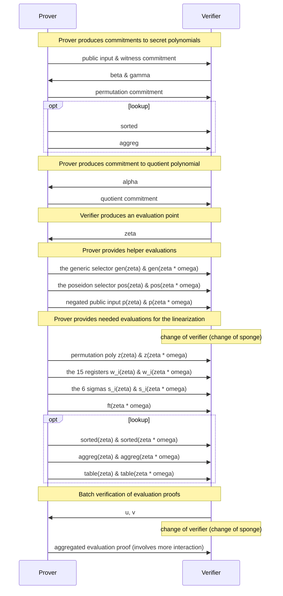

# Kimchi

* This document specifies *kimchi*, a zero-knowledge proof system that's a variant of PLONK.
* This document does not specify how circuits are created or executed, but only how to convert a circuit and its execution into a proof.

Table of content:

<!-- toc -->

## Overview

There are three main algorithms to kimchi:

* [Setup](#constraint-system-creation): takes a circuit and produces a prover index, and a verifier index.
* [Proof creation](#proof-creation): takes the prover index, and the execution trace of the circuit to produce a proof.
* [Proof verification](#proof-verification): takes the verifier index and a proof to verify.

As part of these algorithms, a number of tables are created (and then converted into polynomials) to create a proof.

### Tables used to describe a circuit

The following tables are created to describe the circuit:

**Gates**. A circuit is described by a series of gates, that we list in a table.
The columns of the tables list the gates, while the rows are the length of the circuit.
For each row, only a single gate can take a value $1$ while all other gates take the value $0$.

|  row  | Generic | Poseidon | CompleteAdd | VarBaseMul | EndoMul | EndoMulScalar | ChaCha0 | ChaCha1 | ChaCha2 | ChaChaFinal |
| :---: | :-----: | :------: | :---------: | :--------: | :-----: | :-----------: | :-----: | :-----: | :-----: | :---------: |
|   0   |    1    |    0     |      0      |     0      |    0    |       0       |    0    |    0    |    0    |      0      |
|   1   |    0    |    1     |      0      |     0      |    0    |       0       |    0    |    0    |    0    |      0      |

**Coefficients**. The coefficient table has 15 columns, and is used to tweak the gates.
Currently, only the [Generic](#double-generic-gate) and the [Poseidon](#poseidon) gates use it (refer to their own sections to see how).
All other gates set their values to $0$.

|  row  |   0   |   1   |   2   |   3   |   4   |   5   |   6   |   7   |   8   |   9   |  10   |  11   |  12   |  13   |  14   |
| :---: | :---: | :---: | :---: | :---: | :---: | :---: | :---: | :---: | :---: | :---: | :---: | :---: | :---: | :---: | :---: |
|   0   |   /   |   /   |   /   |   /   |   /   |   /   |   /   |   /   |   /   |   /   |   /   |   /   |   /   |   /   |   /   |

**Wiring (or Permutation, or sigmas)**. For gates to take the outputs of other gates as inputs, we use a wiring table to wire registers together.
To learn about registers, see the next section.
It is defined at every row, but only for the first $7$ registers.
Each cell specifies a `(row, column)` tuple that it should be wired to.  Cells that are not connected to another cell are wired to themselves.
Note that if three or more registers are wired together, they must form a cycle.
For example, if register `(0, 4)` is wired to both registers `(80, 6)` and `(90, 0)` then you would have the following table:

|  row  |    0    |   1   |   2   |   3   |    4     |   5   |    6     |
| :---: | :-----: | :---: | :---: | :---: | :------: | :---: | :------: |
|   0   |   0,0   |  0,1  |  0,2  |  0,3  | **80,6** |  0,5  |   0,6    |
|  ...  |         |       |       |       |          |       |          |
|  80   |  80,0   | 80,1  | 80,2  | 80,3  |   80,4   | 80,5  | **90,0** |
|  ...  |         |       |       |       |          |       |          |
|  90   | **0,4** | 90,1  | 90,2  | 90,3  |   90,4   | 90,5  |   90,6   |

The lookup feature is currently optional, as it can add some overhead to the protocol.
In the case where you would want to use lookups, the following tables would be needed:

**Lookup Tables**. The different [lookup tables](https://en.wikipedia.org/wiki/Lookup_table) that are used in the circuit. For example, the XOR lookup table:

| l   | r   | o   |
| --- | --- | --- |
| 1   | 0   | 1   |
| 0   | 1   | 1   |
| 1   | 1   | 0   |
| 0   | 0   | 0   |

**Lookup selectors**. A lookup selector is used to perform a number of queries in different lookup tables. Any gate can advertise its use of a lookup selector (so a lookup selector can be associated to several gates), and on which rows they want to use them (current and/or next). In cases where a gate need to use lookups in its current row only, and is the only one performing a specific combination of queries, then its gate selector can be used in place of a lookup selector. As with gates, lookup selectors (including gates used as lookup selectors) are mutually exclusives (only one can be used on a given row).

We currently have two lookup selectors:

|  row  | ChaChaQuery | ChaChaFinalQuery |
| :---: | :---------: | :--------------: |
|   0   |      0      |        0         |
|   1   |      1      |        0         |

Where each apply 4 queries. A query is a table describing which lookup table it queries, and the linear combination of the witness to use in the query.
For example, the following table describes a query into the XOR table made out of linear combinations of registers (checking that $r_0 \oplus r_2 = 2 \cdot r_1$):

| table_id |   l   |   r   |   o   |
| :------: | :---: | :---: | :---: |
|   XOR    | 1, r0 | 1, r2 | 2, r1 |

### Tables produced during proof creation

The following tables are created by the prover at runtime:

**Registers (or Witness)**. Registers are also defined at every row, and are split into two types: the *IO registers* from $0$ to $6$ usually contain input or output of the gates (note that a gate can output a value on the next row as well).
I/O registers can be wired to each other (they'll be forced to have the same value), no matter what row they're on (for example, the register at `row:0, col:4` can be wired to the register at `row:80, col:6`).
The rest of the registers, $7$ through $14$, are called *advice registers* as they can store values that useful only for the row's active gate.
Think of them as intermediary or temporary values needed in the computation when the prover executes a circuit.

|  row  |   0   |   1   |   2   |   3   |   4   |   5   |   6   |   7   |   8   |   9   |  10   |  11   |  12   |  13   |  14   |
| :---: | :---: | :---: | :---: | :---: | :---: | :---: | :---: | :---: | :---: | :---: | :---: | :---: | :---: | :---: | :---: |
|   0   |   /   |   /   |   /   |   /   |   /   |   /   |   /   |   /   |   /   |   /   |   /   |   /   |   /   |   /   |   /   |

**Wiring (Permutation) trace**. You can think of the permutation trace as an extra register that is used to enforce the wiring specified in the wiring table.
It is a single column that applies on all the rows as well, which the prover computes as part of a proof.

|  row  |  pt   |
| :---: | :---: |
|   0   |   /   |

**Queries trace**. These are the actual values made by queries, calculated by the prover at runtime, and used to construct the proof.

**Table trace**. Represents the concatenation of all the lookup tables, combined into a single column at runtime by both the prover and the verifier.

**Sorted trace**. Represents the processed (see the lookup section) concatenation of the queries trace and the table trace. It is produced at runtime by the prover. The sorted trace is long enough that it is split in several columns.

**Lookup (aggregation, or permutation) trace**. This is a one column table that is similar to the wiring (permutation) trace we talked above. It is produced at runtime by the prover.

## Dependencies

To specify kimchi, we rely on a number of primitives that are specified outside of this specification.
In this section we list these specifications, as well as the interfaces we make use of in this specification.

### Polynomial Commitments

Refer to the [specification on polynomial commitments](./poly-commitment.md).
We make use of the following functions from that specification:

- `PolyCom.non_hiding_commit(poly) -> PolyCom::NonHidingCommitment`
- `PolyCom.commit(poly) -> PolyCom::HidingCommitment`
- `PolyCom.evaluation_proof(poly, commitment, point) -> EvaluationProof`
- `PolyCom.verify(commitment, point, evaluation, evaluation_proof) -> bool`

### Poseidon hash function

Refer to the [specification on Poseidon](./poseidon.md).
We make use of the following functions from that specification:

- `Poseidon.init(params) -> FqSponge`
- `Poseidon.update(field_elem)`
- `Poseidon.finalize() -> FieldElem`

specify the following functions on top:

- `Poseidon.produce_challenge()` (TODO: uses the endomorphism)
- `Poseidon.to_fr_sponge() -> state_of_fq_sponge_before_eval, FrSponge`

With the current parameters:

* S-Box alpha: `7`
* Width: `3`
* Rate: `2`
* Full rounds: `55`
* Round constants: [`fp_kimchi`](https://github.com/o1-labs/proof-systems/blob/0b01f7575cdfa45541fcfcd88d59f73b015af56b/oracle/src/pasta/fp_kimchi.rs#L55), [`fq_kimchi`](https://github.com/o1-labs/proof-systems/blob/0b01f7575cdfa45541fcfcd88d59f73b015af56b/oracle/src/pasta/fq_kimchi.rs#L54)
* MDS matrix: [`fp_kimchi`](https://github.com/o1-labs/proof-systems/blob/0b01f7575cdfa45541fcfcd88d59f73b015af56b/oracle/src/pasta/fp_kimchi.rs#L10), [`fq_kimchi`](https://github.com/o1-labs/proof-systems/blob/0b01f7575cdfa45541fcfcd88d59f73b015af56b/oracle/src/pasta/fq_kimchi.rs#L10)

### Pasta

Kimchi is made to work on cycles of curves, so the protocol switch between two fields Fq and Fr, where Fq represents the base field and Fr represents the scalar field.

See the [Pasta curves specification](./pasta.md).

## Constraints

Kimchi enforces the correct execution of a circuit by creating a number of constraints and combining them together.
In this section, we describe all the constraints that make up the main polynomial $f$ once combined.

We define the following functions:

* `combine_constraints(range_alpha, constraints)`, which takes a range of contiguous powers of alpha and a number of constraints.
It returns the sum of all the constraints, where each constraint has been multiplied by a power of alpha.
In other words it returns:
$$ \sum_i \alpha^i \cdot \text\{constraint}_i $$

The different ranges of alpha are described as follows:

<!-- generated using `cargo test -p kimchi --lib -- alphas::tests::get_alphas_for_spec --nocapture` -->
* **gates**. Offset starts at 0 and 21 powers of $\alpha$ are used
* **Permutation**. Offset starts at 21 and 3 powers of $\alpha$ are used

```admonish
As gates are mutually exclusive (a single gate is used on each row), we can reuse the same range of powers of alpha across all the gates.
```

TODO: linearization

### Permutation

{sections.permutation}

### Lookup

Lookups in kimchi allows you to check if a single value, or a series of values, are part of a table.
The first case is useful to check for checking if a value belongs to a range (from 0 to 1,000, for example), whereas the second case is useful to check truth tables (for example, checking that three values can be found in the rows of an XOR table) or write and read from a memory vector (where one column is an index, and the other is the value stored at that index).

```admonish
Similarly to the generic gate, each values taking part in a lookup can be scaled with a fixed field element.
```

The lookup functionality is an opt-in feature of kimchi that can be used by custom gates.
From the user's perspective, not using any gates that make use of lookups means that the  feature will be disabled and there will be no overhead to the protocol.

```admonish
For now, the Chacha gates are the only gates making use of lookups.
```

Refer to the [lookup RFC](../rfcs/3-lookup.md) for an overview of the lookup feature.

In this section, we describe the tables kimchi supports, as well as the different lookup selectors (and their associated queries)

#### The Lookup Tables

Kimchi currently supports a single lookup table:

{sections.tables}

**XOR**. {sections.xor}

#### The Lookup Selectors

**ChaChaSelector**. Performs 4 queries to the XOR lookup table.

|   l   |   r   |   o    | -   |   l   |   r   |   o    | -   |   l   |   r   |   o    | -   |   l   |   r    |   o    |
| :---: | :---: | :----: | --- | :---: | :---: | :----: | --- | :---: | :---: | :----: | --- | :---: | :----: | :----: |
| 1, r3 | 1, r7 | 1, r11 | -   | 1, r4 | 1, r8 | 1, r12 | -   | 1, r5 | 1, r9 | 1, r13 | -   | 1, r6 | 1, r10 | 1, r14 |

**ChaChaFinalSelector**. Performs 4 different queries to the XOR lookup table. (TODO: specify the layout)

#### Producing the sorted table as the prover

{sections.lookup}

### Gates

A circuit is described as a series of gates.
In this section we describe the different gates currently supported by kimchi, the constraints associated to them, and the way the register table, coefficient table, and permutation can be used in conjunction.

TODO: for each gate describe how to create it?

#### Double Generic Gate

{sections.generic}

#### Poseidon

{sections.poseidon}

#### Chacha

{sections.chacha}

#### Elliptic Curve Addition

{sections.complete_add}

#### Endo Scalar

{sections.endomul_scalar}

#### Endo Scalar Multiplication

{sections.endosclmul}

#### Scalar Multiplication

{sections.varbasemul}

## Setup

In this section we specify the setup that goes into creating two indexes from a circuit:

* A [*prover index*](#prover-index), necessary for the prover to to create proofs.
* A [*verifier index*](#verifier-index), necessary for the verifier to verify proofs.

```admonish
The circuit creation part is not specified in this document. It might be specified in a separate document, or we might want to specify how to create the circuit description tables.
```

As such, the transformation of a circuit into these two indexes can be seen as a compilation step. Note that the prover still needs access to the original circuit to create proofs, as they need to execute it to create the witness (register table).

### Common Index

In this section we describe data that both the prover and the verifier index share.

**`URS` (Uniform Reference String)** The URS is a set of parameters that is generated once, and shared between the prover and the verifier.
It is used for polynomial commitments, so refer to the [poly-commitment specification](./poly-commitment.md) for more details.

```admonish
Kimchi currently generates the URS based on the circuit, and attach it to the index. So each circuit can potentially be accompanied with a different URS. On the other hand, Mina reuses the same URS for multiple circuits ([see zkapps for more details](https://minaprotocol.com/blog/what-are-zkapps)).
```

**`Domain`**. A domain large enough to contain the circuit and the zero-knowledge rows (used to provide zero-knowledge to the protocol). Specifically, the smallest subgroup in our field that has order greater or equal to `n + ZK_ROWS`, with `n` is the number of gates in the circuit.
TODO: what if the domain is larger than the URS?

```admonish warning "Ordering of elements in the domain"
Note that in this specification we always assume that the first element of a domain is $1$.
```

**`Shifts`**. As part of the permutation, we need to create `PERMUTS` shifts.
To do that, the following logic is followed (in pseudo code):
(TODO: move shift creation within the permutation section?)

```python
shifts[0] = 1 # first shift is identity

for i in 0..7: # generate 7 shifts
    i = 7
    shift, i = sample(domain, i)
    while shifts.contains(shift) do:
        shift, i = sample(domain, i)
    shift[i] = shift

def sample(domain, i):
    i += 1
    shift = Field(Blake2b512(to_be_bytes(i)))
    while is_not_quadratic_non_residue(shift) || domain.contains(shift):
        i += 1
        shift = Field(Blake2b512(to_be_bytes(i)))
    return shift, i
```

**`Public`**. This variable simply contains the number of public inputs. (TODO: actually, it's not contained in the verifier index)

The compilation steps to create the common index are as follow:

{sections.constraint_system}

### Lookup Index

If lookup is used, the following values are added to the common index:

**`LookupSelectors`**. The list of lookup selectors used. In practice, this tells you which lookup tables are used.

**`TableIds`**. This is a list of table ids used by the Lookup gate.

**`MaxJointSize`**. This is the maximum number of columns appearing in the lookup tables used by the lookup selectors. For example, the XOR lookup has 3 columns.

To create the index, follow these steps:

{sections.lookup_index}

### Prover Index

Both the prover and the verifier index, besides the common parts described above, are made out of pre-computations which can be used to speed up the protocol.
These pre-computations are optimizations, in the context of normal proofs, but they are necessary for recursion.

{sections.prover_index}

### Verifier Index

Same as the prover index, we have a number of pre-computations as part of the verifier index.

{sections.verifier_index}

## Proof Construction & Verification

Originally, kimchi is based on an interactive protocol that was transformed into a non-interactive one using the [Fiat-Shamir](https://o1-labs.github.io/mina-book/crypto/plonk/fiat_shamir.html) transform.
For this reason, it can be useful to visualize the high-level interactive protocol before the transformation:



The Fiat-Shamir transform simulates the verifier messages via a hash function that hashes the transcript of the protocol so far before outputing verifier messages.
You can find these operations under the [proof creation](#proof-creation) and [proof verification](#proof-verification) algorithms as absorption and squeezing of values with the sponge.

### Proof Structure

A proof consists of the following data structures:

{sections.proof}

The following sections specify how a prover creates a proof, and how a verifier validates a number of proofs.

### Proof Creation

To create a proof, the prover expects:

* A prover index, containing a representation of the circuit (and optionaly pre-computed values to be used in the proof creation).
* The (filled) registers table, representing parts of the execution trace of the circuit.

```admonish
The public input is expected to be passed in the first `Public` rows of the registers table.
```

The following constants are set:

* `EVAL_POINTS = 2`. This is the number of points that the prover has to evaluate their polynomials at.
($\zeta$ and $\zeta\omega$ where $\zeta$ will be deterministically generated.)
* `ZK_ROWS = 3`. This is the number of rows that will be randomized to provide zero-knowledgeness.
Note that it only needs to be greater or equal to the number of evaluations (2) in the protocol.
Yet, it contains one extra row to take into account the last constraint (final value of the permutation accumulator).
(TODO: treat the final constraint separately so that ZK_ROWS = 2)

The prover then follows the following steps to create the proof:

{sections.prover}

### Proof Verification

TODO: we talk about batch verification, but is there an actual batch operation? It seems like we're just verifying an aggregated opening proof

We define two helper algorithms below, used in the batch verification of proofs.

{sections.verifier}

## Optimizations

* `commit_evaluation`: TODO

## Security Considerations

TODO
