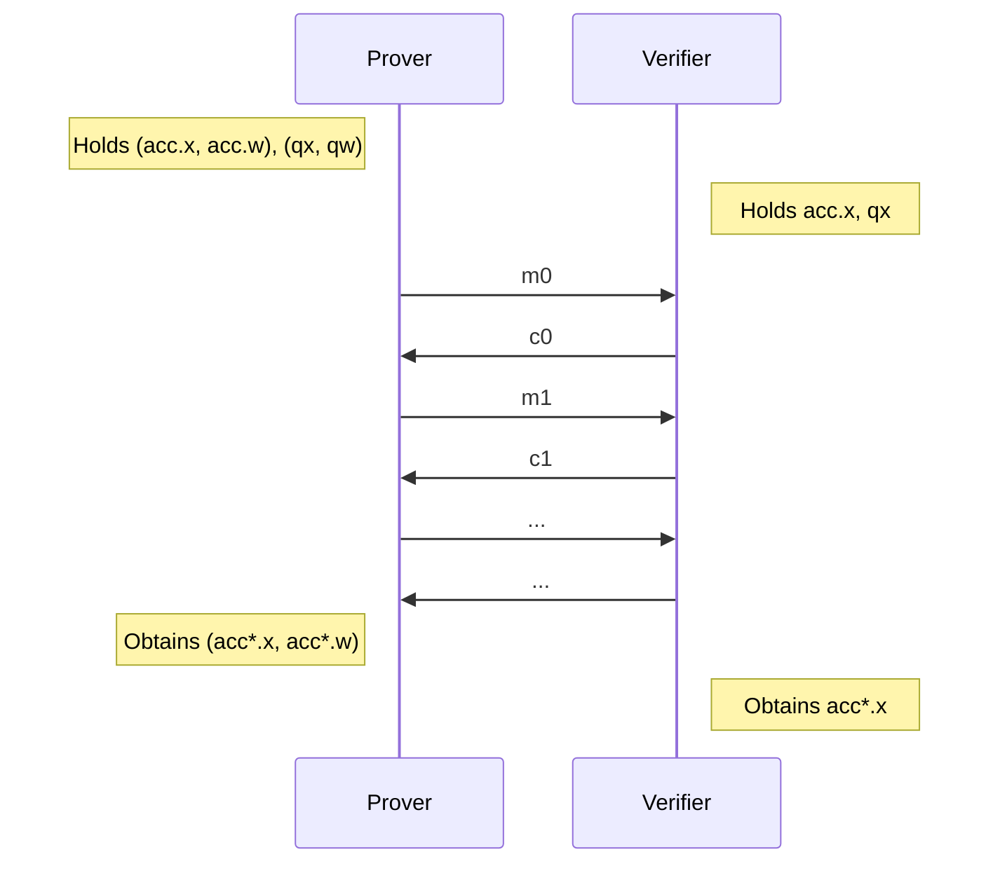

# Accumulation

## Introduction

The trick below was originally described in [Halo](https://eprint.iacr.org/2020/499.pdf),
however we are going to rely on the abstraction of "accumulation schemes" described by Bünz, Chiesa, Mishra and Spooner in [Proof-Carrying Data from Accumulation Schemes](/https://eprint.iacr.org/2020/499.pdf), in particular the scheme in Appendix A. 2.

Relevant resources include:

- [Proof-Carrying Data from Accumulation Schemes](https://eprint.iacr.org/2020/499.pdf) by Benedikt Bünz, Alessandro Chiesa, Pratyush Mishra and Nicholas Spooner.
- [Recursive Proof Composition without a Trusted Setup (Halo)](https://eprint.iacr.org/2019/1021.pdf) by Sean Bowe, Jack Grigg and Daira Hopwood.

This page describes the most relevant parts of these papers and how it is implemented in Pickles.

## Accumulation schemes at a high level

At a high-level accumulation schemes is about _interactively/non-deterministically_ reducing membership of two (or more) instances $\mathsf{qx} \in \language_\mathsf{q}$ (instance language), $\mathsf{acc}.x \in \language_\mathsf{acc}$ (accumulation language) to membership of $\mathsf{acc}^*.x \in \language_\mathsf{acc}$ such that if:

$$\mathsf{qx} \notin \language_\mathsf{q} \lor \mathsf{acc}.x \notin \language_\mathsf{acc}$$

Then $\mathsf{acc}^*.x \notin \language_\mathsf{acc}$ with overwhelming probability (over the random coins of the verifier).

In other words: a prover holding
$(\mathsf{qx}, \mathsf{qw}) \in \relation_\mathsf{q}$,
$(\mathsf{acc}.x, \mathsf{acc}.w) \in \relation_\mathsf{acc}$
and a verifier holding
$\mathsf{qx}$,
$\mathsf{acc}.x$
engages in an (public-coin) protocol, which outputs $(\mathsf{acc}^*.x, \mathsf{acc}^*.w) \in \relation_\mathsf{acc}$
to the prover and $\mathsf{acc}^*.x$ to the verifier, pictorially:



As a design goal we want this "interactive reduction" (called the "accumulation verifier") to be highly efficient, in terms of:

1. Rounds (corresponding to random oracle invocations in the compiled protocol
2. Communication.
3. Computation for the verifier.

<!--
In this document we ignore zero-knowledge for ease of exposition, it is however mostly trivial, e.g. to open a polynomial $f(z) = v$ pick a polnyomial $g$ st. $g(z) = 0$ and compute a linear combination.
-->

**Note:** technically, the languages we are interested in are trivial e.g. every commitment can be opened to every polynomial,
however, we mean that no efficient adversary can find a witness for membership e.g. a valid opening.

## Polynomial Commitment Scheme Claims

Recall that the polynomial commitment scheme (PCS) in Kimchi is just the trivial scheme based on Pedersen commitments.
For Kimchi we are interested in "accumulation for the language ($\relation_\mathsf{PCS}$) of polynomial commitment openings", meaning that:

$$
\left(
\mathsf{qx} = (C, z, v),
\mathsf{qw} = (\vec{f})
\right)
\in
\relation_\mathsf{q}
=
\relation_\mathsf{PCS}
\iff
\left\{
\begin{align}
C &= \langle \vec{f}, \vec{G} \rangle \\
v &= \sum_{i = 0} f_i \cdot z^i
\end{align}
\right\}
$$

Where $\vec{f}$ is a list of coefficients for a polynomial $f(X) \coloneqq \sum_{i} f_i \cdot X^i$.

In other words, we are going to reduce openings of polynomial commitments $\relation_\mathsf{PCS}$ to some other language $\relation_\mathsf{acc} = \mathcal{R}_\mathsf{IPA}$ which is described below...

## Recalling Folding Arguments

Let us that by recalling how to construct an opening proof for the PCS above using a variant of the well-known recursive folding argument.
Define $\vec{z} = (1, z, z^2, z^3, \ldots, z^{\ell-1})$.

### Convert PCS Relation to Inner Product Relation

First we start by adding the evaluation $v$ to the commitment "in a new coordinate": the verifier adds the opening to the commitment $C$, i.e.

1. Verifier picks $U \sample \GG$ and sends $U$ to the prover.

2. Verifier updates $C' \gets C + [v] \cdot U$

Intuitively we sample $U$ to avoid a malicious prover "putting something in the $U$-position", because he must commit to $v$ before seeing $U$.

If the prover is honest, we should have a commitment of the form:

$$
C' =
\langle \vec{f}, \vec{G} \rangle + [v] \cdot U
=
\langle \vec{f}, \vec{G} \rangle + [\langle \vec{z}, \vec{f} \rangle] \cdot U
\in \GG
$$

### Recursive Folding

The folding argument reduces a commitment to a polynomial with $\ell$ (a power of two)
coefficients to a polynomial with $\ell / 2$ coefficients.
To see how it works let us rewrite the inner product in terms of a first and second part:

$$
\langle \vec{f}, \vec{z} \rangle =
\langle \vec{f}_L, \vec{z}_L \rangle
+
\langle \vec{f}_R, \vec{z}_R \rangle
\in \FF
$$

Where $\vec{f}_L = (f_1, \ldots, f_{\ell/2})$ and $\vec{f}_R = (f_{\ell/2 + 1}, \ldots, f_\ell)$,
similarly for $\vec{z}$.

Now consider a natural "randomized version" with a challenge $\alpha \in \FF$ of this inner product:

$$
    \begin{align}
    \langle \vec{f}_L + \alpha \cdot \vec{f}_R, \ \alpha \cdot \vec{z}_L + \vec{z}_R \rangle
    &= \langle \vec{f}_L, \vec{z}_R \rangle \\
    &+ \alpha  \cdot \underline{\left(\langle \vec{f}_R, \vec{z}_R \rangle + \langle \vec{f}_L, \vec{z}_L \rangle\right)} \\
    &+ \alpha^2 \cdot  \langle \vec{f}_R, \vec{z}_L \rangle
    \end{align}
$$

The term we care about (underlined) is $\langle \vec{f}_R, \vec{z}_R \rangle + \langle \vec{f}_L, \vec{z}_L \rangle = v$, the other two terms are cross-term garbage.
The trick in the folding argument is to let the prover provide the cross terms to "correct" (before seeing $\alpha$):
the prover commits to the three terms (one of which is already provided) and the verifier computes a commitment to the new randomized inner product.
i.e.

The prover sends:

$$
L = \langle 0 \Vert c_L, G \rangle + [\langle 0 \Vert c_L, z \rangle] \cdot U
$$

$$
R = \langle c_R \Vert 0, G \rangle + [\langle c_R \Vert 0, z \rangle] \cdot U
$$

<!--
\\[
L = \langle c_L, G_R \rangle + [\langle c_L, z_R \rangle] \cdot H'
\\]

\\[
R = \langle c_R, G_L \rangle + [\langle c_R, z_L \rangle] \cdot H'
\\]

\\[
\begin{align}
C' &= L + [\alpha] \cdot C + [\alpha^2] \cdot R \\
   &=
   \langle z_R + \alpha z_L, G_L \rangle +
   \langle z_L + \alpha z_R, G_R \rangle +
   [\langle z_L, c_R \rangle + \alpha (\underline{\langle z_L, c_L \rangle + \langle z_R, c_R \rangle}) + \alpha^2 \langle z_R, c_L \rangle ] \cdot H' \\
   &= \langle z_R + \alpha z_L, G_L \rangle +
   \langle z_L + \alpha z_R, G_R \rangle +
   [
    \langle z_R + \alpha z_L, c_L \rangle
    + \langle z_L + \alpha z_R, c_R \rangle] \cdot H' \\
\end{align}
\\]

-->

\\[
\begin{align}
C' &= L + [\alpha] \cdot C + [\alpha^2] \cdot R \\
   &= \langle (0 \Vert c_L) + \alpha \cdot (c_L \Vert c_R) + \alpha^2 \cdot (c_R \vert 0), G \rangle + [
   \langle (0 \Vert c_L) + \alpha \cdot (c_L \Vert c_R) + \alpha^2 (c_R \vert 0), z \rangle
   ] \cdot H' \\
   &= \langle (\alpha \cdot c_L + \alpha^2 c_R) \Vert (c_L + \alpha c_R), G \rangle + [\langle (\alpha \cdot c_L + \alpha^2 c_R) \Vert (c_L + \alpha c_R), z \rangle] \cdot H' \\
   &= \langle (\alpha c' \Vert c'), G \rangle + [\langle (\alpha c' \Vert c'), z \rangle] \cdot H'
\end{align}
\\]

Notice how the left side of the concatenation $\alpha \cdot c_L + \alpha^2 \cdot c_R = \alpha \cdot (c_L + \alpha c_R)$ is $\alpha$ times the right side $c' = c_L + \alpha \cdot c_R$, this means that you can open the commitment above by just supplying $(c_L + \alpha \cdot c_R)$. Naively this would be done by sending $c'$ and computing:

\\[
C' = \langle (\alpha c' \Vert c'), G \rangle + [\langle (\alpha c' \Vert c'), z \rangle] \cdot H'
\\]

\\[
C' = \langle (\alpha c' \Vert c'), G \rangle + [\langle c', z_L \alpha + z_R \rangle] \cdot H'
\\]

However by defining:

\\[
G' = [\alpha] \cdot G_L + G_R
\\]

We get:

\\[
C' = \langle c', G' \rangle + [\underline{\langle (\alpha c' \Vert c'), z \rangle}] \cdot H'
\\]


Taking a look at the $\langle (\alpha c' \Vert c'), z \rangle$ term we get:
\\[
\begin{align}
\underline{\langle (\alpha c' \Vert c'), z \rangle} &= \langle \alpha c', z_L \rangle + \langle c', z_R \rangle \\
&= \langle c', \alpha z_L \rangle + \langle c', z_R \rangle \\
&= \langle c', \alpha z_L + z_R \rangle
\end{align}
\\]

Thus by defining:

\\[
z' = z_L \cdot \alpha + z_R
\\]

We finally obtain:

\\[
C' = \langle c', G' \rangle + [\langle c', z' \rangle] \cdot H'
\\]

Which is a **new instance** of the original inner product relation, but now of **half the size**!

To reduce the size further just recursively apply this technique log(n) times...

At the end $G'$ is just a single group element at which point you trivially prove membership: by just sending the verifier $c'$ and $z'$ who then computes $C'$ from the provided values. Easy.

## The Halo Observation

A polynomial evaluation can be reduced to an inner product argument using a variant of the well-known folding argument, which we now reiterate for concreteness.

In the protocol above, the only computationally expensive thing the verifier has to compute is:

\\[
G' = [\alpha] \cdot G_L + G_R
\\]

The rest is sub-linear (in particular computing $C'$)

The naive approach has him doing this every round of the protocol. However, this can be defered to one big final multi-scalar exponentiation relying on all the challenges $\alpha_1, \ldots, \alpha_R$ to reduce concrete cost (e.g. using Pippenger).

**Side Note:** This is one of the primary reasons why verifying e.g. a Bulletproof is concretely much faster than creating a Bulletproof.

So how does this final MSM (Multi-Scalar Multi-exponentiation) look?

Well it is **very structured** and this is the **Halo observation** in a nut-shell!

If you define the polynomial:

\\[
h(X) = \prod_{i=0} \left(1 + \alpha_{R - i} \cdot X^{2^i}\right) = \sum_{i=0} a_i X^i
\\]

Then the final $G'$ (called $U$) is actually a commitment to (the coefficients $a$) of $h$ i.e.

\\[
G' = U = \langle a, G \rangle
\\]

To see this consider a simple example:

<figure>

<figcaption align = "center"><b>Fig 1.</b> Illustrates the final combination in the MSM for a CRS of 4 elements.</figcaption>
</figure>

See that the final $U$ is:

\\[
\begin{align}
U &= [\alpha_2] \cdot ([\alpha_1] \cdot G_1 + [1] \cdot G_3) + [1] \cdot ([\alpha_1] \cdot G_2 + G_4) \\
&= [\alpha_2 \alpha_1] G_1 + [\alpha_2] G_3 + [\alpha_1] G_2 + G_4
\end{align}
\\]

Which is exacly the expansion of $h(X)$.

From now on I will refer to the language above as IPA claims:

\\[
    (h(X), U) \in
    \mathcal{L}_{\mathsf{IPA}} \iff \left\{
    (c) :
    \begin{align}
    U &= \langle c, G \rangle \\
    h(X) &= \sum_{i = 0} c_i \cdot X^i
    \end{align}
    \right\}
\\]


Where $h(X)$ is in the format above. Unlike PCS claims there are no evaluation and the polynomial (small description) is provided to the verifier.

This will be useful because it allows us to "reduce polynomial commitments to polynomial commitments" and back again using the folding argument, ad infinitum, as we shall see.

### "Compiling" (Or More) IPA Instances Into PCS

Now suppose we have two instances of the claim:

\\[
\mathsf{A}_1 =
(h_1(X), U_1) \in \mathcal{L}_{\mathsf{IPA}} \\
\mathsf{A}_2 = (h_2(X), U_2) \in \mathcal{L}_{\mathsf{IPA}}
\\]

The verifier could check the claims, however, this is expensive (it takes linear time) and the verifier should be succinct...

So what we can do instead is to compute a linear combination and end up with once instance again. To do so the verifier will convert the claims above to openings of polynomial commitments, in more detail:

1. The verifier sends $\beta$, $z$ to the prover
2. Compute:
\\[
C = U_1 + [\beta] \cdot U_2 \\
v = h_1(z) + \beta \cdot h_2(z)
\\]

Note that **even though h(X)** is large it is succinct to compute it at any point.

The verifier outputs the PCS claim:

\\[
    (C, z, v) \in \mathcal{L}_{\mathsf{PCS}}
\\]

i.e. $C$ is a commitment to a polynomial $f(X)$ st. $f(z) = v$.

At this point we can compress any number of such IPA claims into a single PCS claim!
How do we show the PCS claim? We use the PCS to IPA transformation (folding argument) from before.  This yields again a single instance of the IPA claim: $(h'(X), U')$.

Pictorially this recurring reduction looks as follows:

<figure>

<figcaption align = "center"><b>Fig 2.</b> Combine two (or more) IPA instances into a single PCS instance, then convert the PCS instance back into an IPA instance.</figcaption>
</figure>

### At The End: Decider Checks IPA Claim Trivially

At all times we are going to have an accumulator of the form:

\\[
\mathsf{A}_1 =
(h_1(X), U_1) \in \mathcal{L}_{\mathsf{IPA}}
\\]

At the end, the "decider" verifies this in the trivial way.

<!--  -->

## What Is Show During Recursion

During the recursion, the next proof proves:

1. The correct accumulation in the input proofs (the verifier for $\pi_1$ and $\pi_2$).
2. Converts the accumulators $\mathsf{A}_1, \mathsf{A}_2$ into PCS claims using the same $\zeta$ used in the Kimchi (opening of witness columns).
3. Aggregate all PCS claims using a linear combination
4. Convert the PCS claim to an IPA claim using the folding argument.

It looks something like this:

<figure>

<figcaption align = "center"><b>Fig 3.</b> New proof proves correct accumulation of previous proofs and accumulates the accumulators of the previous proofs with the new openings.</figcaption>
</figure>

Soundness now follows by recurrence:

0. The $n$'th PCS claims are valid (checked directly by the verifier)
1. Therefore, we can rely on the soundness of the $n$'th SNARK (PlonK/Kimchi)
2. The $n$'th SNARK proves that accumulation of PCS claims in step $(n-1)$ was correct.
3. Hence with overwhemling probabily the $(n-1)$'th PCS claims are valid
4. Therefore, we can rely on the soundness of the $(n-1)$'th SNARK
5. The $(n-1)$'th SNARK proves that accumulation of PCS claims in step $(n-2)$ was correct.
6. ...

In other words soundness of the last SNARK proves soundness of the reduction above and since the reduced result was correct, the inputs are correct with overwhelming probability. Therefore by correctness of step $n$ we get correctness of step $n-1$ and so on.

## Notation and Kimchi/Pickles

The new evaluation point $z$ in Kimchi is called $\zeta$ and is the same as used by the PlonK-like proof system.

In Kimchi the proof type is as follows:

```rust
/// The proof that the prover creates from a [ProverIndex] and a `witness`.
#[derive(Clone)]
pub struct ProverProof<G: AffineCurve> {
    /// All the polynomial commitments required in the proof
    pub commitments: ProverCommitments<G>,

    /// batched commitment opening proof
    pub proof: OpeningProof<G>,

    /// Two evaluations over a number of committed polynomials
    // TODO(mimoo): that really should be a type Evals { z: PE, zw: PE }
    pub evals: [ProofEvaluations<Vec<ScalarField<G>>>; 2],

    /// Required evaluation for [Maller's optimization](https://o1-labs.github.io/mina-book/crypto/plonk/maller_15.html#the-evaluation-of-l)
    pub ft_eval1: ScalarField<G>,

    /// The public input
    pub public: Vec<ScalarField<G>>,

    /// The challenges underlying the optional polynomials folded into the proof
    pub prev_challenges: Vec<(Vec<ScalarField<G>>, PolyComm<G>)>,
}
```

The `prev_challenges` field refers to the challenges in the accumulator (the $\alpha$'s) which defines $h(X)$. the `PolyComm<G>` is the $U$ from above: the commitment to $h(X)$.
