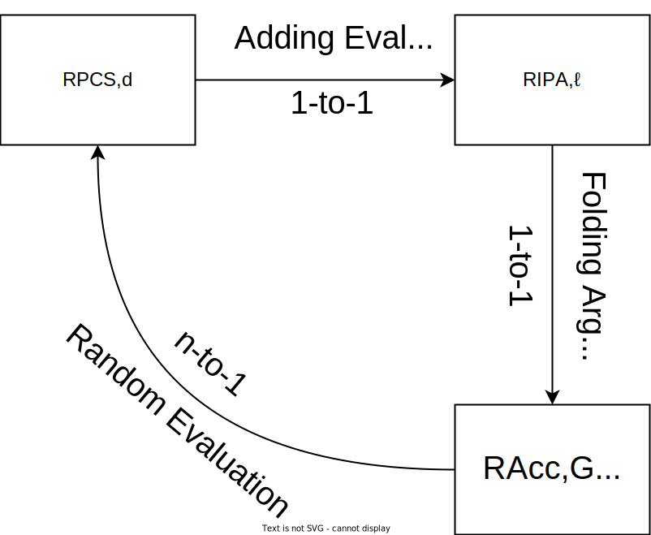
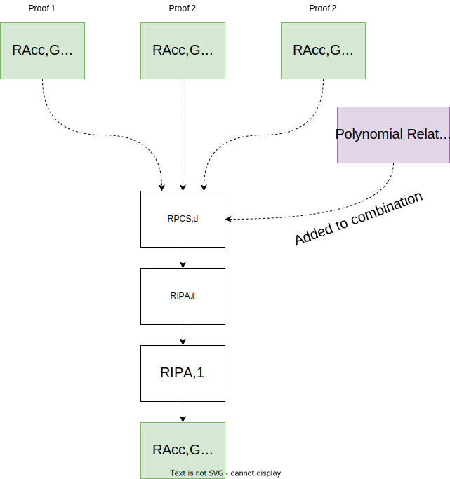

    # Accumulation

## Introduction

The trick below was originally described in [Halo](https://eprint.iacr.org/2019/1021.pdf),
however we are going to base this post on the abstraction of "accumulation schemes" described by Bünz, Chiesa, Mishra and Spooner in [Proof-Carrying Data from Accumulation Schemes](https://eprint.iacr.org/2020/499.pdf), in particular the scheme in Appendix A. 2.

Relevant resources include:

- [Proof-Carrying Data from Accumulation Schemes](https://eprint.iacr.org/2020/499.pdf) by Benedikt Bünz, Alessandro Chiesa, Pratyush Mishra and Nicholas Spooner.
- [Recursive Proof Composition without a Trusted Setup (Halo)](https://eprint.iacr.org/2019/1021.pdf) by Sean Bowe, Jack Grigg and Daira Hopwood.

This page describes the most relevant parts of these papers and how it is implemented in Pickles/Kimchi.
It is not meant to document the low-level details of the code in Pickles, but to describe what the code aims to do,
allowing someone reviewing / working on this part of the codebase to gain context.

## Interactive Reductions Between Relations

The easiest way to understand "accumulation schemes" is as a set of interactive reductions between relations.
An interactive reduction $\relation \to \relation'$ proceeds as follows:

- The prover/verifier starts with some statement $\statement$, the prover additionally holds $\witness$.
- They then run some protocol between them.
- After which, they both obtain $\statement'$ and the prover obtains $\witness'$

Pictorially:

<figure>

<figcaption>
<b>
Fig 1.
</b>
An overview the particular reductions/languages (described below) we require.
</figcaption>
</figure>

With the security/completeness guarantee that:

$$
(\statement, \witness) \in \relation
\iff
(\statement', \witness') \in \relation'
$$

Except with negligible probability.

In other words: we have reduced membership of $\relation$ to membership of $\relation'$
using interaction between the parties: unlike a classical Karp-Levin reduction the soundness/completeness may rely on random coins and multiple rounds.
Foreshadowing here is a diagram/overview of the reductions
(the relations will be described as we go)
used in Pickles:

<figure>

<figcaption>
<b>
Fig 2.
</b>
An overview the particular reductions/languages (described below) we require.
</figcaption>
</figure>

As you can see from Fig. 2, we have a cycle of reductions (following the arrows) e.g. we can reduce a relation "$\relation_{\mathsf{Acc}, \vec{G}}$" to itself by applying all 4 reductions. This may seem useless: why reduce a relation to itself?

However the crucial point is the "in-degree" (e.g. n-to-1) of these reductions:
take a look at the diagram and note that
<u>any</u> number of $\relAcc$ instances can be reduced to a <u>single</u> $\relPCS{\degree}$ instance!
This $\relPCS{d}$ instance can then be converted to a single $\relAcc$
by applying the reductions (moving "around the diagram" by running one protocol after the other):

$$
\relPCS{\degree} \to
\relIPA{\ell}  \to
\relIPA{1} \to
\relAcc
$$

**Note:** There are many examples of interactive reductions, an example familiar to the reader is PlonK itself:
which reduces circuit-satisfiability $\relation_{C}$ ($\statement$ is the public inputs and $\witness$ is the wire assignments)
to openings of polynomial commitments $\relPCS{d}$ ($\statement'$ are polynomial commitments and evaluation points, $\witness$ is the opening of the commitment).

More Theory/Reflections about Interactive Reductions (click to expand)

 

As noted in
[Compressed $\Sigma$-Protocol Theory and Practical Application to Plug & Play Secure Algorithmics](https://eprint.iacr.org/2020/152.pdf)
every Proof-of-Knowledge (PoK) with $k$-rounds for a relation $\relation$ can instead be seen as a reduction to some relation $\relation'$
with $k-1$ rounds as follows:

- Letting $\statement'$ be the view of the verifier.
- $\witness'$ be a $k$'th-round message which could make the verifier accept.

Hence the relation $\relation'$ is the set of verifier views (except for the last round) and the last missing message which would make the verifier accept if sent.

This simple, yet beautiful, observation turns out to be <u>extremely useful</u>: rather than explicitly sending the last-round message (which may be large/take the verifier a long time to check), the prover can instead prove that <u>he knows</u> a last-round message which <u>would make the verifier accept</u>, after all, sending the witness $\witness'$ is a particularly simple/inefficient PoK for $(\statement', \witness') \in \relation'$.

The reductions in this document are all of this form (including the folding argument):
receiving/verifying the last-round message would require too many resources (time/communication) of the verifier,
hence we instead replace it with yet another reduction to yet another language (e.g. where the witness is now half the size).

Hence we end up with a chain of reductions: going from the languages of the last-round messages.
An "accumulation scheme" is just an example of such a chain of reductions which happens to be a cycle.
Meaning the language is "self-reducing" via a series of interactive reductions.

**A Note On Fiat-Shamir:** All the protocols described here are public coin and hence in implementation
the Fiat-Shamir transform is applied to avoid interaction: the verifiers challenges are sampled using a hash function (e.g. Poseidon) modelled as a reprogrammable random oracle.

## Polynomial Commitment Openings $\relPCS{d}$

Recall that the polynomial commitment scheme (PCS) in Kimchi is just the trivial scheme based on Pedersen commitments.
For Kimchi we are interested in "accumulation for the language ($\relation_{\mathsf{PCS}, d}$) of polynomial commitment openings", meaning that:

$$
\left(
\statement = (\comm, \vec{G}, \openx, \openy),
\witness= (\vec{f})
\right)
\in
\relation_{\mathsf{PCS},d}
\iff
\left\{
\begin{align}
\comm &= \langle \vec{f}, \vec{G} \rangle \\
\openy &= \sum_{i = 0}^{d-1} f_i \cdot \openx^i
\end{align}
\right\}
$$

Where $\vec{f}$ is a list of $d$ coefficients for a polynomial $f(X) \coloneqq \sum_{i=0}^{d-1} f_i \cdot X^i$.

This is the language we are interested in reducing: providing a trivial proof, i.e. sending $\vec{f}$ requires linear communication and time of the verifier,
we want a poly-log verifier.
The communication complexity will be solved by a well-known folding argument, however to reduce computation we are going to need the "Halo trick".

First a reduction from PCS to an inner product relation.

## Reduction 1: $\relation_{\mathsf{PCS},d} \to \relation_{\mathsf{IPA},\ell}$

Formally the relation of the inner product argument is:

$$
\left(
\statement = (\comm, \vec{G}, H, \vec{\openx}, y),
\witness = (\vec{f})
\right)
\in
\relation_{\mathsf{IPA},\ell}
\iff
\left\{
\begin{align}
\openy &=
\langle
\vec{f},
\vec{\openx}
\rangle \in \FF \\
\land \\
\comm &= \langle \vec{f}, \vec{G} \rangle + [\openy] \cdot \genOpen \in \GG
\end{align}
\right\}
$$ where $\vec{f},\vec{\openx}, \vec{G}$ are of length $\ell$.

We can reduce $\left(\statement = (\comm, \vec{G}, \openx, \openy),
\witness = (\vec{f})\right) \in
\relation_{\mathsf{PCS}, d}$ to $\relation_{\mathsf{IPA}, \ell}$ with $d = \ell$ as follows:

- Define $\vec{\openx} = (1, \openx, \openx^2, \openx^3, \ldots, \openx^{\ell-1})$. Because $\vec{f}$ was a satisfying witness to $\relation_{\mathsf{PCS}, d}$,  we have $\openy = f(\openx) = \langle \vec{f}, \vec{\openx} \rangle$. The prover sends $y$.
- The verifier adds the evaluation $\openy$ to the commitment "in a new coordinate" as follows:
    1. Verifier picks $\genOpen \sample \GG$ and sends $H$ to the prover.
    2. Prover/Verifier updates $\comm \gets \comm + [\openy] \cdot \genOpen$

Intuitively we sample a fresh $\genOpen$ to avoid a malicious prover "putting something in the $H$-position", because he must send $\openy$ before seeing $\genOpen$, hence he would need to guess $\genOpen$ before-hand.
If the prover is honest, we should have a commitment of the form:

$$
C =
\langle \vec{f}, \vec{G} \rangle + [\openy] \cdot H
=
\langle \vec{f}, \vec{G} \rangle + [\langle \vec{\openx}, \vec{f} \rangle] \cdot H
\in \GG
$$

**Note:** In some variants of this reduction $H$ is chosen as $[\delta] \cdot J$ for a constant $J \in \GG$ where $\delta \sample \FF$ by the verifier,
this also works, however we (in Kimchi) simply hash to the curve to sample $H$.

## Reduction 2 (Incremental Step): $\relation_{\mathsf{IPA},\ell} \to \relation_{\mathsf{IPA},\ell/2}$

**Note:** The folding argument described below is the particular variant implemented in Kimchi, although some of the variable names are different.

The folding argument reduces a inner product with $\ell$ (a power of two) coefficients to an inner product relation with $\ell / 2$ coefficients.
To see how it works let us rewrite the inner product in terms of a first and second part:

$$
\langle \vec{f}, \vec{\openx} \rangle =
\langle \vec{f}_L, \vec{\openx}_L \rangle
+
\langle \vec{f}_R, \vec{\openx}_R \rangle
\in \FF
$$

Where $\vec{f}_L = (f_1, \ldots, f_{\ell/2})$ and $\vec{f}_R = (f_{\ell/2 + 1}, \ldots, f_\ell)$,
similarly for $\vec{\openx}$.

Now consider a "randomized version" with a challenge $\chalfold \in \FF$ of this inner product:

$$
    \begin{align}
    \langle \vec{f}_L + \chalfold^{-1} \cdot \vec{f}_R, \ \vec{\openx}_L + \chalfold \cdot \vec{\openx}_R \rangle
    &=
    \chalfold^{-1} \cdot  \langle \vec{f}_R, \vec{\openx}_L \rangle \\
    &+ \underline{\color{magenta} \left(\langle \vec{f}_R, \vec{\openx}_R \rangle + \langle \vec{f}_L, \vec{\openx}_L \rangle\right)} \\
    &+ \chalfold \cdot \langle \vec{f}_L, \vec{\openx}_R \rangle
    \end{align}
$$

Additional intuition: How do you arrive at the expression above? (click to expand)

 
The trick is to ensure that
$\langle \vec{f}_R, \vec{\openx}_R \rangle + \langle \vec{f}_L, \vec{\openx}_L \rangle = \langle \vec{f}, \vec{\openx} \rangle = v$
ends up in the same power of $\chalfold$.

The particular expression above is not special and arguably not the most elegant:
simpler alternatives can easily be found
and the inversion can be avoided, e.g. by instead using:
$$
    \begin{align}
    \langle \vec{f}_L + \chalfold \cdot \vec{f}_R, \ \chalfold \cdot \vec{\openx}_L + \vec{\openx}_R \rangle
    &= \langle \vec{f}_L, \vec{\openx}_R \rangle \\
    &+ \chalfold  \cdot \underline{\color{magenta} \left(\langle \vec{f}_R, \vec{\openx}_R \rangle + \langle \vec{f}_L, \vec{\openx}_L \rangle\right)} \\
    &+ \chalfold^2 \cdot  \langle \vec{f}_R, \vec{\openx}_L \rangle
    \end{align}
$$
Which will have the same overall effect of isolating the interesting term (this time as the $\chalfold$-coefficient).
The particular variant above can be found in e.g. [Compressed $\Sigma$-Protocol Theory and Practical Application to Plug & Play Secure Algorithmics](https://eprint.iacr.org/2020/152.pdf)
and proving extraction is somewhat easier than the variant used in Kimchi.

The term we care about (underlined in magenta) is $\langle \vec{f}_R, \vec{\openx}_R \rangle + \langle \vec{f}_L, \vec{\openx}_L \rangle = v$, the other two terms are cross-term garbage.
The solution is to let the prover provide commitments to the cross terms to "correct" this randomized splitting of the inner product <u>before</u> seeing $\chalfold$:
the prover commits to the three terms (one of which is already provided) and the verifier computes a commitment to the new randomized inner product. i.e.

The prover sends commitment to the cross terms $\langle \vec{f}_R, \vec{\openx}_L \rangle$ and $\langle \vec{f}_L, \vec{\openx}_R \rangle$:

$$
L = \langle \vec{f}_R \Vert \vec{0}, \vec{G} \rangle + [\langle \vec{f}_R, \vec{\openx}_L \rangle] \cdot H
$$

<!--
$$
L = \langle \vec{f}_R, \vec{G}_L \rangle + [\langle \vec{f}_R, \vec{\openx}_L \rangle] \cdot H
$$
-->

$$
R = \langle \vec{0} \Vert \vec{f}_L, \vec{G} \rangle + [\langle \vec{f}_L, \vec{\openx}_R \rangle] \cdot H
$$

The verifier samples $\chalfold \sample \FF$ and updates the commitment as:

$$
\begin{align}
C' &= [\chalfold^{-1}] \cdot L + C + [\chalfold] \cdot R \\
   &\ \\
   &= {\langle \chalfold^{-1} \cdot (\vec{f}_R \Vert \vec{0}) + (\vec{f}_L \Vert \vec{f}_R) + \chalfold \cdot (\vec{0} \Vert \vec{f}_L), \vec{G} \rangle} \\
   &+
    \left[
        {
          \chalfold^{-1} \cdot \langle \vec{f}_R, \vec{\openx}_L \rangle
          +
          {
          \color{magenta}
            \langle \vec{f}_L, \vec{\openx}_L \rangle
            + \langle \vec{f}_R, \vec{\openx}_R \rangle
            }
        + \chalfold \cdot \langle \vec{f}_L, \vec{\openx}_R \rangle
    }\right] \cdot H \\
   &\ \\
   &=
   {\color{blue} \left\langle
        \left(
        \vec{f}_L + \chalfold^{-1} \vec{f}_R
        \right)
        \Vert
        \left(
        \chalfold \cdot \vec{f}_L + \vec{f}_R
        \right)
        ,
        \vec{G} \right\rangle} \\
   &+
   \left[
    {
    \color{green}
    \langle
    \vec{f}_L + \chalfold^{-1} \cdot \vec{f}_R
    ,
    \vec{\openx}_L
    \rangle
    +
    \langle
    \chalfold \cdot \vec{f}_L +\vec{f}_R
    ,
    \vec{\openx}_R
    \rangle
    }
    \right] \cdot H
\end{align}
$$

The final observation in the folding argument is simply that:

$$
\chalfold \vec{f}_L + \vec{f}_R
=
\chalfold
\cdot
\left(
{
    \color{purple}
    \vec{f}_L + \chalfold^{-1} \cdot \vec{f}_R
}
\right)
=
\chalfold
\cdot
{
\color{purple}
\vec{f}'
}
$$
where ${
\color{purple}
\vec{f}'
}$ is the new witness.

Hence we can replace occurrences of $\chalfold \vec{f}_L + \vec{f}_R$ by $\chalfold \vec{f}'$,
with this look at the green term:

$$
\begin{align}
    {
    \color{green}
    \langle
    \vec{f}_L + \chalfold^{-1} \cdot \vec{f}_R
    ,
    \vec{\openx}_L
    \rangle
    +
    \langle
    \chalfold \cdot \vec{f}_L +\vec{f}_R
    ,
    \vec{\openx}_R
    \rangle
    }
  &=
    {
    \langle
    \vec{f}'
    ,
    \vec{\openx}_L
    \rangle
    +
    \langle
    \chalfold \cdot \vec{f}'
    ,
    \vec{\openx}_R
    \rangle
    } \\
   &=
    {
    \langle
    {
    \vec{f}'
    }
    ,
    \vec{\openx}_L
    \rangle
    +
    \langle
    {
    \vec{f}'
    }
    ,
    \chalfold
    \cdot
    \vec{\openx}_R
    \rangle
    } \\
   &=
    {
    \langle
    \vec{f}'
    ,
    \vec{\openx}_L
    +
    \chalfold
    \cdot
    \vec{\openx}_R
    \rangle
    } \\
    &=
    \langle
    \vec{f}',
    \vec{\openx}'
    \rangle
\end{align}
$$

By defining $\vec{\openx}' = \vec{\openx}_L + \chalfold \cdot \vec{\openx}_R$.
We also rewrite the blue term in terms of $\vec{f}'$ similarly:
$$
\begin{align}
   {\color{blue} \left\langle
        \left(
        \vec{f}_L + \chalfold^{-1} \cdot \vec{f}_R
        \right)
        \Vert
        \left(
        \chalfold \cdot \vec{f}_L + \vec{f}_R
        \right)
        ,
        \vec{G} \right\rangle}
    &=
   {\langle
        \vec{f}'
        \Vert
        (
        \chalfold \cdot \vec{f}'
        )
        ,
        \vec{G} \rangle} \\
    &=
   {\langle
        \vec{f}'
        \Vert
        \vec{f}'
        ,
        \vec{G}_L \Vert ([\chalfold] \cdot \vec{G}_R) \rangle} \\
    &=
   \langle
    \vec{f}'
    ,
    \vec{G}'
   \rangle
\end{align}
$$

By defining $\vec{G}' = \vec{G}_L + [\chalfold] \cdot \vec{G}_R$.
In summary by computing:
$$
\begin{align}
C' &\gets [\chalfold^{-1}] \cdot L + C + [\chalfold] \cdot R \in \GG \\
\vec{f}' &\gets \vec{f}_L + \chalfold^{-1} \cdot \vec{f}_R \in \FF^{\ell / 2} \\
\vec{\openx}' &\gets \vec{\openx}_L + \chalfold \cdot \vec{\openx}_R \in \FF^{\ell / 2} \\
\vec{G}' &\gets \vec{G}_L + [\chalfold] \cdot \vec{G}_R \in \GG^{\ell / 2} \\
\openy'       &\gets \langle \vec{f'}, \vec{\openx}' \rangle
\end{align}
$$

We obtain a new instance of the inner product relation (of half the size):

$$
(
\statement = (C', \vec{G}', H, \vec{\openx}'),
\witness = (\vec{f}', \openy')
) \in
\relation_{\mathsf{IPA}, \ell/2}
$$

At this point the prover could send $\vec{\openx}'$, $\vec{f}'$ to the verifier who could verify the claim:

1. Computing $\vec{G}'$ from $\chalfold$ and $\vec{G}$
2. Computing $C'$ from $\vec{f}'$, $H$ and $L,R$ (obtained from the preceeding round)
3. Checking $\openy' \overset?= \langle \vec{f}', \vec{\openx}' \rangle$

This would require half as much communication as the naive proof. A modest improvement...

However, we can iteratively apply this transformation until we reach an instance of constant size:

## Reduction 2 (Full): $\relIPA{\ell} \to \ldots \to \relIPA{1}$

That the process above can simply be applied again to the new $(C', \vec{G}', H, \vec{\openx}', v) \in \relation_{\mathsf{IPA}, \ell/2}$ instance as well.
By doing so $k = \log_2(\ell)$ times the total communication is brought down to $2 k$ $\GG$-elements
until the instance consists of $(\comm, \vec{G}, \genOpen, \vec{\openx}) \in \relIPA{1}$
at which point the prover simply provides the witness $\vec{f}' \in \FF$.

Because we need to refer to the terms in the intermediate reductions
we let
$\vec{G}^{(i)}$, $\vec{f}^{(i)}$, $\vec{\openx}^{(i)}$
be the
$\vec{G}'$, $\vec{f}'$, $\vec{\openx}'$ vectors respectively after $i$ recursive applications, with $\vec{G}^{(0)}$, $\vec{f}^{(0)}$, $\vec{\openx}^{(0)}$ being the original instance.
We will drop the vector arrow for $\vec{G}^{(k)}$ (similarly, for $f,x$), since the last step vector has size $1$, so we refer to this single value instead.
We denote by $\chalfold_i$ the challenge of the $i$'th application.

## Reduction 3: $\relation_{\mathsf{IPA},1} \to \relation_{\mathsf{Acc},\overset{\rightarrow}{G} }$

While the proof for $\relIPA{\ell}$ above has $O(\log(\ell))$-size, the verifiers time-complexity is $O(\ell)$:

- Computing $G^{(k)}$ from $\vec{G}^{(0)}$ using $\vec{\chalfold}$ takes $O(\ell)$.
- Computing $\openx^{(k)}$ from $\vec{\openx}^{(0)}$ using $\vec{\chalfold}$ takes $O(\ell)$.

The rest of the verifiers computation is only $O(\log(\ell))$, namely computing:

- Sampling all the challenges $\chalfold \sample \FF$.
- Computing $C^{(i)} \gets [\chalfold_i^{-1}] \cdot L^{(i)} + C^{(i-1)} + [\chalfold_i] \cdot R^{(i)}$ for every $i$

However, upon inspection, the more pessimistic claim that computing $\vec{\openx}^{(k)}$ takes $O(\ell)$ turns out to be false:

**Claim:**
Define
$
\hpoly(X) \coloneqq \prod_{i = 0}^{k - 1} \left(1 + \chalfold_{k - i} \cdot X^{2^i}\right)
$,
then
$
\openx^{(k)} = \hpoly(\openx)
$ for all $\openx$. Therefore, $\openx^{(k)}$ can be evaluated in $O(k) = O(\log \ell)$.

**Proof:**
This can be verified by looking at the expansion of $\hpoly(X)$.
Define $\{h_i\}_{i=0}^l$ to be the coefficients of $\hpoly(X)$, that is $\hpoly(X) = \sum_{i=1}^\ell h_i \cdot X^{i-1}$.
Then the claim is equivalent to $\openx^{(k)} = \sum_{i=1}^{\ell} h_i \cdot \openx^{i-1}$.
Let $\vec{b}(i,j)$ denote the $j$th bit in the bit-decomposition of the index $i$ and observe that:
$$
h_i = \prod_{j=1}^k \vec \chalfold_{k-j}^{b(i,j)} \text{\qquad where\qquad } \sum_{j} \vec b(i,j) \cdot 2^j = i
$$
Now, compare this with how a $k$th element of $x^{(i)}$ is constructed:
$$
\begin{align*}
x^{(1)}_k &= x^{(0)}_k + \alpha_1 \cdot x^{(0)}_{n/2+k}\\
x^{(2)}_k &= x^{(1)}_k + \alpha_2 \cdot x^{(2)}_{n/4+k}\\
&= x^{(0)}_k + \alpha_1 \cdot x^{(0)}_{n/2+k} + \alpha_2 \cdot (x^{(0)}_{n/4+k} + \alpha_1 \cdot x^{(0)}_{n/2 + n/4 +k})\\
&= \sum_{i=0}^3 x^{(0)}_{i \cdot \frac{n}{4} + k} \cdot \big( \prod_{j=0}^1 \alpha_j^{b(i,j)} \big)
\end{align*}
$$
Recalling that $x^{(0)}_k = x^k$, it is easy to see that this generalizes exactly to the expression for $h_i$ that we derived later, which concludes that evaluation through $h(X)$ is correct.

Finally, regarding evaluation complexity, it is clear that $\hpoly$ can be evaluated in $O(k = \log \ell)$ time as a product of $k$ factors.
This concludes the proof.

#### The "Halo Trick"

The "Halo trick" resides in observing that this is also the case for $\vec{G}^{(k)}$:
since it is folded the same way as $\vec{\openx}^{(k)}$. It is not hard to convince one-self (using the same type of argument as above) that:

$$
G^{(k)} = \langle \vec{h}, \vec{G} \rangle
$$

Where $\vec{h}$ is the coefficients of $h(X)$ (like $\vec{f}$ is the coefficients of $f(X)$), i.e. $h(X) = \sum_{i = 1}^{\ell} h_i X^{i-1}$

For notational convince (and to emphasise that they are 1 dimensional vectors), define/replace:

$$
U = \vec{G}^{(k)} \in \GG, \ \ \ c = \vec{f}^{(k)} \in \FF, \ \ \ h(\openx) = \vec{\openx}^{(k)} \in \FF
$$

With this we define the "accumulator language" which states that "$U$" was computed correctly:

$$
\left(\statement = (U, \vec{\chalfold}), \witness = \epsilon\right)
\in
\relation_{\mathsf{Acc}, \vec{G}}
\iff
\left\{
    \begin{align}
       h(X) &\coloneqq \prod_{i = 0}^{k - 1} \left(1 + \chalfold_{k - i} \cdot X^{2^i}\right)
    \land \ U = \langle \vec{h}, \vec{G} \rangle
    \end{align}
\right\}
$$

**Note:** since there is <u>no witness</u> for this relation anyone can verify the relation (in $O(\ell)$ time)
by simply computing $\langle \vec{h}, \vec{G} \rangle$ in linear time.
Instances are also small: the size is dominated by $\vec{\chalfold}$ which is $|\vec{\chalfold}| = \log_2 \ell$.

**In The Code:** in the Kimchi code $\vec{\accChal}$ is called `prev_challenges` and $\accCom$ is called `comm`,
all defined in the `RecursionChallenge` struct.

Now, using the new notation rewrite $\relation_{\mathsf{IPA},1}$ as:

$$
\left(
\statement = (\comm, \accCom, \genOpen, h(\openx)),
\witness = (c)
\right)
\in
\relation_{\mathsf{IPA},1}
\iff
\left\{
\begin{align}
\openy &= c \cdot h(\openx) \\
\land \ \comm &= [c] \cdot \accCom + [\openy] \cdot \genOpen \in \GG
\end{align}
\right\}
$$

**Note:**
It is the same relation, we just replaced some names
($c = \vec{f}^{(k)}$, $\vec{\openx}^{(k)} = \hpoly(\openx)$)
and simplified a bit:
inner products between 1-dimensional vectors are just multiplications.

We now have all the components to reduce $\relIPA{1} \to \relAcc$ (with no soundness error) as follows:

1. Prover sends $c, \accCom$ to the verifier.
2. Verifier does:
    - Compute $\openy \gets h(\openx) \cdot c$
    - Checks $\comm \overset?= [c] \cdot \accCom + [\openy] \cdot \genOpen$
3. Output
$(\statement = (\accCom, \vec{\accChal}), \witness = \epsilon) \in \relAcc$

**Note:** The above can be optimized, in particular there is no need for the prover to send $\accCom$.

## Reduction 4: $\relation_{\mathsf{Acc}, \overset{\rightarrow}{G}} \to \relation_{\mathsf{PCS}, d}$

Tying the final knot in the diagram.

The expensive part in checking $
(\accCom, \vec{\chalfold})
\in
\relation_{\mathsf{Acc}, \vec{G}}
$ consists in computing
$\langle \vec{h}, \vec{G} \rangle$
given the $\vec{\chalfold}$ describing $h(X)$: first expanding $\vec{\chalfold}$ into $\vec{h}$, then computing the MSM.
However, by observing that
$\accCom = \langle \vec{h}, \vec{G} \rangle$ is actually <u>a polynomial commitment</u> to $h(X)$, which we can evaluate at any point using $O(\log \ell)$ operations,
we arrive at a simple strategy for reducing any number of such claims to a single polynomial commitment opening:

1. Prover sends $\accCom^{(1)}, \ldots, \accCom^{(n)}$ to the verifier.
2. Verifier samples $\chaleval \sample \FF$, $u \sample \FF$ and computes:

$$
\begin{align}
y &= \sum_i \ \chalfold^{i-1} \cdot h^{(i)}(u) \in \FF \\
C &= \sum_i \ [\chalfold^{i-1}] \cdot U^{(i)} \in \GG
\end{align}
$$
Alternatively:
$$
\begin{align}
y &= \sum_i \ u^{i-1} \cdot h^{(i)}(\chaleval) \in \FF \\
C &= \sum_i \ [u^{i-1}] \cdot U^{(i)} \in \GG
\end{align}
$$

And outputs the following claim:

$$
(C, \chaleval, y) \in \language_{\mathsf{PCS},\ell}
$$

i.e. the polynomial commitment $C$ opens to $y$ at $\chaleval$. The prover has the witness:

$$
f(X) = \sum_i \ \chalfold^{i-1} \cdot h^{(i)}(X)
$$

Why is this a sound reduction: if one of the $U^{(i)}$ does not commit to $h^{(i)}$ then they disagree except on at most $\ell$ points,
hence $f^{(i)}(\chaleval) \neq h^{(i)}(\chaleval)$ with probability $\ell/|\FF|$.
Taking a union bound over all $n$ terms leads to soundness error $\frac{n \ell}{|\FF|}$ -- negligible.

The reduction above requires $n$ $\GG$ operations and $O(n \log \ell)$ $\FF$ operations.

## Support for Arbitrary Polynomial Relations

Additional polynomial commitments (i.e. from PlonK) can be added to the randomized sums $(C, y)$ above and opened at $\chaleval$ as well: in which case the prover proves the claimed openings at $\chaleval$ before sampling the challenge $u$.
This is done in Kimchi/Pickles: the $\chaleval$ and $u$ above is the same as in the Kimchi code.
The combined $y$ (including both the $h(\cdot)$ evaluations and polynomial commitment openings at $\chaleval$ and $\chaleval \omega$) is called `combined_inner_product` in Kimchi.

<figure>

<figcaption>
<b>
Fig 3.
</b>
Cycle of reductions with the added polynomial relations from PlonK.
</figcaption>
</figure>

This $\relation_{\mathsf{PCS},\ell}$ instance reduced back into a single $\relAcc$ instance,
which is included with the proof.

## Multiple Accumulators (PCD Case)

From the section above it may seem like there is always going to be a single $\relAcc$ instance,
this is indeed the case if the proof only verifies a <u>single</u> proof, "Incremental Verifiable Computation" (IVC) in the literature.
If the proof verifies <u>multiple</u> proofs, "Proof-Carrying Data" (PCD), then there will be multiple accumulators:
every "input proof" includes an accumulator ($\relAcc$ instance),
all these are combined into the new (single) $\relAcc$ instance included in the new proof:
this way, if one of the original proofs included an invalid accumulator and therefore did not verify, the new proof will also include an invalid accumulator and not verify with overwhelming probability.

<figure>

<figcaption>
<b>
Fig 4.
</b> Multiple accumulators from previous input proofs (part of the witness) and the polynomial relations for the new proof are combined and reduced into the new accumulator.
</figcaption>
</figure>

Note that the new proof contains the (single) accumulator of each "input" proof, even though the proofs themselves are part of the witness:
this is because verifying each input proof results in an accumulator (which could then be checked directly -- however this is expensive):
the "result" of verifying a proof is an accumulator (instance of $\relAcc$) -- which can be verified directly or further "accumulated".

These accumulators are the `RecursionChallenge` structs included in a Kimchi proof.
The verifier check the PlonK proof (which proves accumulation for each "input proof"), this results in some number of polynomial relations,
these are combined with the accumulators for the "input" proofs to produce the new accumulator.

## Accumulation Verifier

The section above implicitly describes the work the verifier must do,
but for the sake of completeness let us explicitly describe what the verifier must do to verify a Fiat-Shamir compiled proof of the transformations above.
This constitutes "the accumulation" verifier which must be implemented "in-circuit" (in addition to the "Kimchi verifier"),
the section below also describes how to incorporate the additional evaluation point $\chaleval \cdot \omega$ ("the step", used by Kimchi to enforce constraints between adjacent rows).
Let $\mathcal{C} \subseteq \FF$ be the challenge space (128-bit GLV decomposed challenges):

1. PlonK verifier on $\pi$ outputs polynomial relations (in Purple in Fig. 4).
1. Checking $\relation_{\mathsf{Acc}, \vec{G}}$ and polynomial relations (from PlonK) to $\relation_{\mathsf{PCS},d}$ (the dotted arrows):
    1. Sample $\chaleval \sample \mathcal{C}$ (evaluation point) using the Poseidon sponge.
    1. Read claimed evaluations at $\chaleval$ and $\omega \chaleval$ (`PointEvaluations`).
    1. Sample $\chalv \sample \mathcal{C}$ (commitment combination challenge, `polyscale`) using the Poseidon sponge.
    1. Sample $\chalu \sample \mathcal{C}$ (evaluation combination challenge, `evalscale`) using the Poseidon sponge.
        - The $(\chalv, \chalu)$ notation is consistent with the Plonk paper where $\chalv$ recombines commitments and $\chalu$ recombines evaluations
    1. Compute $C \in \GG$ with $\chalv$ from:
        - $\accCom^{(1)}, \ldots, \accCom^{(n)}$ (`RecursionChallenge.comm` $\in \GG$)
        - Polynomial commitments from PlonK (`ProverCommitments`)
    1. Compute $\openy_{\chaleval}$ (part of `combined_inner_product`) with $\chalv$ from:
        - The evaluations of $h^{(1)}(\chaleval), \ldots, h^{(n)}(\chaleval)$
        - Polynomial openings from PlonK (`ProofEvaluations`) at $\chaleval$
    1. Compute $\openy_{\chaleval\omega}$ (part of `combined_inner_product`) with $\chalv$ from:
        - The evaluations of $h^{(1)}(\chaleval\omega), \ldots, h^{(n)}(\chaleval\omega)$
        - Polynomial openings from PlonK (`ProofEvaluations`) at $\chaleval \cdot \omega$

        At this point we have two PCS claims, these are combined in the next transform.
        

        At this point we have two claims:
            $$
            \begin{align}
            (\comm, \chaleval, \openy_{\chaleval}) &\in \langPCS{\degree} \\
            (\comm, \chaleval\omega, \openy_{\chaleval\omega}) &\in \langPCS{\degree}
            \end{align}
            $$
        These are combined using a random linear combination with $\chalv$ in the inner product argument
        (see [Different functionalities](../plonk/inner_product_api.html) for details).
        

1. Checking $\relation_{\mathsf{PCS}, d} \to \relation_{\mathsf{IPA},\ell}$.
    1. Sample $\genOpen \sample \GG$ using the Poseidon sponge: hash to curve.
    1. Compute $\openy \gets \openy_{\chaleval} + \chalu \cdot \openy_{\chaleval\omega}$.
    1. Update $\comm' \gets \comm + [\openy] \cdot \genOpen$.
1. Checking $\relation_{\mathsf{IPA}, \ell} \to \relation_{\mathsf{IPA},1}$:  
   Check the correctness of the folding argument, for every $i = 1, \ldots, k$:
    1. Receive $L^{(i)}, R^{(i)} \in \GG$ (see the vector `OpeningProof.lr` in Kimchi).
    1. Sample $\chalfold_i \sample \mathcal{C}$ using the Poseidon sponge.
    1. Compute $C^{(i)} = [\chalfold_i^{-1}] \cdot L + C^{(i-1)} + [\chalfold_i] \cdot R$ (using GLV endomorphism)  
       (**Note:** to avoid the inversion the element $P = [\chalfold_i^{-1}] \cdot L$ is witnessed
       and the verifier checks $[\chalfold_i] \cdot P = [\chalfold_i] \cdot ([\chalfold_i^{-1}] \cdot L) = L$.
       To understand why computing the field inversion would be expensive
       see [deferred computation](deferred.html))
1. Checking $\relation_{\mathsf{IPA},1} \to \relation_{\mathsf{Acc}, \vec{G}}$
    1. Receive $c$ form the prover.
    1. Define $\hpoly$ from $\vec{\chalfold}$ (folding challenges, computed above).
    1. Compute a combined evaluation of the IPA challenge polynomial on two points: $b = \hpoly(\chaleval) + \chalu \cdot \hpoly(\chaleval \omega)$
       - Computationally, $b$ is obtained inside bulletproof folding procedure, by folding the vector $b_{\mathsf{init}}$ such that $b_{\mathsf{init},j} = \zeta^j + v \cdot \zeta^j w^j$ using the same standard bulletproof challenges that constitute $h(X)$. This $b_{\mathsf{init}}$ is a $v$-recombined evaluation point. The equality is by linearity of IPA recombination.
    1. Compute $\openy' \gets c \cdot b = c \cdot (\hpoly(\chaleval) + \chalu \cdot \hpoly(\chaleval \omega))$, this works since:
       $$
       \openx^{(\rounds)} =
       \openx^{(\rounds)}_{\chaleval} + \chalu \cdot \openx^{(\rounds)}_{\chaleval\omega}
       $$
       See [Different functionalities](../plonk/inner_product_api.html) for more details or
       [the relevant code](https://github.com/o1-labs/proof-systems/blob/76c678d3db9878730f8a4eead65d1e038a509916/poly-commitment/src/commitment.rs#L785).
    1. Compute $\accCom \gets \comm^{(k)} - [\openy'] \cdot \genOpen$    (i.e. st. $\comm^{(k)} = \accCom + [\openy'] \cdot \genOpen$)

Note that the accumulator verifier must be proven (in addition to the Kimchi/PlonK verifier) for each input proof.

## No Cycles of Curves?

Note that the "cycles of curves" (e.g. Pasta cycle) does not show up in this part of the code:
a <u>separate accumulator</u> is needed for each curve and the final verifier must check both accumulators to deem the combined recursive proof valid.
This takes the form of `passthough` data in pickles.

Note however, that the accumulation verifier makes use of both $\GG$-operations and $\FF$-operations,
therefore it (like the Kimchi verifier) also requires [deferred computation](deferred.html).
