# Overview of Pickles

Pickles is a recursion layer built on top of Kimchi. The complexity of pickles
as a protocol lies in specifying how to verify previous kimchi inside of the
current ones. Working over two curves requires us to have different circuits and
a "mirrored" structure, some computations are deferred for efficiency, and one
needs to carefully keep track of the accumulators. In this section we provide a
general overview of pickles, while next sections in the same chapter dive into
the actual implementation details.

Pickles works over [Pasta](../specs/pasta.md), a cycle of curves consisting of
Pallas and Vesta, and thus it defines two generic circuits, one for each curve.
Each can be thought of as a parallel instantiation of a kimchi proof systems.
These circuits are not symmetric and have somewhat different function:

- **Step circuit**: this is the main circuit that contains application logic.
  Each step circuit verifies a statement and potentially several (at most 2)
  other wrap proofs.
- **Wrap circuit**: this circuit merely verifies the step circuit, and does not
  have its own application logic. The intuition is that every time an
  application statement is proven it's done in Step, and then the resulting
  proof is immediately wrapped using Wrap.

#### General Circuit Structure

Both Step and Wrap circuits additionally do a lot of recursive verification of
the previous steps. Without getting too technical, Step (without lost of
generality) does the following:

1. Execute the application logic statement (e.g. the mina transaction is valid)
2. Verify that the previous Wrap proof is (first-)half-valid (perform only main
   checks that are efficient for the curve)
3. Verify that the previous Step proof is (second-)half-valid (perform the
   secondary checks that were inefficient to perform when the previous Step was
   Wrapped)
4. Verify that the previous Step correctly aggregated the previous accumulator,
   e.g.
   $\mathsf{acc}_2 = \mathsf{Aggregate}(\mathsf{acc}_1, \pi_{\mathsf{step},2})$.

The diagram roughly illustrates the interplay of the two kimchi instances.

We note that the Step circuit may repeat items 2-3 to handle the following case:
when Step 2 consumes several Wrap 1.X (e.g. Wrap 1.1, Wrap 1.2, etc), it must
perform all these main Wrap 1.X checks, but also all the deferred Step 1.X
checks where Wrap 1.X wraps exactly Step 1.X.

#### On Accumulators

The accumulator is an abstraction introduced for the purpose of this diagram. In
practice, each kimchi proof consists of (1) commitments to polynomials, (2)
evaluations of them, (3) and the opening proof. What we refer to as accumulator
here is actually the commitment inside the opening proof. It is called `sg` in
the implementation and is semantically a polynomial commitment to `h(X)`
(`b_poly` in the code) --- the poly-sized polynomial that is built from IPA
challenges. It's a very important polynomial -- it can be evaluated in log time,
but the commitment verification takes poly time, so the fact that `sg` is a
commitment to `h(X)` is never proven inside the circuit. For more details, see
[Proof-Carrying Data from Accumulation Schemes](https://eprint.iacr.org/2020/499.pdf),
Appendix A.2, where `sg` is called `U`.

In pickles, what we do is that we "absorb" this commitment `sg` from the
previous step while creating a new proof. That is, for example, Step 1 will
produce this commitment that is denoted as `acc1` on the diagram, as part of its
opening proof, and Step 2 will absorb this commitment. And this "absorption" is
what Wrap 2 will prove (and, partially, Step 3 will also refer to the challenges
used to build `acc1`, but this detail is completely avoided in this overview).
In the end, `acc2` will be the result of Step 2, so in a way `acc2` "aggregates"
`acc1` which somewhat justifies the language used.
