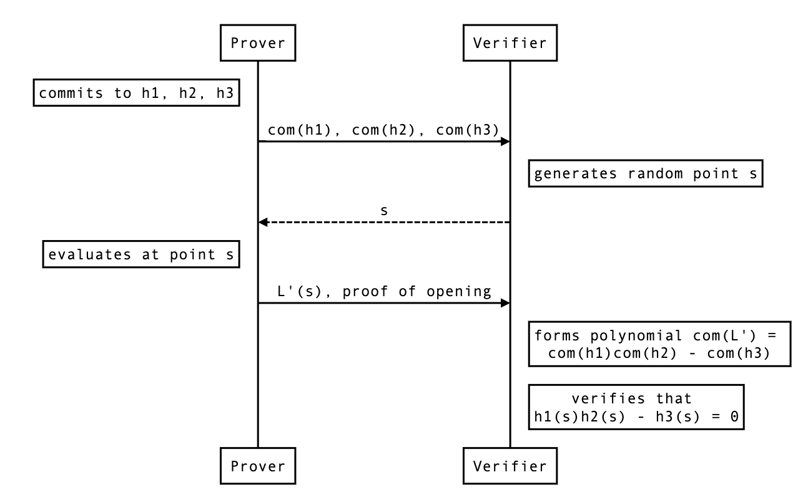

# Maller optimization to reduce proof size

In the PLONK paper, they make use of an optimization from Mary Maller in order to reduce the proof size.

## Explanation

Maller's optimization is used in the "polynomial dance" between the prover and the verifier to reduce the number of openings the prover send.

Recall that the polynomial dance is the process where the verifier and the prover form polynomials together so that:

1. the prover doesn't leak anything important to the verifier
2. the verifier doesn't give the prover too much freedom

In the dance, the prover can additionally perform some steps that will keep the same properties but with reduced communication.

-----

Let's see the protocol where _Prover_ wants to prove to _Verifier_ that

$$\forall x \in \mathbb{F}, \; h_1(x)h_2(x) - h_3(x) = 0$$

given commitments of $h_1, h_2, h_3$, 


<!--
//replace -\- with --:
```sequence
Note left of Prover: commits to h1, h2, h3
Prover->Verifier: com(h1), com(h2), com(h3)
Note right of Verifier: generates random point s
Verifier-\->Prover: s
Note left of Prover: evaluates at point s
Prover->Verifier: h1(s), h2(s), h3(s)
Prover->Verifier: proofs of openings
Note right of Verifier: verifies that \n h1(s)h2(s) - h3(s) = 0
```
-->

A shorter proof exists. Essentially, if the verifier already has the opening `h1(s)`, they can reduce the problem to showing that 

$$ \forall x \in \mathbb{F}, \; L(x) = h_1(s)h_2(x) - h_3(x) = 0$$

given commitments of $h_1, h_2, h_3$ and evaluation of $h1$ at a point $s$.


<!--
//replace -\- with --:
```sequence
Note left of Prover: commits to h1, h2, h3
Prover->Verifier: com(h1), com(h2), com(h3)
Note right of Verifier: generates random point s
Verifier-\->Prover: s
Note left of Prover: evaluates at point s
Prover->Verifier: h1(s), L(s)
Prover->Verifier: proofs of openings
Note right of Verifier: forms polynomial com(L) = \n h1(s)com(h2) - com(h3)
Note right of Verifier: checks that L(s) = 0
```
-->

## Notes

Why couldn't the prover open the polynomial $L'$ directly?

$$L'(x) = h_1(x)h_2(x) - h_3(x)$$

By doing



<!--
```sequence
Note left of Prover: commits to h1, h2, h3
Prover->Verifier: com(h1), com(h2), com(h3)
Note right of Verifier: generates random point s
Verifier->Prover: s
Note left of Prover: evaluates at point s
Prover->Verifier: L'(s), proof of opening
Note right of Verifier: forms polynomial com(L') = \n com(h1)com(h2) - com(h3)
Note right of Verifier: verifies that \n h1(s)h2(s) - h3(s) = 0
```
-->

The problem here is that you can't multiply the commitments together without using a pairing (if you're using a pairing-based polynomial commitment scheme), and you can only use that pairing once in the protocol.

If you're using an inner-product-based commitment, you can't even multiply commitments.

question: where does the multiplication of commitment occurs in the pairing-based protocol of PLONK? And how come we can use bootleproof if we need that multiplication of commitment?

## Appendix: Original explanation from the PLONK paper

https://eprint.iacr.org/2019/953.pdf


For completion, the lemma 4.7:


