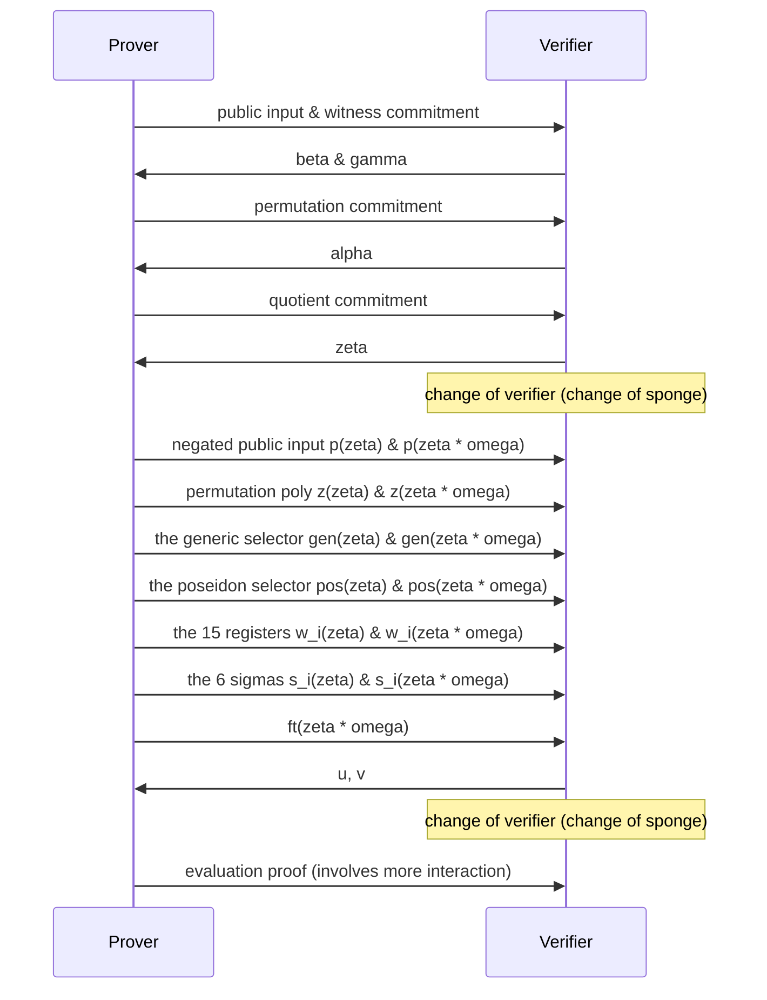

# Kimchi

* This document specifies *kimchi*, a zero-knowledge proof system that's a variant of PLONK.
* This document does not specify how circuits are created or executed, but only how to convert a circuit and its execution into a proof.

Table of content:

<!-- toc -->

## Overview

There are three main algorithms to kimchi:

* [Setup](#constraint-system-creation): takes a circuit and produces a prover index, and a verifier index.
* [Proof creation](#proof-creation): takes the prover index, and the execution trace of the circuit to produce a proof.
* [Proof verification](#proof-verification): takes the verifier index and a proof to verify.

As part of these algorithms, a number of tables are created (and then converted into polynomials) to create a proof.

**Gates**. A circuit is described by a series of gates, that we list in a table. 
The columns of the tables list the gates, while the rows are the length of the circuit. 
For each row, only a single gate can take a value $1$ while all other gates take the value $0$.

|  row  | Generic | Poseidon | CompleteAdd | VarBaseMul | EndoMul | EndoMulScalar | ChaCha0 | ChaCha1 | ChaCha2 | ChaChaFinal |
| :---: | :-----: | :------: | :---------: | :--------: | :-----: | :-----------: | :-----: | :-----: | :-----: | :---------: |
|   0   |    1    |    0     |      0      |     0      |    0    |       0       |    0    |    0    |    0    |      0      |
|   1   |    0    |    1     |      0      |     0      |    0    |       0       |    0    |    0    |    0    |      0      |

**Coefficients**. The coefficient table has 15 columns, and is used to tweak the gates. 
Currently, only the [Generic](#double-generic-gate) and the [Poseidon](#poseidon) gates use it (refer to their own sections to see how). 
All other gates set their values to $0$.

|  row  |   0   |   1   |   2   |   3   |   4   |   5   |   6   |   7   |   8   |   9   |  10   |  11   |  12   |  13   |  14   |
| :---: | :---: | :---: | :---: | :---: | :---: | :---: | :---: | :---: | :---: | :---: | :---: | :---: | :---: | :---: | :---: |
|   0   |   /   |   /   |   /   |   /   |   /   |   /   |   /   |   /   |   /   |   /   |   /   |   /   |   /   |   /   |   /   |

**Registers (or Witness)**. Registers are also defined at every row, and are split into two types: the *IO registers* from $0$ to $6$ usually contain input or output of the gates (note that a gate can output a value on the next row as well). 
I/O registers can be wired to each other (they'll be forced to have the same value), no matter what row they're on (for example, the register at `row:0, col:4` can be wired to the register at `row:80, col:6`). 
The rest of the registers, $7$ through $14$, are called *advice registers* as they can store values that useful only for the row's active gate. 
Think of them as intermediary or temporary values needed in the computation when the prover executes a circuit.

|  row  |   0   |   1   |   2   |   3   |   4   |   5   |   6   |   7   |   8   |   9   |  10   |  11   |  12   |  13   |  14   |
| :---: | :---: | :---: | :---: | :---: | :---: | :---: | :---: | :---: | :---: | :---: | :---: | :---: | :---: | :---: | :---: |
|   0   |   /   |   /   |   /   |   /   |   /   |   /   |   /   |   /   |   /   |   /   |   /   |   /   |   /   |   /   |   /   |


**Wiring (or Permutation, or sigmas)**. For gates to take the outputs of other gates as inputs, we use a wiring table to wire registers together. 
It is defined at every row, but only for the first $7$ registers. 
Each cell specifies a `(row, column)` tuple that it should be wired to.  Cells that are not connected to another cell are wired to themselves.
Note that if three or more registers are wired together, they must form a cycle. 
For example, if register `(0, 4)` is wired to both registers `(80, 6)` and `(90, 0)` then you would have the following table:

|  row  |    0    |   1   |   2   |   3   |    4     |   5   |    6     |
| :---: | :-----: | :---: | :---: | :---: | :------: | :---: | :------: |
|   0   |   0,0   |  0,1  |  0,2  |  0,3  | **80,6** |  0,5  |   0,6    |
|  ...  |         |       |       |       |          |       |          |
|  80   |  80,0   | 80,1  | 80,2  | 80,3  |   80,4   | 80,5  | **90,0** |
|  ...  |         |       |       |       |          |       |          |
|  90   | **0,4** | 90,1  | 90,2  | 90,3  |   90,4   | 90,5  |   90,6   |

**Wiring (Permutation) trace**. You can think of the permutation trace as an extra register that is used to enforce the wiring specified in the wiring table. 
It is a single column that applies on all the rows as well, which the prover computes as part of a proof.

|  row  |  pt   |
| :---: | :---: |
|   0   |   /   |

**Lookup**: TODO

To summarize, the following tables are created and used to describe a circuit:

* gates
* coefficients
* wiring (permutation)
* TODO: lookup

```admonish
This specification does not document how to create a circuit.
```

And to create a proof, the prover will execute the circuit and record an execution trace with the following tables:

* registers
* wiring (permutation) trace
* TODO: lookup

## Dependencies

To specify kimchi, we rely on a number of primitives that are specified outside of this specification.
In this section we list these specifications, as well as the interfaces we make use of in this specification.

### Polynomial Commitments

Refer to the [specification on polynomial commitments](./poly-commitment.md). 
We make use of the following functions from that specification:

- `PolyCom.non_hiding_commit(poly) -> PolyCom::NonHidingCommitment`
- `PolyCom.commit(poly) -> PolyCom::HidingCommitment`
- `PolyCom.evaluation_proof(poly, commitment, point) -> EvaluationProof`
- `PolyCom.verify(commitment, point, evaluation, evaluation_proof) -> bool`

### Poseidon hash function

Refer to the [specification on Poseidon](./poseidon.md). 
We make use of the following functions from that specification:

- `Poseidon.init(params) -> FqSponge`
- `Poseidon.update(field_elem)`
- `Poseidon.finalize() -> FieldElem`

specify the following functions on top:

- `Poseidon.produce_challenge()` (TODO: uses the endomorphism)
- `Poseidon.to_fr_sponge() -> state_of_fq_sponge_before_eval, FrSponge`

With the current parameters:

* S-Box alpha: `7`
* Width: `3`
* Rate: `2`
* Full rounds: `55`
* Round constants: [`fp_kimchi`](https://github.com/o1-labs/proof-systems/blob/0b01f7575cdfa45541fcfcd88d59f73b015af56b/oracle/src/pasta/fp_kimchi.rs#L55), [`fq_kimchi`](https://github.com/o1-labs/proof-systems/blob/0b01f7575cdfa45541fcfcd88d59f73b015af56b/oracle/src/pasta/fq_kimchi.rs#L54)
* MDS matrix: [`fp_kimchi`](https://github.com/o1-labs/proof-systems/blob/0b01f7575cdfa45541fcfcd88d59f73b015af56b/oracle/src/pasta/fp_kimchi.rs#L10), [`fq_kimchi`](https://github.com/o1-labs/proof-systems/blob/0b01f7575cdfa45541fcfcd88d59f73b015af56b/oracle/src/pasta/fq_kimchi.rs#L10)

### Pasta

Kimchi is made to work on cycles of curves, so the protocol switch between two fields Fq and Fr, where Fq represents the base field and Fr represents the scalar field.

See the [Pasta curves specification](./pasta.md).

## Constraints

Kimchi enforces the correct execution of a circuit by creating a number of constraints and combining them together.
In this section, we describe all the constraints that make up the main polynomial $f$ once combined.

We define the following functions:

* `combine_constraints(range_alpha, constraints)`, which takes a range of contiguous powers of alpha and a number of constraints. 
It returns the sum of all the constraints, where each constraint has been multiplied by a power of alpha. 
In other words it returns:
$$ \sum_i \alpha^i \cdot \text{constraint}_i $$

The different ranges of alpha are described as follows:

<!-- generated using `cargo test -p kimchi --lib -- alphas::tests::get_alphas_for_spec --nocapture` -->
* **gates**. Offset starts at 0 and 21 powers of $\alpha$ are used
* **Permutation**. Offset starts at 21 and 3 powers of $\alpha$ are used

```admonish
As gates are mutually exclusive (a single gate is used on each row), we can reuse the same range of powers of alpha across all the gates. 
```

TODO: linearization

### Permutation


The permutation constraints are the following 4 constraints:

The two sides of the coin (with $\text{shift}_0 = 1$):

$$\begin{align}
    & z(x) \cdot zkpm(x) \cdot \alpha^{PERM0} \cdot \\
    & (w_0(x) + \beta \cdot \text{shift}_0 x + \gamma) \cdot \\
    & (w_1(x) + \beta \cdot \text{shift}_1 x + \gamma) \cdot \\
    & (w_2(x) + \beta \cdot \text{shift}_2 x + \gamma) \cdot \\
    & (w_3(x) + \beta \cdot \text{shift}_3 x + \gamma) \cdot \\
    & (w_4(x) + \beta \cdot \text{shift}_4 x + \gamma) \cdot \\
    & (w_5(x) + \beta \cdot \text{shift}_5 x + \gamma) \cdot \\
    & (w_6(x) + \beta \cdot \text{shift}_6 x + \gamma)
\end{align}$$

and

$$\begin{align}
& -1 \cdot z(x \omega) \cdot zkpm(x) \cdot \alpha^{PERM0} \cdot \\
& (w_0(x) + \beta \cdot \sigma_0(x) + \gamma) \cdot \\
& (w_1(x) + \beta \cdot \sigma_1(x) + \gamma) \cdot \\
& (w_2(x) + \beta \cdot \sigma_2(x) + \gamma) \cdot \\
& (w_3(x) + \beta \cdot \sigma_3(x) + \gamma) \cdot \\
& (w_4(x) + \beta \cdot \sigma_4(x) + \gamma) \cdot \\
& (w_5(x) + \beta \cdot \sigma_5(x) + \gamma) \cdot \\
& (w_6(x) + \beta \cdot \sigma_6(x) + \gamma) \cdot
\end{align}$$

the initialization of the accumulator:

$$(z(x) - 1) L_1(x) \alpha^{PERM1}$$

and the accumulator's final value:

$$(z(x) - 1) L_{n-k}(x) \alpha^{PERM2}$$

You can read more about why it looks like that in [this post](https://minaprotocol.com/blog/a-more-efficient-approach-to-zero-knowledge-for-plonk).

The quotient contribution of the permutation is split into two parts $perm$ and $bnd$.
They will be used by the prover.

$$
\begin{align}
perm(x) =
    & \; a^{PERM0} \cdot zkpl(x) \cdot [ \\
    & \;\;   z(x) \cdot \\
    & \;\;   (w_0(x) + \gamma + x \cdot \beta \cdot \text{shift}_0) \cdot \\
    & \;\;   (w_1(x) + \gamma + x \cdot \beta \cdot \text{shift}_1) \cdot \\
    & \;\;   (w_2(x) + \gamma + x \cdot \beta \cdot \text{shift}_2) \cdot \\
    & \;\;   (w_3(x) + \gamma + x \cdot \beta \cdot \text{shift}_3) \cdot \\
    & \;\;   (w_4(x) + \gamma + x \cdot \beta \cdot \text{shift}_4) \cdot \\
    & \;\;   (w_5(x) + \gamma + x \cdot \beta \cdot \text{shift}_5) \cdot \\
    & \;\;   (w_6(x) + \gamma + x \cdot \beta \cdot \text{shift}_6) \cdot \\
    & \;   - \\
    & \;\;   z(x \cdot w) \cdot \\
    & \;\;   (w_0(x) + \gamma + \sigma_0 \cdot \beta) \cdot \\
    & \;\;   (w_1(x) + \gamma + \sigma_1 \cdot \beta) \cdot \\
    & \;\;   (w_2(x) + \gamma + \sigma_2 \cdot \beta) \cdot \\
    & \;\;   (w_3(x) + \gamma + \sigma_3 \cdot \beta) \cdot \\
    & \;\;   (w_4(x) + \gamma + \sigma_4 \cdot \beta) \cdot \\
    & \;\;   (w_5(x) + \gamma + \sigma_5 \cdot \beta) \cdot \\
    & \;\;   (w_6(x) + \gamma + \sigma_6 \cdot \beta) \cdot \\
    &]
\end{align}
$$

and `bnd`:

$$bnd(x) =
    a^{PERM1} \cdot \frac{z(x) - 1}{x - 1}
    +
    a^{PERM2} \cdot \frac{z(x) - 1}{x - sid[n-k]}
$$

The linearization:

$\text{scalar} \cdot \sigma_6(x)$

where $\text{scalar}$ is computed as:

$$
\begin{align}
z(\zeta \omega) \beta \alpha^{PERM0} zkpl(\zeta) \cdot \\
(\gamma + \beta \sigma_0(\zeta) + w_0(\zeta)) \cdot \\
(\gamma + \beta \sigma_1(\zeta) + w_1(\zeta)) \cdot \\
(\gamma + \beta \sigma_2(\zeta) + w_2(\zeta)) \cdot \\
(\gamma + \beta \sigma_3(\zeta) + w_3(\zeta)) \cdot \\
(\gamma + \beta \sigma_4(\zeta) + w_4(\zeta)) \cdot \\
(\gamma + \beta \sigma_5(\zeta) + w_5(\zeta)) \cdot \\
\end{align}
$$

To compute the permutation aggregation polynomial,
the prover interpolates the polynomial that has the following evaluations.
The first evaluation represents the initial value of the accumulator:
$$z(g^0) = 1$$
For $i = 0, \cdot, n - 4$, where $n$ is the size of the domain,
evaluations are computed as:

$$z(g^{i+1}) = z_1 / z_2$$

with

$$
\begin{align}
z_1 = &\ (w_0(g^i + sid(g^i) \cdot beta \cdot shift_0 + \gamma) \cdot \\
&\ (w_1(g^i) + sid(g^i) \cdot beta \cdot shift_1 + \gamma) \cdot \\
&\ (w_2(g^i) + sid(g^i) \cdot beta \cdot shift_2 + \gamma) \cdot \\
&\ (w_3(g^i) + sid(g^i) \cdot beta \cdot shift_3 + \gamma) \cdot \\
&\ (w_4(g^i) + sid(g^i) \cdot beta \cdot shift_4 + \gamma) \cdot \\
&\ (w_5(g^i) + sid(g^i) \cdot beta \cdot shift_5 + \gamma) \cdot \\
&\ (w_6(g^i) + sid(g^i) \cdot beta \cdot shift_6 + \gamma)
\end{align}
$$

and

$$
\begin{align}
z_2 = &\ (w_0(g^i) + \sigma_0 \cdot beta + \gamma) \cdot \\
&\ (w_1(g^i) + \sigma_1 \cdot beta + \gamma) \cdot \\
&\ (w_2(g^i) + \sigma_2 \cdot beta + \gamma) \cdot \\
&\ (w_3(g^i) + \sigma_3 \cdot beta + \gamma) \cdot \\
&\ (w_4(g^i) + \sigma_4 \cdot beta + \gamma) \cdot \\
&\ (w_5(g^i) + \sigma_5 \cdot beta + \gamma) \cdot \\
&\ (w_6(g^i) + \sigma_6 \cdot beta + \gamma)
\end{align}
$$


If computed correctly, we should have $z(g^{n-3}) = 1$.

Finally, randomize the last `EVAL_POINTS` evaluations $z(g^{n-2})$ and $z(g^{n-1})$,
in order to add zero-knowledge to the protocol.


### Lookup


Because of our ZK-rows, we can't do the trick in the plookup paper of
wrapping around to enforce consistency between the sorted lookup columns.

Instead, we arrange the LookupSorted table into columns in a snake-shape.

Like so,
_   _
| | | | |
| | | | |
|_| |_| |

or, imagining the full sorted array is [ s0, ..., s8 ], like

s0 s4 s4 s8
s1 s3 s5 s7
s2 s2 s6 s6

So the direction ("increasing" or "decreasing" (relative to LookupTable)
is
if i % 2 = 0 { Increasing } else { Decreasing }

Then, for each i < max_lookups_per_row, if i % 2 = 0, we enforce that the
last element of LookupSorted(i) = last element of LookupSorted(i + 1),
and if i % 2 = 1, we enforce that the
first element of LookupSorted(i) = first element of LookupSorted(i + 1)

Overview of the protocol
========================
* We have our initial table `lookup_table`, with our desired values listed.
* We have the implicit table `lookups(witness)` representing the values looked up in each row
  of the witness.
  - This table is initially variable-width, where some rows have no lookups, and others have
    several.
  - We explicitly compute this table, and where the width for a particular row is less than the
    maximum width, we insert a 'dummy' lookup value as many times as we need to to give every
    row the same number of lookups.
  - We'll call this padded table `witness_lookups`.
* We want to generate a `sorted_table` that contains every entry from the concatenated table
`lookup_table||witness_lookups`, where values are in the same order as `lookup_table`, with all
duplicates placed next to each other.
  - There's an edge case around duplicate values in the `lookup_table` itself: these should
    appear in `sorted_table` at least once each time they appeared in the `lookup_table`.
  - This ensures that, for any `beta` and for each `i`, the pair `lookup_table[i] + beta *
    lookup_table[i+1]` corresponds to some distinct `j` such that `sorted_table[j] + beta *
    sorted_table[j+1]`.
  - For all other values of `j`, `sorted_table[j] = sorted_table[j+1]`: since we've dealt with
    all of the 'different' pairs corresponding from moving from one value in `lookup_table` to
    the next, the only remaining pairs are those corresponding to the duplicates provided by the
    lookups in `witness_lookups`.
  - For example, if `lookup_table` is `[0, 1, 2, 3, 4, 5]` and `witness_lookups` is
    `[0, 0, 0, 2, 2, 4]`, then `sorted_table` is `[0, 0, 0, 0, 1, 2, 2, 2, 3, 4, 4, 5]`, and
    the differences are
    `[(0, 0), (0, 0), (0, 0), (0, 1), (1, 2), (2, 2), (2, 2), (2, 3), (3, 4), (4, 4), (4, 5)]`.
    The entries where the pairs are different are those that match with the `lookup_table`, and
    the equal pairs can be paired with the `witness_lookups`. This `sorted_table` is computed
    by the `sorted` function.
* in order to check the multiset inclusion, we calculate the product over our sorted table:
  `gamma * (1 + beta) + sorted_table[i] + beta * sorted_table[i+1]`
  - again, when the adjacent terms `sorted_table[i]` and `sorted_table[i+1]` are equal, this
    simplifies to `(gamma + sorted_table[i]) * (1 + beta)`
  - when they are different, there is some `j` such that it equals `gamma * (1 + beta) +
    lookup_table[i] + beta * lookup_table[i+1]`
  - using the example above, this becomes
    ```ignore
        gamma * (1 + beta) + 0 + beta * 0
      * gamma * (1 + beta) + 0 + beta * 0
      * gamma * (1 + beta) + 0 + beta * 0
      * gamma * (1 + beta) + 0 + beta * 1
      * gamma * (1 + beta) + 1 + beta * 2
      * gamma * (1 + beta) + 2 + beta * 2
      * gamma * (1 + beta) + 2 + beta * 2
      * gamma * (1 + beta) + 2 + beta * 3
      * gamma * (1 + beta) + 3 + beta * 4
      * gamma * (1 + beta) + 4 + beta * 4
      * gamma * (1 + beta) + 4 + beta * 5
    ```
    which we can simplify to
    ```ignore
        (gamma + 0) * (1 + beta)
      * (gamma + 0) * (1 + beta)
      * (gamma + 0) * (1 + beta)
      * gamma * (1 + beta) + 0 + beta * 1
      * gamma * (1 + beta) + 1 + beta * 2
      * (gamma + 2) * (1 + beta)
      * (gamma + 2) * (1 + beta)
      * gamma * (1 + beta) + 2 + beta * 3
      * gamma * (1 + beta) + 3 + beta * 4
      * (gamma + 4) * (1 + beta)
      * gamma * (1 + beta) + 4 + beta * 5
    ```
* because we said before that each pair corresponds to either a pair in the `lookup_table` or a
  duplicate from the `witness_table`, the product over the sorted table should equal the
  product of `gamma * (1 + beta) + lookup_table[i] + beta * lookup_table[i+1]` multiplied by
  the product of `(gamma + witness_table[i]) * (1 + beta)`, since each term individually
  cancels out.
  - using the example above, the `lookup_table` terms become
    ```ignore
        gamma * (1 + beta) + 0 + beta * 1
      * gamma * (1 + beta) + 1 + beta * 2
      * gamma * (1 + beta) + 2 + beta * 3
      * gamma * (1 + beta) + 3 + beta * 4
      * gamma * (1 + beta) + 4 + beta * 5
    ```
    and the `witness_table` terms become
    ```ignore
        (gamma + 0) * (1 + beta)
      * (gamma + 0) * (1 + beta)
      * (gamma + 0) * (1 + beta)
      * (gamma + 2) * (1 + beta)
      * (gamma + 2) * (1 + beta)
      * (gamma + 4) * (1 + beta)
    ```

There is some nuance around table lengths; for example, notice that `witness_table` need not be
the same length as `lookup_table` (and indeed is not in our implementation, due to multiple
lookups per row), and that `sorted_table` will always be longer than `lookup_table`, which is
where we require 'snakifying' to check consistency. Happily, we don't have to perform
snakifying on `witness_table`, because its contribution above only uses a single term rather
than a pair of terms.


### Gates

A circuit is described as a series of gates.
In this section we describe the different gates currently supported by kimchi, the constraints associated to them, and the way the register table, coefficient table, and permutation can be used in conjunction.

TODO: for each gate describe how to create it?

#### Double Generic Gate

The double generic gate contains two generic gates.

A generic gate is simply the 2-fan in gate specified in the
vanilla PLONK protocol that allows us to do operations like:

* addition of two registers (into an output register)
* or multiplication of two registers
* equality of a register with a constant

More generally, the generic gate controls the coefficients $c_i$ in the equation:

$$c_0 \cdot l + c_1 \cdot r + c_2 \cdot o + c_3 \cdot (l \times r) + c_4$$

The layout of the gate is the following:

|  0 |  1 |  2 |  3 |  4 |  5 | 6 | 7 | 8 | 9 | 10 | 11 | 12 | 13 | 14 |
|:--:|:--:|:--:|:--:|:--:|:--:|:-:|:-:|:-:|:-:|:--:|:--:|:--:|:--:|:--:|
| l1 | r1 | o1 | l2 | r2 | o2 |   |   |   |   |    |    |    |    |    |

where l1, r1, and o1 (resp. l2, r2, o2)
are the left, right, and output registers
of the first (resp. second) generic gate.

The selectors are stored in the coefficient table as:

|  0 |  1 |  2 |  3 |  4 |  5 | 6  |  7 |  8 |  9 | 10 | 11 | 12 | 13 | 14 |
|:--:|:--:|:--:|:--:|:--:|:--:|:--:|:--:|:--:|:--:|:--:|:--:|:--:|:--:|:--:|
| l1 | r1 | o1 | m1 | c1 | l2 | r2 | o2 | m2 | c2 |    |    |    |    |    |

with m1 (resp. m2) the mul selector for the first (resp. second) gate,
and c1 (resp. c2) the constant selector for the first (resp. second) gate.

The constraints:

* $w_0 \cdot c_0 + w_1 \cdot c_1 + w_2 \cdot c_2 + w_0 \cdot w_1 \cdot c_3 + c_4$
* $w_3 \cdot c_5 + w_4 \cdot c_6 + w_5 \cdot c_7 + w_3 w_4 c_8 + c_9$

where the $c_i$ are the [coefficients]().


#### Poseidon

The poseidon gate encodes 5 rounds of the poseidon permutation.
A state is represents by 3 field elements. For example,
the first state is represented by `(s0, s0, s0)`,
and the next state, after permutation, is represented by `(s1, s1, s1)`.

Below is how we store each state in the register table:

|  0 |  1 |  2 |  3 |  4 |  5 |  6 |  7 |  8 |  9 | 10 | 11 | 12 | 13 | 14 |
|:--:|:--:|:--:|:--:|:--:|:--:|:--:|:--:|:--:|:--:|:--:|:--:|:--:|:--:|:--:|
| s0 | s0 | s0 | s4 | s4 | s4 | s1 | s1 | s1 | s2 | s2 | s2 | s3 | s3 | s3 |
| s5 | s5 | s5 |    |    |    |    |    |    |    |    |    |    |    |    |

The last state is stored on the next row. This last state is either used:

* with another Poseidon gate on that next row, representing the next 5 rounds.
* or with a Zero gate, and a permutation to use the output elsewhere in the circuit.
* or with another gate expecting an input of 3 field elements in its first registers.

```admonish
As some of the poseidon hash variants might not use $5k$ rounds (for some $k$),
the result of the 4-th round is stored directly after the initial state.
This makes that state accessible to the permutation.
```

We define $M_{r, c}$ as the MDS matrix at row $r$ and column $c$.

We define the S-box operation as $w^S$ for $S$ the `SPONGE_BOX` constant.

We store the 15 round constants $r_i$ required for the 5 rounds (3 per round) in the coefficient table:

|  0 |  1 |  2 |  3 |  4 |  5 |  6 |  7 |  8 |  9 | 10 | 11 | 12 | 13 | 14 |
|:--:|:--:|:--:|:--:|:--:|:--:|:--:|:--:|:--:|:--:|:--:|:--:|:--:|:--:|:--:|
| r0 | r1 | r2 | r3 | r4 | r5 | r6 | r7 | r8 | r9 | r10 | r11 | r12 | r13 | r14 |

The initial state, stored in the first three registers, are not constrained.
The following 4 states (of 3 field elements), including 1 in the next row,
are constrained to represent the 5 rounds of permutation.
Each of the associated 15 registers is associated to a constraint, calculated as:

first round:
* $w_6 - [r_0 + (M_{0, 0} w_0^S + M_{0, 1} w_1^S + M_{0, 2} w_2^S)]$
* $w_7 - [r_1 + (M_{1, 0} w_0^S + M_{1, 1} w_1^S + M_{1, 2} w_2^S)]$
* $w_8 - [r_2 + (M_{2, 0} w_0^S + M_{2, 1} w_1^S + M_{2, 2} w_2^S)]$

second round:
* $w_9 - [r_3 + (M_{0, 0} w_6^S + M_{0, 1} w_7^S + M_{0, 2} w_8^S)]$
* $w_{10} - [r_4 + (M_{1, 0} w_6^S + M_{1, 1} w_7^S + M_{1, 2} w_8^S)]$
* $w_{11} - [r_5 + (M_{2, 0} w_6^S + M_{2, 1} w_7^S + M_{2, 2} w_8^S)]$

third round:
* $w_{12} - [r_6 + (M_{0, 0} w_9^S + M_{0, 1} w_{10}^S + M_{0, 2} w_{11}^S)]$
* $w_{13} - [r_7 + (M_{1, 0} w_9^S + M_{1, 1} w_{10}^S + M_{1, 2} w_{11}^S)]$
* $w_{14} - [r_8 + (M_{2, 0} w_9^S + M_{2, 1} w_{10}^S + M_{2, 2} w_{11}^S)]$

fourth round:
* $w_3 - [r_9 + (M_{0, 0} w_{12}^S + M_{0, 1} w_{13}^S + M_{0, 2} w_{14}^S)]$
* $w_4 - [r_{10} + (M_{1, 0} w_{12}^S + M_{1, 1} w_{13}^S + M_{1, 2} w_{14}^S)]$
* $w_5 - [r_{11} + (M_{2, 0} w_{12}^S + M_{2, 1} w_{13}^S + M_{2, 2} w_{14}^S)]$

fifth round:
* $w_{0, next} - [r_{12} + (M_{0, 0} w_3^S + M_{0, 1} w_4^S + M_{0, 2} w_5^S)]$
* $w_{1, next} - [r_{13} + (M_{1, 0} w_3^S + M_{1, 1} w_4^S + M_{1, 2} w_5^S)]$
* $w_{2, next} - [r_{14} + (M_{2, 0} w_3^S + M_{2, 1} w_4^S + M_{2, 2} w_5^S)]$

where $w_{i, next}$ is the polynomial $w_i(\omega x)$ which points to the next row.


#### Chacha 

There are four chacha constraint types, corresponding to the four lines in each quarter round.

```
a += b; d ^= a; d <<<= 16;
c += d; b ^= c; b <<<= 12;
a += b; d ^= a; d <<<= 8;
c += d; b ^= c; b <<<= 7;
```

or, written without mutation, (and where `+` is mod $2^32$),

```
a'  = a + b ; d' = (d ⊕ a') <<< 16;
c'  = c + d'; b' = (b ⊕ c') <<< 12;
a'' = a' + b'; d'' = (d' ⊕ a') <<< 8;
c'' = c' + d''; b'' = (c'' ⊕ b') <<< 7;
```

We lay each line as two rows.

Each line has the form

```
x += z; y ^= x; y <<<= k
```

or without mutation,

```
x' = x + z; y' = (y ⊕ x') <<< k
```

which we abbreviate as

L(x, x', y, y', z, k)

In general, such a line will be laid out as the two rows


| 0 | 1 | 2 | 3 | 4 | 5 | 6 | 7 | 8 | 9 | 10 | 11 | 12 | 13 | 14 |
|---|---|---|---|---|---|---|---|---|---|----|----|----|----|----|
| x | y | z | (y^x')_0 | (y^x')_1 | (y^x')_2 | (y^x')_3 | (x+z)_0 | (x+z)_1 | (x+z)_2 | (x+z)_3 | y_0 | y_1 | y_2 | y_3 |
| x' | y' | (x+z)_8 | (y^x')_4 | (y^x')_5 | (y^x')_6 | (y^x')_7 | (x+z)_4 | (x+z)_5 | (x+z)_6 | (x+z)_7 | y_4 | y_5 | y_6 | y_7 |

where A_i indicates the i^th nybble (four-bit chunk) of the value A.

$(x+z)_8$ is special, since we know it is actually at most 1 bit (representing the overflow bit of x + z).

So the first line `L(a, a', d, d', b, 8)` for example becomes the two rows

| 0 | 1 | 2 | 3 | 4 | 5 | 6 | 7 | 8 | 9 | 10 | 11 | 12 | 13 | 14 |
|---|---|---|---|---|---|---|---|---|---|----|----|----|----|----|
| a | d | b | (d^a')_0 | (d^a')_1 | (d^a')_2 | (d^a')_3 | (a+b)_0 | (a+b)_1 | (a+b)_2 | (a+b)_3 | d_0 | d_1 | d_2 | d_3 |
| a' | d' | (a+b)_8 | (d^a')_4 | (d^a')_5 | (d^a')_6 | (d^a')_7 | (a+b)_4 | (a+b)_5 | (a+b)_6 | (a+b)_7 | d_4 | d_5 | d_6 | d_7 |

along with the equations

* $(a+b)_8^2 = (a+b)_8$ (booleanity check)
* $a' = \sum_{i = 0}^7 (2^4)^i (a+b)_i$
* $a + b = 2^{32} (a+b)_8 + a'$
* $d = \sum_{i = 0}^7 (2^4)^i d_i$
* $d' = \sum_{i = 0}^7 (2^4)^{(i + 4) \mod 8} (a+b)_i$

The $(i + 4) \mod 8$ rotates the nybbles left by 4, which means bit-rotating by $4 \times 4 = 16$ as desired.

The final line is a bit more complicated as we have to rotate by 7, which is not a multiple of 4.
We accomplish this as follows.

Let's say we want to rotate the nybbles $A_0, \cdots, A_7$ left by 7.
First we'll rotate left by 4 to get

$$A_7, A_0, A_1, \cdots, A_6$$

Rename these as
$$B_0, \cdots, B_7$$

We now want to left-rotate each $B_i$ by 3.

Let $b_i$ be the low bit of $B_i$.
Then, the low 3 bits of $B_i$ are
$(B_i - b_i) / 2$.

The result will thus be

* $2^3 b_0 + (B_7 - b_7)/2$
* $2^3 b_1 + (B_0 - b_0)/2$
* $2^3 b_2 + (B_1 - b_1)/2$
* $\cdots$
* $2^3 b_7 + (B_6 - b_6)/2$

or re-writing in terms of our original nybbles $A_i$,

* $2^3 a_7 + (A_6 - a_6)/2$
* $2^3 a_0 + (A_7 - a_7)/2$
* $2^3 a_1 + (A_0 - a_0)/2$
* $2^3 a_2 + (A_1 - a_1)/2$
* $2^3 a_3 + (A_2 - a_2)/2$
* $2^3 a_4 + (A_3 - a_3)/2$
* $2^3 a_5 + (A_4 - a_4)/2$
* $2^3 a_6 + (A_5 - a_5)/2$

For neatness, letting $(x, y, z) = (c', b', d'')$, the first 2 rows for the final line will be:

| 0 | 1 | 2 | 3 | 4 | 5 | 6 | 7 | 8 | 9 | 10 | 11 | 12 | 13 | 14 |
|---|---|---|---|---|---|---|---|---|---|----|----|----|----|----|
| x | y | z | (y^x')_0 | (y^x')_1 | (y^x')_2 | (y^x')_3 | (x+z)_0 | (x+z)_1 | (x+z)_2 | (x+z)_3 | y_0 | y_1 | y_2 | y_3 |
| x' | _ | (x+z)_8 | (y^x')_4 | (y^x')_5 | (y^x')_6 | (y^x')_7 | (x+z)_4 | (x+z)_5 | (x+z)_6 | (x+z)_7 | y_4 | y_5 | y_6 | y_7 |

but then we also need to perform the bit-rotate by 1.

For this we'll add an additional 2 rows. It's probably possible to do it with just 1,
but I think we'd have to change our plookup setup somehow, or maybe expand the number of columns,
or allow access to the previous row.

Let $lo(n)$ be the low bit of the nybble n. The 2 rows will be

| 0 | 1 | 2 | 3 | 4 | 5 | 6 | 7 | 8 | 9 | 10 | 11 | 12 | 13 | 14 |
|---|---|---|---|---|---|---|---|---|---|----|----|----|----|----|
| y' | (y^x')_0 | (y^x')_1 | (y^x')_2 | (y^x')_3 | lo((y^x')_0) | lo((y^x')_1) | lo((y^x')_2) | lo((y^x')_3) |
| _ | (y^x')_4 | (y^x')_5 | (y^x')_6 | (y^x')_7 | lo((y^x')_4) | lo((y^x')_5) | lo((y^x')_6) | lo((y^x')_7) |

On each of them we'll do the plookups

```
((cols[1] - cols[5])/2, (cols[1] - cols[5])/2, 0) in XOR
((cols[2] - cols[6])/2, (cols[2] - cols[6])/2, 0) in XOR
((cols[3] - cols[7])/2, (cols[3] - cols[7])/2, 0) in XOR
((cols[4] - cols[8])/2, (cols[4] - cols[8])/2, 0) in XOR
```

which checks that $(y^{x'})_i - lo((y^{x'})_i)$ is a nybble,
which guarantees that the low bit is computed correctly.

There is no need to check nybbleness of $(y^x')_i$ because those will be constrained to
be equal to the copies of those values from previous rows, which have already been
constrained for nybbleness (by the lookup in the XOR table).

And we'll check that y' is the sum of the shifted nybbles.


#### Elliptic Curve Addition

The layout is

|  0 |  1 |  2 |  3 |  4 |  5 |  6  |    7   | 8 |   9   |    10   |
|:--:|:--:|:--:|:--:|:--:|:--:|:---:|:------:|:-:|:-----:|:-------:|
| x1 | y1 | x2 | y2 | x3 | y3 | inf | same_x | s | inf_z | x21_inv |

where
- `(x1, y1), (x2, y2)` are the inputs and `(x3, y3)` the output.
- `inf` is a boolean that is true iff the result (x3, y3) is the point at infinity.

The rest of the values are inaccessible from the permutation argument, but
- `same_x` is a boolean that is true iff `x1 == x2`.

The following constraints are generated:

constraint 1:
* $x_{0} = w_{2} - w_{0}$
* $(w_{10} \cdot x_{0} - \mathbb{F}(1) - w_{7})$

constraint 2:

* $x_{0} = w_{2} - w_{0}$
* $w_{7} \cdot x_{0}$

constraint 3:

* $x_{0} = w_{2} - w_{0}$
* $x_{1} = w_{3} - w_{1}$
* $x_{2} = w_{0} \cdot w_{0}$
* $w_{7} \cdot (2 \cdot w_{8} \cdot w_{1} - 2 \cdot x_{2} - x_{2}) + (\mathbb{F}(1) - w_{7}) \cdot (x_{0} \cdot w_{8} - x_{1})$

constraint 4:

* $w_{0} + w_{2} + w_{4} - w_{8} \cdot w_{8}$

constraint 5:

* $w_{8} \cdot (w_{0} - w_{4}) - w_{1} - w_{5}$

constraint 6:

* $x_{1} = w_{3} - w_{1}$
* $x_{1} \cdot (w_{7} - w_{6})$

constraint 7:

* $x_{1} = w_{3} - w_{1}$
* $x_{1} \cdot w_{9} - w_{6}$


#### Endo Scalar

We give constraints for the endomul scalar computation.

Each row corresponds to 8 iterations of the inner loop in "Algorithm 2" on page 29 of
[the Halo paper](https://eprint.iacr.org/2019/1021.pdf).

The state of the algorithm that's updated across iterations of the loop is `(a, b)`.
It's clear from that description of the algorithm that an iteration of the loop can
be written as

```ignore
(a, b, i) ->
  ( 2 * a + c_func(r_{2 * i}, r_{2 * i + 1}),
    2 * b + d_func(r_{2 * i}, r_{2 * i + 1}) )
```

for some functions `c_func` and `d_func`. If one works out what these functions are on
every input (thinking of a two-bit input as a number in $\{0, 1, 2, 3\}$), one finds they
are given by

`c_func(x)`, defined by
- `c_func(0) = 0`
- `c_func(1) = 0`
- `c_func(2) = -1`
- `c_func(3) = 1`

`d_func(x)`, defined by
- `d_func(0) = -1`
- `d_func(1) = 1`
- `d_func(2) = 0`
- `d_func(3) = 0`

One can then interpolate to find polynomials that implement these functions on $\{0, 1, 2, 3\}$.

You can use [`sage`](https://www.sagemath.org/), as
```ignore
R = PolynomialRing(QQ, 'x')
c_func = R.lagrange_polynomial([(0, 0), (1, 0), (2, -1), (3, 1)])
d_func = R.lagrange_polynomial([(0, -1), (1, 1), (2, 0), (3, 0)])
```

Then, `c_func` is given by

```ignore
2/3 * x^3 - 5/2 * x^2 + 11/6 * x
```

and `d_func` is given by
```ignore
2/3 * x^3 - 7/2 * x^2 + 29/6 * x - 1 <=> c_func + (-x^2 + 3x - 1)
```

We lay it out the witness as

|  0 |  1 |  2 |  3 |  4 |  5 |  6 |  7 |  8 |  9 | 10 | 11 | 12 | 13 | 14 | Type |
|----|----|----|----|----|----|----|----|----|----|----|----|----|----|----|------|
| n0 | n8 | a0 | b0 | a8 | b8 | x0 | x1 | x2 | x3 | x4 | x5 | x6 | x7 |    | ENDO |

where each `xi` is a two-bit "crumb".

We also use a polynomial to check that each `xi` is indeed in $\{0, 1, 2, 3\}$,
which can be done by checking that each $x_i$ is a root of the polyunomial below:

```ignore
crumb(x)
= x (x - 1) (x - 2) (x - 3)
= x^4 - 6*x^3 + 11*x^2 - 6*x
= x *(x^3 - 6*x^2 + 11*x - 6)
```
Each iteration performs the following computations

* Update $n$: $\quad n_{i+1} = 2 \cdot n_{i} + x_i$
* Update $a$: $\quad a_{i+1} = 2 \cdot a_{i} + c_i$
* Update $b$: $\quad b_{i+1} = 2 \cdot b_{i} + d_i$

Then, after the 8 iterations, we compute expected values of the above operations as:

* `expected_n8 := 2 * ( 2 * ( 2 * ( 2 * ( 2 * ( 2 * ( 2 * (2 * n0 + x0) + x1 ) + x2 ) + x3 ) + x4 ) + x5 ) + x6 ) + x7`
* `expected_a8 := 2 * ( 2 * ( 2 * ( 2 * ( 2 * ( 2 * ( 2 * (2 * a0 + c0) + c1 ) + c2 ) + c3 ) + c4 ) + c5 ) + c6 ) + c7`
* `expected_b8 := 2 * ( 2 * ( 2 * ( 2 * ( 2 * ( 2 * ( 2 * (2 * b0 + d0) + d1 ) + d2 ) + d3 ) + d4 ) + d5 ) + d6 ) + d7`

Putting together all of the above, these are the 11 constraints for this gate

* Checking values after the 8 iterations:
  * Constrain $n$: ` 0 = expected_n8 - n8`
  * Constrain $a$: ` 0 = expected_a8 - a8`
  * Constrain $b$: ` 0 = expected_b8 - b8`
* Checking the crumbs, meaning each $x$ is indeed in the range $\{0, 1, 2, 3\}$:
  * Constrain $x_0$: `0 = x0 * ( x0^3 - 6 * x0^2 + 11 * x0 - 6 )`
  * Constrain $x_1$: `0 = x1 * ( x1^3 - 6 * x1^2 + 11 * x1 - 6 )`
  * Constrain $x_2$: `0 = x2 * ( x2^3 - 6 * x2^2 + 11 * x2 - 6 )`
  * Constrain $x_3$: `0 = x3 * ( x3^3 - 6 * x3^2 + 11 * x3 - 6 )`
  * Constrain $x_4$: `0 = x4 * ( x4^3 - 6 * x4^2 + 11 * x4 - 6 )`
  * Constrain $x_5$: `0 = x5 * ( x5^3 - 6 * x5^2 + 11 * x5 - 6 )`
  * Constrain $x_6$: `0 = x6 * ( x6^3 - 6 * x6^2 + 11 * x6 - 6 )`
  * Constrain $x_7$: `0 = x7 * ( x7^3 - 6 * x7^2 + 11 * x7 - 6 )`


#### Endo Scalar Multiplication

We implement custom gate constraints for short Weierstrass curve
endomorphism optimised variable base scalar multiplication.

Given a finite field $\mathbb{F}_q$ of order $q$, if the order is not a multiple of 2 nor 3, then an
elliptic curve over $\mathbb{F}_q$ in short Weierstrass form is represented by the set of points $(x,y)$
that satisfy the following equation with $a,b\in\mathbb{F}_q$ and $4a^3+27b^2\neq_{\mathbb{F}_q} 0$:
$$E(\mathbb{F}_q): y^2 = x^3 + a x + b$$
If $P=(x_p, y_p)$ and $T=(x_t, y_t)$ are two points in the curve E(\mathbb{F}_q), the goal of this
operation is to perform the operation $2P±T$ efficiently as $(P±T)+P$.

`S = (P + (b ? T : −T)) + P`

The same algorithm can be used to perform other scalar multiplications, meaning it is
not restricted to the case $2\cdot P$, but it can be used for any arbitrary $k\cdot P$. This is done
by decomposing the scalar $k$ into its binary representation.
Moreover, for every step, there will be a one-bit constraint meant to differentiate between addition and subtraction
for the operation $(P±T)+P$:

In particular, the constraints of this gate take care of 4 bits of the scalar withing a single EVBSM row.
When the scalar is longer (which will usually be the case), multiple EVBSM rows will be concatenated.

|  Row  |  0 |  1 |  2 |  3 |  4 |  5 |  6 |   7 |   8 |   9 |  10 |  11 |  12 |  13 |  14 |  Type |
|-------|----|----|----|----|----|----|----|-----|-----|-----|-----|-----|-----|-----|-----|-------|
|     i | xT | yT |  Ø |  Ø | xP | yP | n  |  xR |  yR |  s1 | s3  | b1  |  b2 |  b3 |  b4 | EVBSM |
|   i+1 |  = |  = |    |    | xS | yS | n' | xR' | yR' | s1' | s3' | b1' | b2' | b3' | b4' | EVBSM |

The layout of this gate (and the next row) allows for this chained behaviour where the output point
of the current row $S$ gets accumulated as one of the inputs of the following row, becoming $P$ in
the next constraints. Similarly, the scalar is decomposed into binary form and $n$ ($n'$ respectively)
will store the current accumulated value and the next one for the check.

For readability, we define the following variables for the constraints:

  * `endo` $:=$ `EndoCoefficient`
  * `xq1` $:= (1 + ($`endo`$ - 1)\cdot b_1) \cdot x_t$
  * `xq2` $:= (1 + ($`endo`$ - 1)\cdot b_3) \cdot x_t$
  * `yq1` $:= (2\cdot b_2 - 1) \cdot y_t$
  * `yq2` $:= (2\cdot b_4 - 1) \cdot y_t$

These are the 11 constraints that correspond to each EVBSM gate,
which take care of 4 bits of the scalar within a single EVBSM row:

* First block:
  * `(xq1 - xp) * s1 = yq1 - yp`
  * `(2 * xp – s1^2 + xq1) * ((xp – xr) * s1 + yr + yp) = (xp – xr) * 2 * yp`
  * `(yr + yp)^2 = (xp – xr)^2 * (s1^2 – xq1 + xr)`
* Second block:
  * `(xq2 - xr) * s3 = yq2 - yr`
  * `(2*xr – s3^2 + xq2) * ((xr – xs) * s3 + ys + yr) = (xr – xs) * 2 * yr`
  * `(ys + yr)^2 = (xr – xs)^2 * (s3^2 – xq2 + xs)`
* Booleanity checks:
  * Bit flag $b_1$: `0 = b1 * (b1 - 1)`
  * Bit flag $b_2$: `0 = b2 * (b2 - 1)`
  * Bit flag $b_3$: `0 = b3 * (b3 - 1)`
  * Bit flag $b_4$: `0 = b4 * (b4 - 1)`
* Binary decomposition:
  * Accumulated scalar: `n_next = 16 * n + 8 * b1 + 4 * b2 + 2 * b3 + b4`

The constraints above are derived from the following EC Affine arithmetic equations:

* (1) => $(x_{q_1} - x_p) \cdot s_1 = y_{q_1} - y_p$
* (2&3) => $(x_p – x_r) \cdot s_2 = y_r + y_p$
* (2) => $(2 \cdot x_p + x_{q_1} – s_1^2) \cdot (s_1 + s_2) = 2 \cdot y_p$
    * <=> $(2 \cdot x_p – s_1^2 + x_{q_1}) \cdot ((x_p – x_r) \cdot s_1 + y_r + y_p) = (x_p – x_r) \cdot 2 \cdot y_p$
* (3) => $s_1^2 - s_2^2 = x_{q_1} - x_r$
    * <=> $(y_r + y_p)^2 = (x_p – x_r)^2 \cdot (s_1^2 – x_{q_1} + x_r)$
*
* (4) => $(x_{q_2} - x_r) \cdot s_3 = y_{q_2} - y_r$
* (5&6) => $(x_r – x_s) \cdot s_4 = y_s + y_r$
* (5) => $(2 \cdot x_r + x_{q_2} – s_3^2) \cdot (s_3 + s_4) = 2 \cdot y_r$
    * <=> $(2 \cdot x_r – s_3^2 + x_{q_2}) \cdot ((x_r – x_s) \cdot s_3 + y_s + y_r) = (x_r – x_s) \cdot 2 \cdot y_r$
* (6) => $s_3^2 – s_4^2 = x_{q_2} - x_s$
    * <=> $(y_s + y_r)^2 = (x_r – x_s)^2 \cdot (s_3^2 – x_{q_2} + x_s)$

Defining $s_2$ and $s_4$ as

* $s_2 := \frac{2 \cdot y_P}{2 * x_P + x_T - s_1^2} - s_1$
* $s_4 := \frac{2 \cdot y_R}{2 * x_R + x_T - s_3^2} - s_3$

Gives the following equations when substituting the values of $s_2$ and $s_4$:

1. `(xq1 - xp) * s1 = (2 * b1 - 1) * yt - yp`
2. `(2 * xp – s1^2 + xq1) * ((xp – xr) * s1 + yr + yp) = (xp – xr) * 2 * yp`
3. `(yr + yp)^2 = (xp – xr)^2 * (s1^2 – xq1 + xr)`
-
4. `(xq2 - xr) * s3 = (2 * b2 - 1) * yt - yr`
5. `(2 * xr – s3^2 + xq2) * ((xr – xs) * s3 + ys + yr) = (xr – xs) * 2 * yr`
6. `(ys + yr)^2 = (xr – xs)^2 * (s3^2 – xq2 + xs)`


#### Scalar Multiplication 

We implement custom Plonk constraints for short Weierstrass curve variable base scalar multiplication.

Given a finite field $\mathbb{F}_q$ of order $q$, if the order is not a multiple of 2 nor 3, then an
elliptic curve over $\mathbb{F}_q$ in short Weierstrass form is represented by the set of points $(x,y)$
that satisfy the following equation with $a,b\in\mathbb{F}_q$ and $4a^3+27b^2\neq_{\mathbb{F}_q} 0$:
$$E(\mathbb{F}_q): y^2 = x^3 + a x + b$$
If $P=(x_p, y_p)$ and $Q=(x_q, y_q)$ are two points in the curve $E(\mathbb{F}_q)$, the algorithm we
represent here computes the operation $2P+Q$ (point doubling and point addition) as $(P+Q)+Q$.

```admonish info
Point $Q=(x_q, y_q)$ has nothing to do with the order $q$ of the field $\mathbb{F}_q$.
```

The original algorithm that is being used can be found in the Section 3.1 of <https://arxiv.org/pdf/math/0208038.pdf>,
which can perform the above operation using 1 multiplication, 2 squarings and 2 divisions (one more squaring)
if $P=Q$), thanks to the fact that computing the $Y$-coordinate of the intermediate addition is not required.
This is more efficient to the standard algorithm that requires 1 more multiplication, 3 squarings in total and 2 divisions.

Moreover, this algorithm can be applied not only to the operation $2P+Q$, but any other scalar multiplication $kP$.
This can be done by expressing the scalar $k$ in biwise form and performing a double-and-add approach.
Nonetheless, this requires conditionals to differentiate $2P$ from $2P+Q$. For that reason, we will implement
the following pseudocode from <https://github.com/zcash/zcash/issues/3924> (where instead, they give a variant
of the above efficient algorithm for Montgomery curves $b\cdot y^2 = x^3 + a \cdot x^2 + x$).

```ignore
Acc := [2]T
for i = n-1 ... 0:
   Q := (r_i == 1) ? T : -T
   Acc := Acc + (Q + Acc)
return (d_0 == 0) ? Q - P : Q
```


The layout of the witness requires 2 rows.
The i-th row will be a `VBSM` gate whereas the next row will be a `ZERO` gate.

|  Row  |  0 |  1 |  2 |  3 |  4 |  5 |  6 |  7 |  8 |  9 | 10 | 11 | 12 | 13 | 14 | Type |
|-------|----|----|----|----|----|----|----|----|----|----|----|----|----|----|----|------|
|     i | xT | yT | x0 | y0 |  n | n' |    | x1 | y1 | x2 | y2 | x3 | y3 | x4 | y4 | VBSM |
|   i+1 | x5 | y5 | b0 | b1 | b2 | b3 | b4 | s0 | s1 | s2 | s3 | s4 |    |    |    | ZERO |

The gate constraints take care of 5 bits of the scalar multiplication.
Each single bit consists of 4 constraints.
There is one additional constraint imposed on the final number.
Thus, the `VarBaseMul` gate argument requires 21 constraints.

For every bit, there will be one constraint meant to differentiate between addition and subtraction
for the operation $(P±T)+P$:

`S = (P + (b ? T : −T)) + P`

We follow this criteria:
- If the bit is positive, the sign should be a subtraction
- If the bit is negative, the sign should be an addition

Then, paraphrasing the above, we will represent this behavior as:

`S = (P - (2 * b - 1) * T ) + P`

Let us call `Input` the point with coordinates `(xI, yI)` and
`Target` is the point being added with coordinates `(xT, yT)`.
Then `Output` will be the point with coordinates `(xO, yO)` resulting from `O = ( I ± T ) + I`

```admonish info
Do not confuse our `Output` point `(xO, yO)` with the point at infinity that is normally represented as $\mathcal{O}$.
```

In each step of the algorithm, we consider the following elliptic curves affine arithmetic equations:

* $s_1 := \frac{y_i - (2\cdot b - 1) \cdot y_t}{x_i - x_t}$
* $s_2 := \frac{2 \cdot y_i}{2 * x_i + x_t - s_1^2} - s_1$
* $x_o := x_t + s_2^2 - s_1^2$
* $y_o := s_2 \cdot (x_i - x_o) - y_i$

For readability, we define the following 3 variables
in such a way that $s_2$ can be expressed as `u / t`:

  * `rx` $:= s_1^2 - x_i - x_t$
  * `t` $:= x_i - $ `rx` $ \iff 2 \cdot x_i - s_1^2 + x_t$
  * `u` $:= 2 \cdot y_i - $ `t` $\cdot s_1 \iff 2 \cdot y_i - s_1 \cdot (2\cdot x_i - s^2_1 + x_t)$

Next, for each bit in the algorithm, we create the following 4 constraints that derive from the above:

* Booleanity check on the bit $b$:
`0 = b * b - b`
* Constrain $s_1$:
`(xI - xT) * s1 = yI – (2b - 1) * yT`
* Constrain `Output` $X$-coordinate $x_o$ and $s_2$:
`0 = u^2 - t^2 * (xO - xT + s1^2)`
* Constrain `Output` $Y$-coordinate $y_o$ and $s_2$:
`0 = (yO + yI) * t - (xI - xO) * u`

When applied to the 5 bits, the value of the `Target` point `(xT, yT)` is maintained,
whereas the values for the `Input` and `Output` points form the chain:

`[(x0, y0) -> (x1, y1) -> (x2, y2) -> (x3, y3) -> (x4, y4) -> (x5, y5)]`

Similarly, 5 different `s0..s4` are required, just like the 5 bits `b0..b4`.

Finally, the additional constraint makes sure that the scalar is being correctly expressed
into its binary form (using the double-and-add decomposition) as:
$$ n' = 2^5 \cdot n + 2^4 \cdot b_0 + 2^3 \cdot b_1 + 2^2 \cdot b_2 + 2^1 \cdot b_3 + b_4$$
This equation is translated as the constraint:
* Binary decomposition:
`0 = n' - (b4 + 2 * (b3 + 2 * (b2 + 2 * (b1 + 2 * (b0 + 2*n)))))`


## Setup

In this section we specify the setup that goes into creating two indexes from a circuit:

* A [*prover index*](#prover-index), necessary for the prover to to create proofs.
* A [*verifier index*](#verifier-index), necessary for the verifier to verify proofs.

```admonish
The circuit creation part is not specified in this document. It might be specified in a separate document, or we might want to specify how to create the circuit description tables.
```

As such, the transformation of a circuit into these two indexes can be seen as a compilation step. Note that the prover still needs access to the original circuit to create proofs, as they need to execute it to create the witness (register table).

### Common Index

In this section we describe data that both the prover and the verifier index share.

**`URS` (Uniform Reference String)** The URS is a set of parameters that is generated once, and shared between the prover and the verifier. 
It is used for polynomial commitments, so refer to the [poly-commitment specification](./poly-commitment.md) for more details.

```admonish
Kimchi currently generates the URS based on the circuit, and attach it to the index. So each circuit can potentially be accompanied with a different URS. On the other hand, Mina reuses the same URS for multiple circuits ([see zkapps for more details](https://minaprotocol.com/blog/what-are-zkapps)).
```

**`Domain`**. A domain large enough to contain the circuit and the zero-knowledge rows (used to provide zero-knowledge to the protocol). Specifically, the smallest subgroup in our field that has order greater or equal to `n + ZK_ROWS`, with `n` is the number of gates in the circuit. 
TODO: what if the domain is larger than the URS?

**`Shifts`**. As part of the permutation, we need to create `PERMUTS` shifts.
To do that, the following logic is followed (in pseudo code):
(TODO: move shift creation within the permutation section?)

```python
shifts[0] = 1 # first shift is identity

for i in 0..7: # generate 7 shifts
    i = 7
    shift, i = sample(domain, i)
    while shifts.contains(shift) do:
        shift, i = sample(domain, i)
    shift[i] = shift

def sample(domain, i):
    i += 1
    shift = Field(Blake2b512(to_be_bytes(i)))
    while is_not_quadratic_non_residue(shift) || domain.contains(shift):
        i += 1
        shift = Field(Blake2b512(to_be_bytes(i)))
    return shift, i
```

**`Public`**. This variable simply contains the number of public inputs. (TODO: actually, it's not contained in the verifier index)

The compilation steps to create the common index are as follow:

1. If the circuit is less than 2 gates, abort.
2. Create a domain for the circuit. That is,
   compute the smallest subgroup of the field that
   has order greater or equal to `n + ZK_ROWS` elements.
3. Pad the circuit: add zero gates to reach the domain size.
4. sample the `PERMUTS` shifts.


### Prover Index

Both the prover and the verifier index, besides the common parts described above, are made out of pre-computations which can be used to speed up the protocol.
These pre-computations are optimizations, in the context of normal proofs, but they are necessary for recursion.

```rs
pub struct ProverIndex<G: CommitmentCurve> {
    /// constraints system polynomials
    #[serde(bound = "ConstraintSystem<ScalarField<G>>: Serialize + DeserializeOwned")]
    pub cs: ConstraintSystem<ScalarField<G>>,

    /// The symbolic linearization of our circuit, which can compile to concrete types once certain values are learned in the protocol.
    #[serde(skip)]
    pub linearization: Linearization<Vec<PolishToken<ScalarField<G>>>>,

    /// The mapping between powers of alpha and constraints
    #[serde(skip)]
    pub powers_of_alpha: Alphas<ScalarField<G>>,

    /// polynomial commitment keys
    #[serde(skip)]
    pub srs: Arc<SRS<G>>,

    /// maximal size of polynomial section
    pub max_poly_size: usize,

    /// maximal size of the quotient polynomial according to the supported constraints
    pub max_quot_size: usize,

    /// random oracle argument parameters
    #[serde(skip)]
    pub fq_sponge_params: ArithmeticSpongeParams<BaseField<G>>,
}
```


### Verifier Index

Same as the prover index, we have a number of pre-computations as part of the verifier index.

```rs
pub struct VerifierIndex<G: CommitmentCurve> {
    /// evaluation domain
    #[serde_as(as = "o1_utils::serialization::SerdeAs")]
    pub domain: D<ScalarField<G>>,
    /// maximal size of polynomial section
    pub max_poly_size: usize,
    /// maximal size of the quotient polynomial according to the supported constraints
    pub max_quot_size: usize,
    /// polynomial commitment keys
    #[serde(skip)]
    pub srs: Arc<SRS<G>>,

    // index polynomial commitments
    /// permutation commitment array
    #[serde(bound = "PolyComm<G>: Serialize + DeserializeOwned")]
    pub sigma_comm: [PolyComm<G>; PERMUTS],
    /// coefficient commitment array
    #[serde(bound = "PolyComm<G>: Serialize + DeserializeOwned")]
    pub coefficients_comm: [PolyComm<G>; COLUMNS],
    /// coefficient commitment array
    #[serde(bound = "PolyComm<G>: Serialize + DeserializeOwned")]
    pub generic_comm: PolyComm<G>,

    // poseidon polynomial commitments
    /// poseidon constraint selector polynomial commitment
    #[serde(bound = "PolyComm<G>: Serialize + DeserializeOwned")]
    pub psm_comm: PolyComm<G>,

    // ECC arithmetic polynomial commitments
    /// EC addition selector polynomial commitment
    #[serde(bound = "PolyComm<G>: Serialize + DeserializeOwned")]
    pub complete_add_comm: PolyComm<G>,
    /// EC variable base scalar multiplication selector polynomial commitment
    #[serde(bound = "PolyComm<G>: Serialize + DeserializeOwned")]
    pub mul_comm: PolyComm<G>,
    /// endoscalar multiplication selector polynomial commitment
    #[serde(bound = "PolyComm<G>: Serialize + DeserializeOwned")]
    pub emul_comm: PolyComm<G>,
    /// endoscalar multiplication scalar computation selector polynomial commitment
    #[serde(bound = "PolyComm<G>: Serialize + DeserializeOwned")]
    pub endomul_scalar_comm: PolyComm<G>,

    /// Chacha polynomial commitments
    #[serde(bound = "PolyComm<G>: Serialize + DeserializeOwned")]
    pub chacha_comm: Option<[PolyComm<G>; 4]>,

    /// wire coordinate shifts
    #[serde_as(as = "[o1_utils::serialization::SerdeAs; PERMUTS]")]
    pub shift: [ScalarField<G>; PERMUTS],
    /// zero-knowledge polynomial
    #[serde(skip)]
    pub zkpm: DensePolynomial<ScalarField<G>>,
    // TODO(mimoo): isn't this redundant with domain.d1.group_gen ?
    /// domain offset for zero-knowledge
    #[serde(skip)]
    pub w: ScalarField<G>,
    /// endoscalar coefficient
    #[serde(skip)]
    pub endo: ScalarField<G>,

    #[serde(bound = "PolyComm<G>: Serialize + DeserializeOwned")]
    pub lookup_index: Option<LookupVerifierIndex<G>>,

    #[serde(skip)]
    pub linearization: Linearization<Vec<PolishToken<ScalarField<G>>>>,
    /// The mapping between powers of alpha and constraints
    #[serde(skip)]
    pub powers_of_alpha: Alphas<ScalarField<G>>,

    // random oracle argument parameters
    #[serde(skip)]
    pub fr_sponge_params: ArithmeticSpongeParams<ScalarField<G>>,
    #[serde(skip)]
    pub fq_sponge_params: ArithmeticSpongeParams<BaseField<G>>,
}
```


## Proof

Originally, kimchi is based on an interactive protocol that was transformed into a non-interactive one using the [Fiat-Shamir](https://o1-labs.github.io/mina-book/crypto/plonk/fiat_shamir.html) transform.
For this reason, it can be useful to visualize the high-level interactive protocol before the transformation:



The Fiat-Shamir transform simulates the verifier messages via a hash function that hashes the transcript of the protocol so far before outputing verifier messages.
You can find these operations under the [proof creation](#proof-creation) and [proof verification](#proof-verification) algorithms as absorption and squeezing of values with the sponge.

A proof consists of:

* a number of (hidden) polynomial commitments:
  * the 15 registers/witness columns
  * the permutation
  * the quotient
  * TODO: lookup
  * TODO: public commitment is not here, but is in the sequence diagram
* evaluations of these polynomials at two random points $\zeta$ and $\zeta \omega$
* evaluations at the two random points of these additional polynomials:
  * the 6 s (sigma)
  * TODO: lookup
  * generic selector
  * poseidon selector
* evaluation at $\zeta \omega$ of ft
* optionally, the public input used (the public input could be implied by the surrounding context and not part of the proof itself)
* optionally, the previous challenges (in case we are in a recursive prover)

From the code:

```rs
#[derive(Clone)]
pub struct LookupEvaluations<Field> {
    /// sorted lookup table polynomial
    pub sorted: Vec<Field>,
    /// lookup aggregation polynomial
    pub aggreg: Field,
    // TODO: May be possible to optimize this away?
    /// lookup table polynomial
    pub table: Field,
}

// TODO: this should really be vectors here, perhaps create another type for chuncked evaluations?
#[derive(Clone)]
pub struct ProofEvaluations<Field> {
    /// witness polynomials
    pub w: [Field; COLUMNS],
    /// permutation polynomial
    pub z: Field,
    /// permutation polynomials
    /// (PERMUTS-1 evaluations because the last permutation is only used in commitment form)
    pub s: [Field; PERMUTS - 1],
    /// lookup-related evaluations
    pub lookup: Option<LookupEvaluations<Field>>,
    /// evaluation of the generic selector polynomial
    pub generic_selector: Field,
    /// evaluation of the poseidon selector polynomial
    pub poseidon_selector: Field,
}

/// Commitments linked to the lookup feature
#[derive(Clone)]
pub struct LookupCommitments<G: AffineCurve> {
    pub sorted: Vec<PolyComm<G>>,
    pub aggreg: PolyComm<G>,
}

/// All the commitments that the prover creates as part of the proof.
#[derive(Clone)]
pub struct ProverCommitments<G: AffineCurve> {
    /// The commitments to the witness (execution trace)
    pub w_comm: [PolyComm<G>; COLUMNS],
    /// The commitment to the permutation polynomial
    pub z_comm: PolyComm<G>,
    /// The commitment to the quotient polynomial
    pub t_comm: PolyComm<G>,
    /// Commitments related to the lookup argument
    pub lookup: Option<LookupCommitments<G>>,
}

/// The proof that the prover creates from a [ProverIndex] and a `witness`.
#[derive(Clone)]
pub struct ProverProof<G: AffineCurve> {
    /// All the polynomial commitments required in the proof
    pub commitments: ProverCommitments<G>,

    /// batched commitment opening proof
    pub proof: OpeningProof<G>,

    /// Two evaluations over a number of committed polynomials
    // TODO(mimoo): that really should be a type Evals { z: PE, zw: PE }
    pub evals: [ProofEvaluations<Vec<ScalarField<G>>>; 2],

    /// Required evaluation for [Maller's optimization](https://o1-labs.github.io/mina-book/crypto/plonk/maller_15.html#the-evaluation-of-l)
    pub ft_eval1: ScalarField<G>,

    /// The public input
    pub public: Vec<ScalarField<G>>,

    /// The challenges underlying the optional polynomials folded into the proof
    pub prev_challenges: Vec<(Vec<ScalarField<G>>, PolyComm<G>)>,
}
```


The following sections specify how a prover creates a proof, and how a verifier validates a number of proofs.

### Proof Creation

To create a proof, the prover expects:

* A prover index, containing a representation of the circuit (and optionaly pre-computed values to be used in the proof creation).
* The (filled) registers table, representing parts of the execution trace of the circuit.

```admonish
The public input is expected to be passed in the first `Public` rows of the registers table.
```

The following constants are set:

* `EVAL_POINTS = 2`. This is the number of points that the prover has to evaluate their polynomials at. 
($\zeta$ and $\zeta\omega$ where $\zeta$ will be deterministically generated.)
* `ZK_ROWS = 3`. This is the number of rows that will be randomized to provide zero-knowledgeness. 
Note that it only needs to be greater or equal to the number of evaluations (2) in the protocol. 
Yet, it contains one extra row to take into account the last constraint (final value of the permutation accumulator). 
(TODO: treat the final constraint separately so that ZK_ROWS = 2)

The prover then follows the following steps to create the proof:

1. Ensure we have room in the witness for the zero-knowledge rows.
   We currently expect the witness not to be of the same length as the domain,
   but instead be of the length of the (smaller) circuit.
   If we cannot add `ZK_ROWS` rows to the columns of the witness before reaching
   the size of the domain, abort.
2. Pad the witness columns with Zero gates to make them the same length as the domain.
   Then, randomize the last `ZK_ROWS` of each columns.
3. Setup the Fq-Sponge.
4. Compute the negated public input polynomial as
   the polynomial that evaluates to $-p_i$ for the first `public_input_size` values of the domain,
   and $0$ for the rest.
5. Commit (non-hiding) to the negated public input polynomial.
6. Absorb the commitment to the public polynomial with the Fq-Sponge.
   Note: unlike the original PLONK protocol,
   the prover also provides evaluations of the public polynomial to help the verifier circuit.
   This is why we need to absorb the commitment to the public polynomial at this point.
7. Commit to the witness columns by creating `COLUMNS` hidding commitments.
   Note: since the witness is in evaluation form,
   we can use the `commit_evaluation` optimization.
8. Absorb the witness commitments with the Fq-Sponge.
9. Compute the witness polynomials by interpolating each `COLUMNS` of the witness.
   TODO: why not do this first, and then commit? Why commit from evaluation directly?
10. TODO: lookup
11. Sample $\beta$ with the Fq-Sponge.
12. Sample $\gamma$ with the Fq-Sponge.
13. TODO: lookup
14. Compute the permutation aggregation polynomial $z$.
15. Commit (hidding) to the permutation aggregation polynomial $z$.
16. Absorb the permutation aggregation polynomial $z$ with the Fq-Sponge.
17. Sample $\alpha'$ with the Fq-Sponge.
18. Derive $\alpha$ from $\alpha'$ using the endomorphism (TODO: details)
19. TODO: instantiate alpha?
20. TODO: this is just an optimization, ignore?
21. TODO: lookup
22. TODO: setup the env
23. Compute the quotient polynomial (the $t$ in $f = Z_H \cdot t$).
    The quotient polynomial is computed by adding all these polynomials together:
    - the combined constraints for all the gates
    - the combined constraints for the permutation
    - TODO: lookup
    - the negated public polynomial
    and by then dividing the resulting polynomial with the vanishing polynomial $Z_H$.
    TODO: specify the split of the permutation polynomial into perm and bnd?
24. commit (hiding) to the quotient polynomial $t$
    TODO: specify the dummies
25. Absorb the the commitment of the quotient polynomial with the Fq-Sponge.
26. Sample $\zeta'$ with the Fq-Sponge.
27. Derive $\zeta$ from $\zeta'$ using the endomorphism (TODO: specify)
28. TODO: lookup
29. Chunk evaluate the following polynomials at both $\zeta$ and $\zeta \omega$:
    * $s_i$
    * $w_i$
    * $z$
    * lookup (TODO)
    * generic selector
    * poseidon selector

    By "chunk evaluate" we mean that the evaluation of each polynomial can potentially be a vector of values.
    This is because the index's `max_poly_size` parameter dictates the maximum size of a polynomial in the protocol.
    If a polynomial $f$ exceeds this size, it must be split into several polynomials like so:
    $$f(x) = f_0(x) + x^n f_1(x) + x^{2n} f_2(x) + \cdots$$

    And the evaluation of such a polynomial is the following list for $x \in {\zeta, \zeta\omega}$:

    $$(f_0(x), f_1(x), f_2(x), \ldots)$$

     TODO: do we want to specify more on that? It seems unecessary except for the t polynomial (or if for some reason someone sets that to a low value)
30. Evaluate the same polynomials without chunking them
    (so that each polynomial should correspond to a single value this time).
31. Compute the ft polynomial.
    This is to implement [Maller's optimization](https://o1-labs.github.io/mina-book/crypto/plonk/maller_15.html).
32. construct the blinding part of the ft polynomial commitment
    see https://o1-labs.github.io/mina-book/crypto/plonk/maller_15.html#evaluation-proof-and-blinding-factors
33. Evaluate the ft polynomial at $\zeta\omega$ only.
34. Setup the Fr-Sponge
35. Squeeze the Fq-sponge and absorb the result with the Fr-Sponge.
36. Evaluate the negated public polynomial (if present) at $\zeta$ and $\zeta\omega$.
37. Absorb all the polynomial evaluations in $\zeta$ and $\zeta\omega$:
    - the public polynomial
    - z
    - generic selector
    - poseidon selector
    - the 15 register/witness
    - 6 sigmas evaluations (the last one is not evaluated)
38. Absorb the unique evaluation of ft: $ft(\zeta\omega)$.
39. Sample $v'$ with the Fr-Sponge
40. Derive $v$ from $v'$ using the endomorphism (TODO: specify)
41. Sample $u'$ with the Fr-Sponge
42. Derive $u$ from $u'$ using the endomorphism (TODO: specify)
43. Create a list of all polynomials that will require evaluations
    (and evaluation proofs) in the protocol.
    First, include the previous challenges, in case we are in a recursive prover.
44. Then, include:
    - the negated public polynomial
    - the ft polynomial
    - the permutation aggregation polynomial z polynomial
    - the generic selector
    - the poseidon selector
    - the 15 registers/witness columns
    - the 6 sigmas
44. Create an aggregated evaluation proof for all of these polynomials at $\zeta$ and $\zeta\omega$ using $u$ and $v$.


### Proof Verification

We define two helper algorithms below, used in the batch verification of proofs. 


#### Fiat-Shamir argument

We run the following algorithm:

1. Setup the Fq-Sponge.
2. Absorb the commitment of the public input polynomial with the Fq-Sponge.
3. Absorb the commitments to the registers / witness columns with the Fq-Sponge.
4. TODO: lookup (joint combiner challenge)
5. TODO: lookup (absorb)
6. Sample $\beta$ with the Fq-Sponge.
7. Sample $\gamma$ with the Fq-Sponge.
8. TODO: lookup
9. Absorb the commitment to the permutation trace with the Fq-Sponge.
10. Sample $\alpha'$ with the Fq-Sponge.
11. Derive $\alpha$ from $\alpha'$ using the endomorphism (TODO: details).
12. Enforce that the length of the $t$ commitment is of size `PERMUTS`.
13. Absorb the commitment to the quotient polynomial $t$ into the argument.
14. Sample $\zeta'$ with the Fq-Sponge.
15. Derive $\zeta$ from $\zeta'$ using the endomorphism (TODO: specify).
16. Setup the Fr-Sponge.
17. Squeeze the Fq-sponge and absorb the result with the Fr-Sponge.
18. Evaluate the negated public polynomial (if present) at $\zeta$ and $\zeta\omega$.
    NOTE: this works only in the case when the poly segment size is not smaller than that of the domain.
19. Absorb all the polynomial evaluations in $\zeta$ and $\zeta\omega$:
    - the public polynomial
    - z
    - generic selector
    - poseidon selector
    - the 15 register/witness
    - 6 sigmas evaluations (the last one is not evaluated)
20. Absorb the unique evaluation of ft: $ft(\zeta\omega)$.
21. Sample $v'$ with the Fr-Sponge.
22. Derive $v$ from $v'$ using the endomorphism (TODO: specify).
23. Sample $u'$ with the Fr-Sponge.
24. Derive $u$ from $u'$ using the endomorphism (TODO: specify).
25. Create a list of all polynomials that have an evaluation proof.
26. Compute the evaluation of $ft(\zeta)$.

#### Partial verification

For every proof we want to verify, we defer the proof opening to the very end.
This allows us to potentially batch verify a number of partially verified proofs.
Essentially, this steps verifies that $f(\zeta) = t(\zeta) * Z_H(\zeta)$.

1. Commit to the negated public input polynomial.
2. Run the [Fiat-Shamir argument](#fiat-shamir-argument).
3. Combine the chunked polynomials' evaluations
   (TODO: most likely only the quotient polynomial is chunked)
   with the right powers of $\zeta^n$ and $(\zeta * \omega)^n$.
4. Compute the commitment to the linearized polynomial $f$.
5. Compute the (chuncked) commitment of $ft$
   (see [Maller's optimization](../crypto/plonk/maller_15.html)).
6. List the polynomial commitments, and their associated evaluations,
   that are associated to the aggregated evaluation proof in the proof:
    - recursion
    - public input commitment
    - ft commitment (chunks of it)
    - permutation commitment
    - index commitments that use the coefficients
    - witness commitments
    - sigma commitments
#### Batch verification of proofs

Below, we define the steps to verify a number of proofs
(each associated to a [verifier index](#verifier-index)).
You can, of course, use it to verify a single proof.

1. If there's no proof to verify, the proof validates trivially.
2. Ensure that all the proof's verifier index have a URS of the same length. (TODO: do they have to be the same URS though? should we check for that?)
3. Validate each proof separately following the [partial verification](#partial-verification) steps.
4. Use the [`PolyCom.verify`](#polynomial-commitments) to verify the partially evaluated proofs.


## Optimizations

* `commit_evaluation`: TODO

## Security Considerations

TODO
