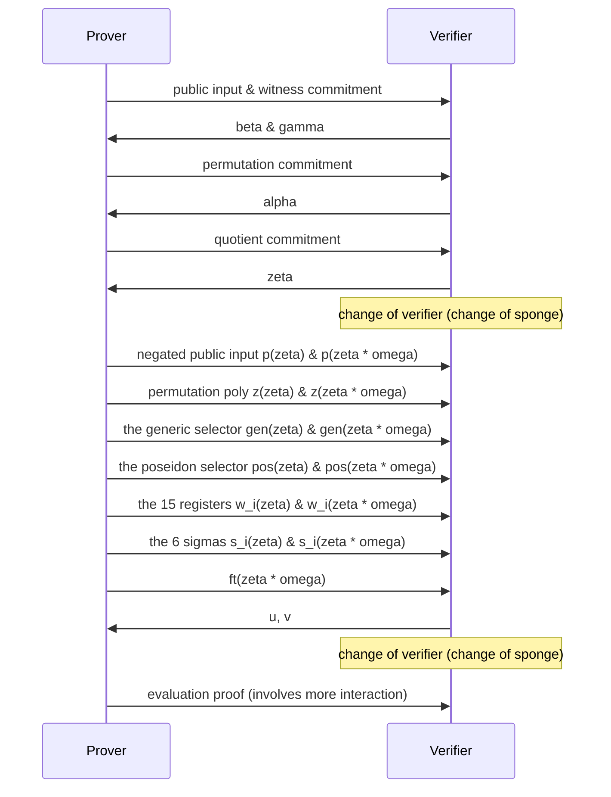

# Kimchi

* This document specifies *kimchi*, a zero-knowledge proof system that's a variant of PLONK.
* This document does not specify how circuits are created or executed, but only how to convert a circuit and its execution into a proof.

Table of content:

<!-- toc -->

## Overview

There are three main algorithms to kimchi:

* [Setup](#constraint-system-creation): takes a circuit and produces a prover index, and a verifier index.
* [Proof creation](#proof-creation): takes the prover index, and the execution trace of the circuit to produce a proof.
* [Proof verification](#proof-verification): takes the verifier index and a proof to verify.

As part of these algorithms, a number of tables are created (and then converted into polynomials) to create a proof.

**Gates**. A circuit is described by a series of gates, that we list in a table. 
The columns of the tables list the gates, while the rows are the length of the circuit. 
For each row, only a single gate can take a value $1$ while all other gates take the value $0$.

|  row  | Generic | Poseidon | CompleteAdd | VarBaseMul | EndoMul | EndoMulScalar | ChaCha0 | ChaCha1 | ChaCha2 | ChaChaFinal |
| :---: | :-----: | :------: | :---------: | :--------: | :-----: | :-----------: | :-----: | :-----: | :-----: | :---------: |
|   0   |    1    |    0     |      0      |     0      |    0    |       0       |    0    |    0    |    0    |      0      |
|   1   |    0    |    1     |      0      |     0      |    0    |       0       |    0    |    0    |    0    |      0      |

**Coefficients**. The coefficient table has 15 columns, and is used to tweak the gates. 
Currently, only the [Generic](#double-generic-gate) and the [Poseidon](#poseidon) gates use it (refer to their own sections to see how). 
All other gates set their values to $0$.

|  row  |   0   |   1   |   2   |   3   |   4   |   5   |   6   |   7   |   8   |   9   |  10   |  11   |  12   |  13   |  14   |
| :---: | :---: | :---: | :---: | :---: | :---: | :---: | :---: | :---: | :---: | :---: | :---: | :---: | :---: | :---: | :---: |
|   0   |   /   |   /   |   /   |   /   |   /   |   /   |   /   |   /   |   /   |   /   |   /   |   /   |   /   |   /   |   /   |

**Registers (or Witness)**. Registers are also defined at every row, and are split into two types: the *IO registers* from $0$ to $6$ usually contain input or output of the gates (note that a gate can output a value on the next row as well). 
I/O registers can be wired to each other (they'll be forced to have the same value), no matter what row they're on (for example, the register at `row:0, col:4` can be wired to the register at `row:80, col:6`). 
The rest of the registers, $7$ through $14$, are called *advice registers* as they can store values that useful only for the row's active gate. 
Think of them as intermediary or temporary values needed in the computation when the prover executes a circuit.

|  row  |   0   |   1   |   2   |   3   |   4   |   5   |   6   |   7   |   8   |   9   |  10   |  11   |  12   |  13   |  14   |
| :---: | :---: | :---: | :---: | :---: | :---: | :---: | :---: | :---: | :---: | :---: | :---: | :---: | :---: | :---: | :---: |
|   0   |   /   |   /   |   /   |   /   |   /   |   /   |   /   |   /   |   /   |   /   |   /   |   /   |   /   |   /   |   /   |


**Wiring (or Permutation, or sigmas)**. For gates to take the outputs of other gates as inputs, we use a wiring table to wire registers together. 
It is defined at every row, but only for the first $7$ registers. 
Each cell specifies a `(row, column)` tuple that it should be wired to.  Cells that are not connected to another cell are wired to themselves.
Note that if three or more registers are wired together, they must form a cycle. 
For example, if register `(0, 4)` is wired to both registers `(80, 6)` and `(90, 0)` then you would have the following table:

|  row  |    0    |   1   |   2   |   3   |    4     |   5   |    6     |
| :---: | :-----: | :---: | :---: | :---: | :------: | :---: | :------: |
|   0   |   0,0   |  0,1  |  0,2  |  0,3  | **80,6** |  0,5  |   0,6    |
|  ...  |         |       |       |       |          |       |          |
|  80   |  80,0   | 80,1  | 80,2  | 80,3  |   80,4   | 80,5  | **90,0** |
|  ...  |         |       |       |       |          |       |          |
|  90   | **0,4** | 90,1  | 90,2  | 90,3  |   90,4   | 90,5  |   90,6   |

**Wiring (Permutation) trace**. You can think of the permutation trace as an extra register that is used to enforce the wiring specified in the wiring table. 
It is a single column that applies on all the rows as well, which the prover computes as part of a proof.

|  row  |  pt   |
| :---: | :---: |
|   0   |   /   |

**Lookup**: TODO

To summarize, the following tables are created and used to describe a circuit:

* gates
* coefficients
* wiring (permutation)
* TODO: lookup

```admonish
This specification does not document how to create a circuit.
```

And to create a proof, the prover will execute the circuit and record an execution trace with the following tables:

* registers
* wiring (permutation) trace
* TODO: lookup

## Dependencies

To specify kimchi, we rely on a number of primitives that are specified outside of this specification.
In this section we list these specifications, as well as the interfaces we make use of in this specification.

### Polynomial Commitments

Refer to the [specification on polynomial commitments](./poly-commitment.md). 
We make use of the following functions from that specification:

- `PolyCom.non_hiding_commit(poly) -> PolyCom::NonHidingCommitment`
- `PolyCom.commit(poly) -> PolyCom::HidingCommitment`
- `PolyCom.evaluation_proof(poly, commitment, point) -> EvaluationProof`
- `PolyCom.verify(commitment, point, evaluation, evaluation_proof) -> bool`

### Poseidon hash function

Refer to the [specification on Poseidon](./poseidon.md). 
We make use of the following functions from that specification:

- `Poseidon.init(params) -> FqSponge`
- `Poseidon.update(field_elem)`
- `Poseidon.finalize() -> FieldElem`

specify the following functions on top:

- `Poseidon.produce_challenge()` (TODO: uses the endomorphism)
- `Poseidon.to_fr_sponge() -> state_of_fq_sponge_before_eval, FrSponge`

With the current parameters:

* S-Box alpha: `7`
* Width: `3`
* Rate: `2`
* Full rounds: `55`
* Round constants: [`fp_kimchi`](https://github.com/o1-labs/proof-systems/blob/0b01f7575cdfa45541fcfcd88d59f73b015af56b/oracle/src/pasta/fp_kimchi.rs#L55), [`fq_kimchi`](https://github.com/o1-labs/proof-systems/blob/0b01f7575cdfa45541fcfcd88d59f73b015af56b/oracle/src/pasta/fq_kimchi.rs#L54)
* MDS matrix: [`fp_kimchi`](https://github.com/o1-labs/proof-systems/blob/0b01f7575cdfa45541fcfcd88d59f73b015af56b/oracle/src/pasta/fp_kimchi.rs#L10), [`fq_kimchi`](https://github.com/o1-labs/proof-systems/blob/0b01f7575cdfa45541fcfcd88d59f73b015af56b/oracle/src/pasta/fq_kimchi.rs#L10)

### Pasta

Kimchi is made to work on cycles of curves, so the protocol switch between two fields Fq and Fr, where Fq represents the base field and Fr represents the scalar field.

See the [Pasta curves specification](./pasta.md).

## Constraints

Kimchi enforces the correct execution of a circuit by creating a number of constraints and combining them together.
In this section, we describe all the constraints that make up the main polynomial $f$ once combined.

We define the following functions:

* `combine_constraints(range_alpha, constraints)`, which takes a range of contiguous powers of alpha and a number of constraints. 
It returns the sum of all the constraints, where each constraint has been multiplied by a power of alpha. 
In other words it returns:
$$ \sum_i \alpha^i \cdot \text{constraint}_i $$

The different ranges of alpha are described as follows:

<!-- generated using `cargo test -p kimchi --lib -- alphas::tests::get_alphas_for_spec --nocapture` -->
* **gates**. Offset starts at 0 and 21 powers of $\alpha$ are used
* **Permutation**. Offset starts at 21 and 3 powers of $\alpha$ are used

```admonish
As gates are mutually exclusive (a single gate is used on each row), we can reuse the same range of powers of alpha across all the gates. 
```

TODO: linearization

### Permutation


The permutation constraints are the following 4 constraints:

The two sides of the coin (with $\text{shift}_0 = 1$):

$$\begin{align}
    & z(x) \cdot zkpm(x) \cdot \alpha^{PERM0} \cdot \\
    & (w_0(x) + \beta \cdot \text{shift}_0 x + \gamma) \cdot \\
    & (w_1(x) + \beta \cdot \text{shift}_1 x + \gamma) \cdot \\
    & (w_2(x) + \beta \cdot \text{shift}_2 x + \gamma) \cdot \\
    & (w_3(x) + \beta \cdot \text{shift}_3 x + \gamma) \cdot \\
    & (w_4(x) + \beta \cdot \text{shift}_4 x + \gamma) \cdot \\
    & (w_5(x) + \beta \cdot \text{shift}_5 x + \gamma) \cdot \\
    & (w_6(x) + \beta \cdot \text{shift}_6 x + \gamma)
\end{align}$$

and

$$\begin{align}
& -1 \cdot z(x \omega) \cdot zkpm(x) \cdot \alpha^{PERM0} \cdot \\
& (w_0(x) + \beta \cdot \sigma_0(x) + \gamma) \cdot \\
& (w_1(x) + \beta \cdot \sigma_1(x) + \gamma) \cdot \\
& (w_2(x) + \beta \cdot \sigma_2(x) + \gamma) \cdot \\
& (w_3(x) + \beta \cdot \sigma_3(x) + \gamma) \cdot \\
& (w_4(x) + \beta \cdot \sigma_4(x) + \gamma) \cdot \\
& (w_5(x) + \beta \cdot \sigma_5(x) + \gamma) \cdot \\
& (w_6(x) + \beta \cdot \sigma_6(x) + \gamma) \cdot
\end{align}$$

the initialization of the accumulator:

$$(z(x) - 1) L_1(x) \alpha^{PERM1}$$

and the accumulator's final value:

$$(z(x) - 1) L_{n-k}(x) \alpha^{PERM2}$$

You can read more about why it looks like that in [this post](https://minaprotocol.com/blog/a-more-efficient-approach-to-zero-knowledge-for-plonk).

The quotient contribution of the permutation is split into two parts $perm$ and $bnd$.
They will be used by the prover.

$$
\begin{align}
perm(x) =
    & \; a^{PERM0} \cdot zkpl(x) \cdot [ \\
    & \;\;   z(x) \cdot \\
    & \;\;   (w_0(x) + \gamma + x \cdot \beta \cdot \text{shift}_0) \cdot \\
    & \;\;   (w_1(x) + \gamma + x \cdot \beta \cdot \text{shift}_1) \cdot \\
    & \;\;   (w_2(x) + \gamma + x \cdot \beta \cdot \text{shift}_2) \cdot \\
    & \;\;   (w_3(x) + \gamma + x \cdot \beta \cdot \text{shift}_3) \cdot \\
    & \;\;   (w_4(x) + \gamma + x \cdot \beta \cdot \text{shift}_4) \cdot \\
    & \;\;   (w_5(x) + \gamma + x \cdot \beta \cdot \text{shift}_5) \cdot \\
    & \;\;   (w_6(x) + \gamma + x \cdot \beta \cdot \text{shift}_6) \cdot \\
    & \;   - \\
    & \;\;   z(x \cdot w) \cdot \\
    & \;\;   (w_0(x) + \gamma + \sigma_0 \cdot \beta) \cdot \\
    & \;\;   (w_1(x) + \gamma + \sigma_1 \cdot \beta) \cdot \\
    & \;\;   (w_2(x) + \gamma + \sigma_2 \cdot \beta) \cdot \\
    & \;\;   (w_3(x) + \gamma + \sigma_3 \cdot \beta) \cdot \\
    & \;\;   (w_4(x) + \gamma + \sigma_4 \cdot \beta) \cdot \\
    & \;\;   (w_5(x) + \gamma + \sigma_5 \cdot \beta) \cdot \\
    & \;\;   (w_6(x) + \gamma + \sigma_6 \cdot \beta) \cdot \\
    &]
\end{align}
$$

and `bnd`:

$$bnd(x) =
    a^{PERM1} \cdot \frac{z(x) - 1}{x - 1}
    +
    a^{PERM2} \cdot \frac{z(x) - 1}{x - sid[n-k]}
$$

The linearization:

$\text{scalar} \cdot \sigma_6(x)$

where $\text{scalar}$ is computed as:

$$
\begin{align}
z(\zeta \omega) \beta \alpha^{PERM0} zkpl(\zeta) \cdot \\
(\gamma + \beta \sigma_0(\zeta) + w_0(\zeta)) \cdot \\
(\gamma + \beta \sigma_1(\zeta) + w_1(\zeta)) \cdot \\
(\gamma + \beta \sigma_2(\zeta) + w_2(\zeta)) \cdot \\
(\gamma + \beta \sigma_3(\zeta) + w_3(\zeta)) \cdot \\
(\gamma + \beta \sigma_4(\zeta) + w_4(\zeta)) \cdot \\
(\gamma + \beta \sigma_5(\zeta) + w_5(\zeta)) \cdot \\
\end{align}
$$

To compute the permutation aggregation polynomial,
the prover interpolates the polynomial that has the following evaluations.
The first evaluation represents the initial value of the accumulator:
$$z(g^0) = 1$$
For $i = 0, \cdot, n - 4$, where $n$ is the size of the domain,
evaluations are computed as:

$$z(g^{i+1}) = z_1 / z_2$$

with

$$
\begin{align}
z_1 = &\ (w_0(g^i + sid(g^i) \cdot beta \cdot shift_0 + \gamma) \cdot \\
&\ (w_1(g^i) + sid(g^i) \cdot beta \cdot shift_1 + \gamma) \cdot \\
&\ (w_2(g^i) + sid(g^i) \cdot beta \cdot shift_2 + \gamma) \cdot \\
&\ (w_3(g^i) + sid(g^i) \cdot beta \cdot shift_3 + \gamma) \cdot \\
&\ (w_4(g^i) + sid(g^i) \cdot beta \cdot shift_4 + \gamma) \cdot \\
&\ (w_5(g^i) + sid(g^i) \cdot beta \cdot shift_5 + \gamma) \cdot \\
&\ (w_6(g^i) + sid(g^i) \cdot beta \cdot shift_6 + \gamma)
\end{align}
$$

and

$$
\begin{align}
z_2 = &\ (w_0(g^i) + \sigma_0 \cdot beta + \gamma) \cdot \\
&\ (w_1(g^i) + \sigma_1 \cdot beta + \gamma) \cdot \\
&\ (w_2(g^i) + \sigma_2 \cdot beta + \gamma) \cdot \\
&\ (w_3(g^i) + \sigma_3 \cdot beta + \gamma) \cdot \\
&\ (w_4(g^i) + \sigma_4 \cdot beta + \gamma) \cdot \\
&\ (w_5(g^i) + \sigma_5 \cdot beta + \gamma) \cdot \\
&\ (w_6(g^i) + \sigma_6 \cdot beta + \gamma)
\end{align}
$$


If computed correctly, we should have $z(g^{n-3}) = 1$.

Finally, randomize the last `EVAL_POINTS` evaluations $z(g^{n-2})$ and $z(g^{n-1})$,
in order to add zero-knowledge to the protocol.


### Lookup


### Gates

A circuit is described as a series of gates.
In this section we describe the different gates currently supported by kimchi, the constraints associated to them, and the way the register table, coefficient table, and permutation can be used in conjunction.

TODO: for each gate describe how to create it?

#### Double Generic Gate

The double generic gate contains two generic gates.

A generic gate is simply the 2-fan in gate specified in the
vanilla PLONK protocol that allows us to do operations like:

* addition of two registers (into an output register)
* or multiplication of two registers
* equality of a register with a constant

More generally, the generic gate controls the coefficients $c_i$ in the equation:

$$c_0 \cdot l + c_1 \cdot r + c_2 \cdot o + c_3 \cdot (l \times r) + c_4$$

The layout of the gate is the following:

|  0 |  1 |  2 |  3 |  4 |  5 | 6 | 7 | 8 | 9 | 10 | 11 | 12 | 13 | 14 |
|:--:|:--:|:--:|:--:|:--:|:--:|:-:|:-:|:-:|:-:|:--:|:--:|:--:|:--:|:--:|
| l1 | r1 | o1 | l2 | r2 | o2 |   |   |   |   |    |    |    |    |    |

where l1, r1, and o1 (resp. l2, r2, o2)
are the left, right, and output registers
of the first (resp. second) generic gate.

The selectors are stored in the coefficient table as:

|  0 |  1 |  2 |  3 |  4 |  5 | 6  |  7 |  8 |  9 | 10 | 11 | 12 | 13 | 14 |
|:--:|:--:|:--:|:--:|:--:|:--:|:--:|:--:|:--:|:--:|:--:|:--:|:--:|:--:|:--:|
| l1 | r1 | o1 | m1 | c1 | l2 | r2 | o2 | m2 | c2 |    |    |    |    |    |

with m1 (resp. m2) the mul selector for the first (resp. second) gate,
and c1 (resp. c2) the constant selector for the first (resp. second) gate.

The constraints:

* $w_0 \cdot c_0 + w_1 \cdot c_1 + w_2 \cdot c_2 + w_0 \cdot w_1 \cdot c_3 + c_4$
* $w_3 \cdot c_5 + w_4 \cdot c_6 + w_5 \cdot c_7 + w_3 w_4 c_8 + c_9$

where the $c_i$ are the [coefficients]().


#### Poseidon

The poseidon gate encodes 5 rounds of the poseidon permutation.
A state is represents by 3 field elements. For example,
the first state is represented by `(s0, s0, s0)`,
and the next state, after permutation, is represented by `(s1, s1, s1)`.

Below is how we store each state in the register table:

|  0 |  1 |  2 |  3 |  4 |  5 |  6 |  7 |  8 |  9 | 10 | 11 | 12 | 13 | 14 |
|:--:|:--:|:--:|:--:|:--:|:--:|:--:|:--:|:--:|:--:|:--:|:--:|:--:|:--:|:--:|
| s0 | s0 | s0 | s4 | s4 | s4 | s1 | s1 | s1 | s2 | s2 | s2 | s3 | s3 | s3 |
| s5 | s5 | s5 |    |    |    |    |    |    |    |    |    |    |    |    |

The last state is stored on the next row. This last state is either used:

* with another Poseidon gate on that next row, representing the next 5 rounds.
* or with a Zero gate, and a permutation to use the output elsewhere in the circuit.
* or with another gate expecting an input of 3 field elements in its first registers.

```admonish
As some of the poseidon hash variants might not use $5k$ rounds (for some $k$),
the result of the 4-th round is stored directly after the initial state.
This makes that state accessible to the permutation.
```

We define $M_{r, c}$ as the MDS matrix at row $r$ and column $c$.

We define the S-box operation as $w^S$ for $S$ the `SPONGE_BOX` constant.

We store the 15 round constants $r_i$ required for the 5 rounds (3 per round) in the coefficient table:

|  0 |  1 |  2 |  3 |  4 |  5 |  6 |  7 |  8 |  9 | 10 | 11 | 12 | 13 | 14 |
|:--:|:--:|:--:|:--:|:--:|:--:|:--:|:--:|:--:|:--:|:--:|:--:|:--:|:--:|:--:|
| r0 | r1 | r2 | r3 | r4 | r5 | r6 | r7 | r8 | r9 | r10 | r11 | r12 | r13 | r14 |

The initial state, stored in the first three registers, are not constrained.
The following 4 states (of 3 field elements), including 1 in the next row,
are constrained to represent the 5 rounds of permutation.
Each of the associated 15 registers is associated to a constraint, calculated as:

first round:
* $w_6 - [r_0 + (M_{0, 0} w_0^S + M_{0, 1} w_1^S + M_{0, 2} w_2^S)]$
* $w_7 - [r_1 + (M_{1, 0} w_0^S + M_{1, 1} w_1^S + M_{1, 2} w_2^S)]$
* $w_8 - [r_2 + (M_{2, 0} w_0^S + M_{2, 1} w_1^S + M_{2, 2} w_2^S)]$

second round:
* $w_9 - [r_3 + (M_{0, 0} w_6^S + M_{0, 1} w_7^S + M_{0, 2} w_8^S)]$
* $w_{10} - [r_4 + (M_{1, 0} w_6^S + M_{1, 1} w_7^S + M_{1, 2} w_8^S)]$
* $w_{11} - [r_5 + (M_{2, 0} w_6^S + M_{2, 1} w_7^S + M_{2, 2} w_8^S)]$

third round:
* $w_{12} - [r_6 + (M_{0, 0} w_9^S + M_{0, 1} w_{10}^S + M_{0, 2} w_{11}^S)]$
* $w_{13} - [r_7 + (M_{1, 0} w_9^S + M_{1, 1} w_{10}^S + M_{1, 2} w_{11}^S)]$
* $w_{14} - [r_8 + (M_{2, 0} w_9^S + M_{2, 1} w_{10}^S + M_{2, 2} w_{11}^S)]$

fourth round:
* $w_3 - [r_9 + (M_{0, 0} w_{12}^S + M_{0, 1} w_{13}^S + M_{0, 2} w_{14}^S)]$
* $w_4 - [r_{10} + (M_{1, 0} w_{12}^S + M_{1, 1} w_{13}^S + M_{1, 2} w_{14}^S)]$
* $w_5 - [r_{11} + (M_{2, 0} w_{12}^S + M_{2, 1} w_{13}^S + M_{2, 2} w_{14}^S)]$

fifth round:
* $w_{0, next} - [r_{12} + (M_{0, 0} w_3^S + M_{0, 1} w_4^S + M_{0, 2} w_5^S)]$
* $w_{1, next} - [r_{13} + (M_{1, 0} w_3^S + M_{1, 1} w_4^S + M_{1, 2} w_5^S)]$
* $w_{2, next} - [r_{14} + (M_{2, 0} w_3^S + M_{2, 1} w_4^S + M_{2, 2} w_5^S)]$

where $w_{i, next}$ is the polynomial $w_i(\omega x)$ which points to the next row.


#### Chacha 


#### Elliptic Curve Addition

The layout is

|  0 |  1 |  2 |  3 |  4 |  5 |  6  |    7   | 8 |   9   |    10   |
|:--:|:--:|:--:|:--:|:--:|:--:|:---:|:------:|:-:|:-----:|:-------:|
| x1 | y1 | x2 | y2 | x3 | y3 | inf | same_x | s | inf_z | x21_inv |

where
- `(x1, y1), (x2, y2)` are the inputs and `(x3, y3)` the output.
- `inf` is a boolean that is true iff the result (x3, y3) is the point at infinity.

The rest of the values are inaccessible from the permutation argument, but
- `same_x` is a boolean that is true iff `x1 == x2`.

The following constraints are generated:

constraint 1:
* $x_{0} = w_{2} - w_{0}$
* $(w_{10} \cdot x_{0} - \mathbb{F}(1) - w_{7})$

constraint 2:

* $x_{0} = w_{2} - w_{0}$
* $w_{7} \cdot x_{0}$

constraint 3:

* $x_{0} = w_{2} - w_{0}$
* $x_{1} = w_{3} - w_{1}$
* $x_{2} = w_{0} \cdot w_{0}$
* $w_{7} \cdot (2 \cdot w_{8} \cdot w_{1} - 2 \cdot x_{2} - x_{2}) + (\mathbb{F}(1) - w_{7}) \cdot (x_{0} \cdot w_{8} - x_{1})$

constraint 4:

* $w_{0} + w_{2} + w_{4} - w_{8} \cdot w_{8}$

constraint 5:

* $w_{8} \cdot (w_{0} - w_{4}) - w_{1} - w_{5}$

constraint 6:

* $x_{1} = w_{3} - w_{1}$
* $x_{1} \cdot (w_{7} - w_{6})$

constraint 7:

* $x_{1} = w_{3} - w_{1}$
* $x_{1} \cdot w_{9} - w_{6}$


#### Endo Scalar


#### Endo Scalar Multiplication


#### Scalar Multiplication 


## Setup

In this section we specify the setup that goes into creating two indexes from a circuit:

* A [*prover index*](#prover-index), necessary for the prover to to create proofs.
* A [*verifier index*](#verifier-index), necessary for the verifier to verify proofs.

```admonish
The circuit creation part is not specified in this document. It might be specified in a separate document, or we might want to specify how to create the circuit description tables.
```

As such, the transformation of a circuit into these two indexes can be seen as a compilation step. Note that the prover still needs access to the original circuit to create proofs, as they need to execute it to create the witness (register table).

### Common Index

In this section we describe data that both the prover and the verifier index share.

**`URS` (Uniform Reference String)** The URS is a set of parameters that is generated once, and shared between the prover and the verifier. 
It is used for polynomial commitments, so refer to the [poly-commitment specification](./poly-commitment.md) for more details.

```admonish
Kimchi currently generates the URS based on the circuit, and attach it to the index. So each circuit can potentially be accompanied with a different URS. On the other hand, Mina reuses the same URS for multiple circuits ([see zkapps for more details](https://minaprotocol.com/blog/what-are-zkapps)).
```

**`Domain`**. A domain large enough to contain the circuit and the zero-knowledge rows (used to provide zero-knowledge to the protocol). Specifically, the smallest subgroup in our field that has order greater or equal to `n + ZK_ROWS`, with `n` is the number of gates in the circuit. 
TODO: what if the domain is larger than the URS?

**`Shifts`**. As part of the permutation, we need to create `PERMUTS` shifts.
To do that, the following logic is followed (in pseudo code):
(TODO: move shift creation within the permutation section?)

```python
shifts[0] = 1 # first shift is identity

for i in 0..7: # generate 7 shifts
    i = 7
    shift, i = sample(domain, i)
    while shifts.contains(shift) do:
        shift, i = sample(domain, i)
    shift[i] = shift

def sample(domain, i):
    i += 1
    shift = Field(Blake2b512(to_be_bytes(i)))
    while is_not_quadratic_non_residue(shift) || domain.contains(shift):
        i += 1
        shift = Field(Blake2b512(to_be_bytes(i)))
    return shift, i
```

**`Public`**. This variable simply contains the number of public inputs.

The compilation steps to create the common index are as follow:

1. If the circuit is less than 2 gates, abort.
2. Create a domain for the circuit. That is,
   compute the smallest subgroup of the field that
   has order greater or equal to `n + ZK_ROWS` elements.
3. Pad the circuit: add zero gates to reach the domain size.
4. sample the `PERMUTS` shifts.


### Prover Index

Both the prover and the verifier index, besides the common parts described above, are made out of pre-computations which can be used to speed up the protocol.
These pre-computations are optimizations, in the context of normal proofs, but they are necessary for recursion.

```rs
pub struct ProverIndex<G: CommitmentCurve> {
    /// constraints system polynomials
    #[serde(bound = "ConstraintSystem<Fr<G>>: Serialize + DeserializeOwned")]
    pub cs: ConstraintSystem<Fr<G>>,

    /// The symbolic linearization of our circuit, which can compile to concrete types once certain values are learned in the protocol.
    #[serde(skip)]
    pub linearization: Linearization<Vec<PolishToken<Fr<G>>>>,

    /// The mapping between powers of alpha and constraints
    #[serde(skip)]
    pub powers_of_alpha: Alphas<Fr<G>>,

    /// polynomial commitment keys
    #[serde(skip)]
    pub srs: Arc<SRS<G>>,

    /// maximal size of polynomial section
    pub max_poly_size: usize,

    /// maximal size of the quotient polynomial according to the supported constraints
    pub max_quot_size: usize,

    /// random oracle argument parameters
    #[serde(skip)]
    pub fq_sponge_params: ArithmeticSpongeParams<Fq<G>>,
}
```


## Verifier Index

Same as the prover index, we have a number of pre-computations as part of the verifier index.

```rs
pub struct VerifierIndex<G: CommitmentCurve> {
    /// evaluation domain
    #[serde_as(as = "o1_utils::serialization::SerdeAs")]
    pub domain: D<Fr<G>>,
    /// maximal size of polynomial section
    pub max_poly_size: usize,
    /// maximal size of the quotient polynomial according to the supported constraints
    pub max_quot_size: usize,
    /// polynomial commitment keys
    #[serde(skip)]
    pub srs: Arc<SRS<G>>,

    // index polynomial commitments
    /// permutation commitment array
    #[serde(bound = "PolyComm<G>: Serialize + DeserializeOwned")]
    pub sigma_comm: [PolyComm<G>; PERMUTS],
    /// coefficient commitment array
    #[serde(bound = "PolyComm<G>: Serialize + DeserializeOwned")]
    pub coefficients_comm: [PolyComm<G>; COLUMNS],
    /// coefficient commitment array
    #[serde(bound = "PolyComm<G>: Serialize + DeserializeOwned")]
    pub generic_comm: PolyComm<G>,

    // poseidon polynomial commitments
    /// poseidon constraint selector polynomial commitment
    #[serde(bound = "PolyComm<G>: Serialize + DeserializeOwned")]
    pub psm_comm: PolyComm<G>,

    // ECC arithmetic polynomial commitments
    /// EC addition selector polynomial commitment
    #[serde(bound = "PolyComm<G>: Serialize + DeserializeOwned")]
    pub complete_add_comm: PolyComm<G>,
    /// EC variable base scalar multiplication selector polynomial commitment
    #[serde(bound = "PolyComm<G>: Serialize + DeserializeOwned")]
    pub mul_comm: PolyComm<G>,
    /// endoscalar multiplication selector polynomial commitment
    #[serde(bound = "PolyComm<G>: Serialize + DeserializeOwned")]
    pub emul_comm: PolyComm<G>,
    /// endoscalar multiplication scalar computation selector polynomial commitment
    #[serde(bound = "PolyComm<G>: Serialize + DeserializeOwned")]
    pub endomul_scalar_comm: PolyComm<G>,

    /// Chacha polynomial commitments
    #[serde(bound = "PolyComm<G>: Serialize + DeserializeOwned")]
    pub chacha_comm: Option<[PolyComm<G>; 4]>,

    // Cairo polynomial commitment
    #[serde(bound = "PolyComm<G>: Serialize + DeserializeOwned")]
    pub cairo_comm: [PolyComm<G>; cairo::CIRCUIT_GATE_COUNT],

    /// wire coordinate shifts
    #[serde_as(as = "[o1_utils::serialization::SerdeAs; PERMUTS]")]
    pub shift: [Fr<G>; PERMUTS],
    /// zero-knowledge polynomial
    #[serde(skip)]
    pub zkpm: DensePolynomial<Fr<G>>,
    // TODO(mimoo): isn't this redundant with domain.d1.group_gen ?
    /// domain offset for zero-knowledge
    #[serde(skip)]
    pub w: Fr<G>,
    /// endoscalar coefficient
    #[serde(skip)]
    pub endo: Fr<G>,

    #[serde(bound = "PolyComm<G>: Serialize + DeserializeOwned")]
    pub lookup_index: Option<LookupVerifierIndex<G>>,

    #[serde(skip)]
    pub linearization: Linearization<Vec<PolishToken<Fr<G>>>>,
    /// The mapping between powers of alpha and constraints
    #[serde(skip)]
    pub powers_of_alpha: Alphas<Fr<G>>,

    // random oracle argument parameters
    #[serde(skip)]
    pub fr_sponge_params: ArithmeticSpongeParams<Fr<G>>,
    #[serde(skip)]
    pub fq_sponge_params: ArithmeticSpongeParams<Fq<G>>,
}
```


## Proof

Originally, kimchi is based on an interactive protocol that was transformed into a non-interactive one using the [Fiat-Shamir](https://o1-labs.github.io/mina-book/crypto/plonk/fiat_shamir.html) transform.
For this reason, it can be useful to visualize the high-level interactive protocol before the transformation:



The Fiat-Shamir transform simulates the verifier messages via a hash function that hashes the transcript of the protocol so far before outputing verifier messages.
You can find these operations under the [proof creation](#proof-creation) and [proof verification](#proof-verification) algorithms as absorption and squeezing of values with the sponge.

A proof consists of:

* a number of (hidden) polynomial commitments:
  * the 15 registers/witness columns
  * the permutation
  * the quotient
  * TODO: lookup
  * TODO: public commitment is not here, but is in the sequence diagram
* evaluations of these polynomials at two random points $\zeta$ and $\zeta \omega$
* evaluations at the two random points of these additional polynomials:
  * the 6 s (sigma)
  * TODO: lookup
  * generic selector
  * poseidon selector
* evaluation at $\zeta \omega$ of ft
* optionally, the public input used (the public input could be implied by the surrounding context and not part of the proof itself)
* optionally, the previous challenges (in case we are in a recursive prover)

The following sections specify how a prover creates a proof, and how a verifier validates a number of proofs.

### Proof Creation

To create a proof, the prover expects:

* A prover index, containing a representation of the circuit (and optionaly pre-computed values to be used in the proof creation).
* The (filled) registers table, representing parts of the execution trace of the circuit.

```admonish
The public input is expected to be passed in the first `Public` rows of the registers table.
```

The following constants are set:

* `EVAL_POINTS = 2`. This is the number of points that the prover has to evaluate their polynomials at. 
($\zeta$ and $\zeta\omega$ where $\zeta$ will be deterministically generated.)
* `ZK_ROWS = 3`. This is the number of rows that will be randomized to provide zero-knowledgeness. 
Note that it only needs to be greater or equal to the number of evaluations (2) in the protocol. 
Yet, it contains one extra row to take into account the last constraint (final value of the permutation accumulator). 
(TODO: treat the final constraint separately so that ZK_ROWS = 2)

The prover then follows the following steps to create the proof:

1. Ensure we have room in the witness for the zero-knowledge rows.
   We currently expect the witness not to be of the same length as the domain,
   but instead be of the length of the (smaller) circuit.
   If we cannot add `ZK_ROWS` rows to the columns of the witness before reaching
   the size of the domain, abort.
2. Pad the witness columns with Zero gates to make them the same length as the domain.
   Then, randomize the last `ZK_ROWS` of each columns.
3. Setup the Fq-Sponge.
4. Compute the negated public input polynomial as
   the polynomial that evaluates to $-p_i$ for the first `public_input_size` values of the domain,
   and $0$ for the rest.
5. Commit (non-hiding) to the negated public input polynomial. **TODO: seems unecessary**
6. Absorb the public polynomial with the Fq-Sponge. **TODO: seems unecessary**
7. Commit to the witness columns by creating `COLUMNS` hidding commitments.
   Note: since the witness is in evaluation form,
   we can use the `commit_evaluation` optimization.
8. Absorb the witness commitments with the Fq-Sponge.
9. Compute the witness polynomials by interpolating each `COLUMNS` of the witness.
   TODO: why not do this first, and then commit? Why commit from evaluation directly?
10. TODO: lookup
11. Sample $\beta$ with the Fq-Sponge.
12. Sample $\gamma$ with the Fq-Sponge.
13. TODO: lookup
14. Compute the permutation aggregation polynomial $z$.
15. Commit (hidding) to the permutation aggregation polynomial $z$.
16. Absorb the permutation aggregation polynomial $z$ with the Fq-Sponge.
17. Sample $\alpha'$ with the Fq-Sponge.
18. Derive $\alpha$ from $\alpha'$ using the endomorphism (TODO: details)
19. TODO: instantiate alpha?
20. TODO: this is just an optimization, ignore?
21. TODO: lookup
22. TODO: setup the env
23. Compute the quotient polynomial (the $t$ in $f = Z_H \cdot t$).
    The quotient polynomial is computed by adding all these polynomials together:
    - the combined constraints for all the gates
    - the combined constraints for the permutation
    - TODO: lookup
    - the negated public polynomial
    and by then dividing the resulting polynomial with the vanishing polynomial $Z_H$.
    TODO: specify the split of the permutation polynomial into perm and bnd?
24. commit (hiding) to the quotient polynomial $t$
    TODO: specify the dummies
25. Absorb the the commitment of the quotient polynomial with the Fq-Sponge.
26. Sample $\zeta'$ with the Fq-Sponge.
27. Derive $\zeta$ from $\zeta'$ using the endomorphism (TODO: specify)
28. TODO: lookup
29. Chunk evaluate the following polynomials at both $\zeta$ and $\zeta \omega$:
    * $s_i$
    * $w_i$
    * $z$
    * lookup (TODO)
    * generic selector
    * poseidon selector

    By "chunk evaluate" we mean that the evaluation of each polynomial can potentially be a vector of values.
    This is because the index's `max_poly_size` parameter dictates the maximum size of a polynomial in the protocol.
    If a polynomial $f$ exceeds this size, it must be split into several polynomials like so:
    $$f(x) = f_0(x) + x^n f_1(x) + x^{2n} f_2(x) + \cdots$$

    And the evaluation of such a polynomial is the following list for $x \in {\zeta, \zeta\omega}$:

    $$(f_0(x), f_1(x), f_2(x), \ldots)$$

     TODO: do we want to specify more on that? It seems unecessary except for the t polynomial (or if for some reason someone sets that to a low value)
30. Evaluate the same polynomials without chunking them
    (so that each polynomial should correspond to a single value this time).
31. Compute the ft polynomial.
    This is to implement [Maller's optimization](https://o1-labs.github.io/mina-book/crypto/plonk/maller_15.html).
32. construct the blinding part of the ft polynomial commitment
    see https://o1-labs.github.io/mina-book/crypto/plonk/maller_15.html#evaluation-proof-and-blinding-factors
33. Evaluate the ft polynomial at $\zeta\omega$ only.
34. Setup the Fr-Sponge
35. Squeeze the Fq-sponge and absorb the result with the Fr-Sponge.
36. Evaluate the negated public polynomial (if present) at $\zeta$ and $\zeta\omega$.
37. Absorb all the polynomial evaluations in $\zeta$ and $\zeta\omega$:
    - the public polynomial
    - z
    - generic selector
    - poseidon selector
    - the 15 register/witness
    - 6 sigmas evaluations (the last one is not evaluated)
38. Absorb the unique evaluation of ft: $ft(\zeta\omega)$.
39. Sample $v'$ with the Fr-Sponge
40. Derive $v$ from $v'$ using the endomorphism (TODO: specify)
41. Sample $u'$ with the Fr-Sponge
42. Derive $u$ from $u'$ using the endomorphism (TODO: specify)
43. Create a list of all polynomials that will require evaluations
    (and evaluation proofs) in the protocol.
    First, include the previous challenges, in case we are in a recursive prover.
44. Then, include:
    - the negated public polynomial (TODO: why?)
    - the ft polynomial
    - the permutation aggregation polynomial z polynomial
    - the generic selector
    - the poseidon selector
    - the 15 registers/witness columns
    - the 6 sigmas
44. Create an aggregated evaluation proof for all of these polynomials at $\zeta$ and $\zeta\omega$ using $u$ and $v$.


### Proof Verification


## Optimizations

* `commit_evaluation`: TODO

## Security Considerations

TODO
