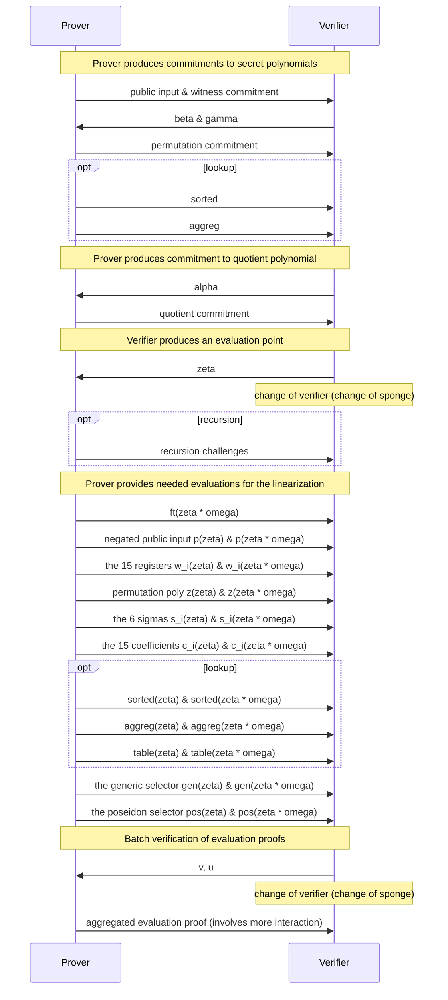

# Kimchi

* This document specifies *kimchi*, a zero-knowledge proof system that's a variant of PLONK.
* This document does not specify how circuits are created or executed, but only how to convert a circuit and its execution into a proof.

Table of content:

<!-- toc -->

## Overview

There are three main algorithms to kimchi:

* [Setup](#setup): takes a circuit and produces a prover index, and a verifier index.
* [Proof creation](#proof-creation): takes the prover index, and the execution trace of the circuit to produce a proof.
* [Proof verification](#proof-verification): takes the verifier index and a proof to verify.

As part of these algorithms, a number of tables are created (and then converted into polynomials) to create a proof.

### Tables used to describe a circuit

The following tables are created to describe the circuit:

**Gates**. A circuit is described by a series of gates, that we list in a table.
The columns of the tables list the gates, while the rows are the length of the circuit.
For each row, only a single gate can take a value $1$ while all other gates take the value $0$.

|  row  | Generic | Poseidon | CompleteAdd | VarBaseMul | EndoMul | EndoMulScalar |
| :---: | :-----: | :------: | :---------: | :--------: | :-----: | :-----------: |
|   0   |    1    |    0     |      0      |     0      |    0    |       0       |
|   1   |    0    |    1     |      0      |     0      |    0    |       0       |

**Coefficients**. The coefficient table has 15 columns, and is used to tweak the gates.
Currently, only the [Generic](#double-generic-gate) and the [Poseidon](#poseidon) gates use it (refer to their own sections to see how).
All other gates set their values to $0$.

|  row  |   0   |   1   |   2   |   3   |   4   |   5   |   6   |   7   |   8   |   9   |  10   |  11   |  12   |  13   |  14   |
| :---: | :---: | :---: | :---: | :---: | :---: | :---: | :---: | :---: | :---: | :---: | :---: | :---: | :---: | :---: | :---: |
|   0   |   /   |   /   |   /   |   /   |   /   |   /   |   /   |   /   |   /   |   /   |   /   |   /   |   /   |   /   |   /   |

**Wiring (or Permutation, or sigmas)**. For gates to take the outputs of other gates as inputs, we use a wiring table to wire registers together.
To learn about registers, see the next section.
It is defined at every row, but only for the first $7$ registers.
Each cell specifies a `(row, column)` tuple that it should be wired to.  Cells that are not connected to another cell are wired to themselves.
Note that if three or more registers are wired together, they must form a cycle.
For example, if register `(0, 4)` is wired to both registers `(80, 6)` and `(90, 0)` then you would have the following table:

|  row  |    0    |   1   |   2   |   3   |    4     |   5   |    6     |
| :---: | :-----: | :---: | :---: | :---: | :------: | :---: | :------: |
|   0   |   0,0   |  0,1  |  0,2  |  0,3  | **80,6** |  0,5  |   0,6    |
|  ...  |         |       |       |       |          |       |          |
|  80   |  80,0   | 80,1  | 80,2  | 80,3  |   80,4   | 80,5  | **90,0** |
|  ...  |         |       |       |       |          |       |          |
|  90   | **0,4** | 90,1  | 90,2  | 90,3  |   90,4   | 90,5  |   90,6   |

The lookup feature is currently optional, as it can add some overhead to the protocol.
In the case where you would want to use lookups, the following tables would be needed:

**Lookup Tables**. The different [lookup tables](https://en.wikipedia.org/wiki/Lookup_table) that are used in the circuit. For example, the XOR lookup table:

| l   | r   | o   |
| --- | --- | --- |
| 1   | 0   | 1   |
| 0   | 1   | 1   |
| 1   | 1   | 0   |
| 0   | 0   | 0   |

**Lookup selectors**. A lookup selector is used to perform a number of queries in different lookup tables. Any gate can advertise its use of a lookup selector (so a lookup selector can be associated to several gates), and on which rows they want to use them (current and/or next). In cases where a gate need to use lookups in its current row only, and is the only one performing a specific combination of queries, then its gate selector can be used in place of a lookup selector. As with gates, lookup selectors (including gates used as lookup selectors) are mutually exclusives (only one can be used on a given row).

For example, suppose we have two lookup selectors:

|  row  | ChaChaQuery | ChaChaFinalQuery |
| :---: | :---------: | :--------------: |
|   0   |      0      |        0         |
|   1   |      1      |        0         |

Where each applies 4 queries. A query is a table describing which lookup table it queries, and the linear combination of the witness to use in the query.
For example, the following table describes a query into the XOR table made out of linear combinations of registers (checking that $r_0 \oplus r_2 = 2 \cdot r_1$):

| table_id |   l   |   r   |   o   |
| :------: | :---: | :---: | :---: |
|   XOR    | 1, r0 | 1, r2 | 2, r1 |

### Tables produced during proof creation

The following tables are created by the prover at runtime:

**Registers (or Witness)**. Registers are also defined at every row, and are split into two types: the *IO registers* from $0$ to $6$ usually contain input or output of the gates (note that a gate can output a value on the next row as well).
I/O registers can be wired to each other (they'll be forced to have the same value), no matter what row they're on (for example, the register at `row:0, col:4` can be wired to the register at `row:80, col:6`).
The rest of the registers, $7$ through $14$, are called *advice registers* as they can store values that useful only for the row's active gate.
Think of them as intermediary or temporary values needed in the computation when the prover executes a circuit.

|  row  |   0   |   1   |   2   |   3   |   4   |   5   |   6   |   7   |   8   |   9   |  10   |  11   |  12   |  13   |  14   |
| :---: | :---: | :---: | :---: | :---: | :---: | :---: | :---: | :---: | :---: | :---: | :---: | :---: | :---: | :---: | :---: |
|   0   |   /   |   /   |   /   |   /   |   /   |   /   |   /   |   /   |   /   |   /   |   /   |   /   |   /   |   /   |   /   |

**Wiring (Permutation) trace**. You can think of the permutation trace as an extra register that is used to enforce the wiring specified in the wiring table.
It is a single column that applies on all the rows as well, which the prover computes as part of a proof.

|  row  |  pt   |
| :---: | :---: |
|   0   |   /   |

**Queries trace**. These are the actual values made by queries, calculated by the prover at runtime, and used to construct the proof.

**Table trace**. Represents the concatenation of all the lookup tables, combined into a single column at runtime by both the prover and the verifier.

**Sorted trace**. Represents the processed (see the lookup section) concatenation of the queries trace and the table trace. It is produced at runtime by the prover. The sorted trace is long enough that it is split in several columns.

**Lookup (aggregation, or permutation) trace**. This is a one column table that is similar to the wiring (permutation) trace we talked above. It is produced at runtime by the prover.

## Dependencies

To specify kimchi, we rely on a number of primitives that are specified outside of this specification.
In this section we list these specifications, as well as the interfaces we make use of in this specification.

### Polynomial Commitments

Refer to the [specification on polynomial commitments](./poly-commitment.md).
We make use of the following functions from that specification:

* `PolyCom.non_hiding_commit(poly) -> PolyCom::NonHidingCommitment`
* `PolyCom.commit(poly) -> PolyCom::HidingCommitment`
* `PolyCom.evaluation_proof(poly, commitment, point) -> EvaluationProof`
* `PolyCom.verify(commitment, point, evaluation, evaluation_proof) -> bool`

### Poseidon hash function

Refer to the [specification on Poseidon](./poseidon.md).
We make use of the following functions from that specification:

* `Poseidon.init(params) -> FqSponge`
* `Poseidon.update(field_elem)`
* `Poseidon.finalize() -> FieldElem`

specify the following functions on top:

* `Poseidon.produce_challenge()` (TODO: uses the endomorphism)
* `Poseidon.to_fr_sponge() -> state_of_fq_sponge_before_eval, FrSponge`

With the current parameters:

* S-Box alpha: `7`
* Width: `3`
* Rate: `2`
* Full rounds: `55`
* Round constants: [`fp_kimchi`](https://github.com/o1-labs/proof-systems/blob/0b01f7575cdfa45541fcfcd88d59f73b015af56b/oracle/src/pasta/fp_kimchi.rs#L55), [`fq_kimchi`](https://github.com/o1-labs/proof-systems/blob/0b01f7575cdfa45541fcfcd88d59f73b015af56b/oracle/src/pasta/fq_kimchi.rs#L54)
* MDS matrix: [`fp_kimchi`](https://github.com/o1-labs/proof-systems/blob/0b01f7575cdfa45541fcfcd88d59f73b015af56b/oracle/src/pasta/fp_kimchi.rs#L10), [`fq_kimchi`](https://github.com/o1-labs/proof-systems/blob/0b01f7575cdfa45541fcfcd88d59f73b015af56b/oracle/src/pasta/fq_kimchi.rs#L10)

### Pasta

Kimchi is made to work on cycles of curves, so the protocol switch between two fields Fq and Fr, where Fq represents the base field and Fr represents the scalar field.

See the [Pasta curves specification](./pasta.md).

## Constraints

Kimchi enforces the correct execution of a circuit by creating a number of constraints and combining them together.
In this section, we describe all the constraints that make up the main polynomial $f$ once combined.

We define the following functions:

* `combine_constraints(range_alpha, constraints)`, which takes a range of contiguous powers of alpha and a number of constraints.
It returns the sum of all the constraints, where each constraint has been multiplied by a power of alpha.
In other words it returns:
$$ \sum_i \alpha^i \cdot \text{constraint}_i $$

The different ranges of alpha are described as follows:

<!-- generated using `cargo test -p kimchi --lib -- alphas::tests::get_alphas_for_spec --nocapture` -->
* **gates**. Offset starts at 0 and 21 powers of $\alpha$ are used
* **Permutation**. Offset starts at 21 and 3 powers of $\alpha$ are used

```admonish
As gates are mutually exclusive (a single gate is used on each row), we can reuse the same range of powers of alpha across all the gates.
```

### Linearization

TODO

### Permutation

The permutation constraints are the following 4 constraints:

The two sides of the coin (with $\text{shift}_0 = 1$):

$$\begin{align}
    & z(x) \cdot zkpm(x) \cdot \alpha^{PERM0} \cdot \\
    & (w_0(x) + \beta \cdot \text{shift}_0 x + \gamma) \cdot \\
    & (w_1(x) + \beta \cdot \text{shift}_1 x + \gamma) \cdot \\
    & (w_2(x) + \beta \cdot \text{shift}_2 x + \gamma) \cdot \\
    & (w_3(x) + \beta \cdot \text{shift}_3 x + \gamma) \cdot \\
    & (w_4(x) + \beta \cdot \text{shift}_4 x + \gamma) \cdot \\
    & (w_5(x) + \beta \cdot \text{shift}_5 x + \gamma) \cdot \\
    & (w_6(x) + \beta \cdot \text{shift}_6 x + \gamma)
\end{align}$$

and

$$\begin{align}
& -1 \cdot z(x \omega) \cdot zkpm(x) \cdot \alpha^{PERM0} \cdot \\
& (w_0(x) + \beta \cdot \sigma_0(x) + \gamma) \cdot \\
& (w_1(x) + \beta \cdot \sigma_1(x) + \gamma) \cdot \\
& (w_2(x) + \beta \cdot \sigma_2(x) + \gamma) \cdot \\
& (w_3(x) + \beta \cdot \sigma_3(x) + \gamma) \cdot \\
& (w_4(x) + \beta \cdot \sigma_4(x) + \gamma) \cdot \\
& (w_5(x) + \beta \cdot \sigma_5(x) + \gamma) \cdot \\
& (w_6(x) + \beta \cdot \sigma_6(x) + \gamma) \cdot
\end{align}$$

the initialization of the accumulator:

$$(z(x) - 1) L_1(x) \alpha^{PERM1}$$

and the accumulator's final value:

$$(z(x) - 1) L_{n-k}(x) \alpha^{PERM2}$$

You can read more about why it looks like that in [this post](https://minaprotocol.com/blog/a-more-efficient-approach-to-zero-knowledge-for-plonk).

The quotient contribution of the permutation is split into two parts $perm$ and $bnd$.
They will be used by the prover.

$$
\begin{align}
perm(x) =
    & \; a^{PERM0} \cdot zkpl(x) \cdot [ \\
    & \;\;   z(x) \cdot \\
    & \;\;   (w_0(x) + \gamma + x \cdot \beta \cdot \text{shift}_0) \cdot \\
    & \;\;   (w_1(x) + \gamma + x \cdot \beta \cdot \text{shift}_1) \cdot \\
    & \;\;   (w_2(x) + \gamma + x \cdot \beta \cdot \text{shift}_2) \cdot \\
    & \;\;   (w_3(x) + \gamma + x \cdot \beta \cdot \text{shift}_3) \cdot \\
    & \;\;   (w_4(x) + \gamma + x \cdot \beta \cdot \text{shift}_4) \cdot \\
    & \;\;   (w_5(x) + \gamma + x \cdot \beta \cdot \text{shift}_5) \cdot \\
    & \;\;   (w_6(x) + \gamma + x \cdot \beta \cdot \text{shift}_6) \cdot \\
    & \;   - \\
    & \;\;   z(x \cdot w) \cdot \\
    & \;\;   (w_0(x) + \gamma + \sigma_0 \cdot \beta) \cdot \\
    & \;\;   (w_1(x) + \gamma + \sigma_1 \cdot \beta) \cdot \\
    & \;\;   (w_2(x) + \gamma + \sigma_2 \cdot \beta) \cdot \\
    & \;\;   (w_3(x) + \gamma + \sigma_3 \cdot \beta) \cdot \\
    & \;\;   (w_4(x) + \gamma + \sigma_4 \cdot \beta) \cdot \\
    & \;\;   (w_5(x) + \gamma + \sigma_5 \cdot \beta) \cdot \\
    & \;\;   (w_6(x) + \gamma + \sigma_6 \cdot \beta) \cdot \\
    &]
\end{align}
$$

and `bnd`:

$$bnd(x) =
    a^{PERM1} \cdot \frac{z(x) - 1}{x - 1}
    +
    a^{PERM2} \cdot \frac{z(x) - 1}{x - sid[n-k]}
$$

The linearization:

$\text{scalar} \cdot \sigma_6(x)$

where $\text{scalar}$ is computed as:

$$
\begin{align}
z(\zeta \omega) \beta \alpha^{PERM0} zkpl(\zeta) \cdot \\
(\gamma + \beta \sigma_0(\zeta) + w_0(\zeta)) \cdot \\
(\gamma + \beta \sigma_1(\zeta) + w_1(\zeta)) \cdot \\
(\gamma + \beta \sigma_2(\zeta) + w_2(\zeta)) \cdot \\
(\gamma + \beta \sigma_3(\zeta) + w_3(\zeta)) \cdot \\
(\gamma + \beta \sigma_4(\zeta) + w_4(\zeta)) \cdot \\
(\gamma + \beta \sigma_5(\zeta) + w_5(\zeta)) \cdot \\
\end{align}
$$

To compute the permutation aggregation polynomial,
the prover interpolates the polynomial that has the following evaluations.
The first evaluation represents the initial value of the accumulator:
$$z(g^0) = 1$$
For $i = 0, \cdot, n - 4$, where $n$ is the size of the domain,
evaluations are computed as:

$$z(g^{i+1}) = z_1 / z_2$$

with

$$
\begin{align}
z_1 = &\ (w_0(g^i + sid(g^i) \cdot beta \cdot shift_0 + \gamma) \cdot \\
&\ (w_1(g^i) + sid(g^i) \cdot beta \cdot shift_1 + \gamma) \cdot \\
&\ (w_2(g^i) + sid(g^i) \cdot beta \cdot shift_2 + \gamma) \cdot \\
&\ (w_3(g^i) + sid(g^i) \cdot beta \cdot shift_3 + \gamma) \cdot \\
&\ (w_4(g^i) + sid(g^i) \cdot beta \cdot shift_4 + \gamma) \cdot \\
&\ (w_5(g^i) + sid(g^i) \cdot beta \cdot shift_5 + \gamma) \cdot \\
&\ (w_6(g^i) + sid(g^i) \cdot beta \cdot shift_6 + \gamma)
\end{align}
$$

and

$$
\begin{align}
z_2 = &\ (w_0(g^i) + \sigma_0 \cdot beta + \gamma) \cdot \\
&\ (w_1(g^i) + \sigma_1 \cdot beta + \gamma) \cdot \\
&\ (w_2(g^i) + \sigma_2 \cdot beta + \gamma) \cdot \\
&\ (w_3(g^i) + \sigma_3 \cdot beta + \gamma) \cdot \\
&\ (w_4(g^i) + \sigma_4 \cdot beta + \gamma) \cdot \\
&\ (w_5(g^i) + \sigma_5 \cdot beta + \gamma) \cdot \\
&\ (w_6(g^i) + \sigma_6 \cdot beta + \gamma)
\end{align}
$$

We randomize the evaluations at `n - zk_rows + 1` and `n - zk_rows + 2` in order to add
zero-knowledge to the protocol.

For a valid witness, we then have have $z(g^{n-zk_rows}) = 1$.


### Lookup

Lookups in kimchi allows you to check if a single value, or a series of values, are part of a table.
The first case is useful to check for checking if a value belongs to a range (from 0 to 1,000, for example), whereas the second case is useful to check truth tables (for example, checking that three values can be found in the rows of an XOR table) or write and read from a memory vector (where one column is an index, and the other is the value stored at that index).

```admonish
Similarly to the generic gate, each values taking part in a lookup can be scaled with a fixed field element.
```

The lookup functionality is an opt-in feature of kimchi that can be used by custom gates.
From the user's perspective, not using any gates that make use of lookups means that the  feature will be disabled and there will be no overhead to the protocol.

Please refer to the [lookup RFC](../kimchi/lookup.md) for an overview of the lookup feature.

In this section, we describe the tables kimchi supports, as well as the different lookup selectors (and their associated queries)

#### The Lookup Tables

Kimchi currently supports two lookup tables:

```rs
/// The table ID associated with the XOR lookup table.
pub const XOR_TABLE_ID: i32 = 0;

/// The range check table ID.
pub const RANGE_CHECK_TABLE_ID: i32 = 1;
```


##### XOR

The lookup table for 4-bit xor.
Note that it is constructed so that `(0, 0, 0)` is the last position in the table.

This is because tables are extended to the full size of a column (essentially)
by padding them with their final value. And, having the value `(0, 0, 0)` here means
that when we commit to this table and use the dummy value in the `lookup_sorted`
columns, those entries that have the dummy value of

$$0 = 0 + j*0 + j^2*0$$

will translate into a scalar multiplication by 0, which is free.


##### 12-bit Check

The range check table is a single-column table containing the numbers from 0 to 2^12 (excluded).
This is used to check that the value fits in 12 bits.


##### Runtime tables

Another type of lookup tables has been suggested in the [Extended Lookup Tables](../kimchi/extended-lookup-tables.md).


#### The Lookup Selectors

**XorSelector**. Performs 4 queries to the XOR lookup table.

|   l   |   r   |   o    | -   |   l   |   r   |   o    | -   |   l   |   r   |   o    | -   |   l   |   r    |   o    |
| :---: | :---: | :----: | --- | :---: | :---: | :----: | --- | :---: | :---: | :----: | --- | :---: | :----: | :----: |
| 1, r3 | 1, r7 | 1, r11 | -   | 1, r4 | 1, r8 | 1, r12 | -   | 1, r5 | 1, r9 | 1, r13 | -   | 1, r6 | 1, r10 | 1, r14 |

#### Producing the sorted table as the prover

Because of our ZK-rows, we can't do the trick in the plookup paper of
wrapping around to enforce consistency between the sorted lookup columns.

Instead, we arrange the LookupSorted table into columns in a snake-shape.

Like so,

```text
   _   _
| | | | |
| | | | |
|_| |_| |
```

or, imagining the full sorted array is `[ s0, ..., s8 ]`, like

```text
s0 s4 s4 s8
s1 s3 s5 s7
s2 s2 s6 s6
```

So the direction ("increasing" or "decreasing" (relative to LookupTable) is

```rs
if i % 2 = 0 { Increasing } else { Decreasing }
```

Then, for each `i < max_lookups_per_row`, if `i % 2 = 0`, we enforce that the
last element of `LookupSorted(i) = last element of LookupSorted(i + 1)`,
and if `i % 2 = 1`, we enforce that
the first element of `LookupSorted(i) = first element of LookupSorted(i + 1)`.


### Gates

A circuit is described as a series of gates.
In this section we describe the different gates currently supported by kimchi, the constraints associated to them, and the way the register table, coefficient table, and permutation can be used in conjunction.

TODO: for each gate describe how to create it?

#### Double Generic Gate

The double generic gate contains two generic gates.

A generic gate is simply the 2-fan in gate specified in the
vanilla PLONK protocol that allows us to do operations like:

* addition of two registers (into an output register)
* or multiplication of two registers
* equality of a register with a constant

More generally, the generic gate controls the coefficients $c_i$ in the equation:

$$c_0 \cdot l + c_1 \cdot r + c_2 \cdot o + c_3 \cdot (l \times r) + c_4$$

The layout of the gate is the following:

|  0 |  1 |  2 |  3 |  4 |  5 | 6 | 7 | 8 | 9 | 10 | 11 | 12 | 13 | 14 |
|:--:|:--:|:--:|:--:|:--:|:--:|:-:|:-:|:-:|:-:|:--:|:--:|:--:|:--:|:--:|
| l1 | r1 | o1 | l2 | r2 | o2 |   |   |   |   |    |    |    |    |    |

where l1, r1, and o1 (resp. l2, r2, o2)
are the left, right, and output registers
of the first (resp. second) generic gate.

The selectors are stored in the coefficient table as:

|  0 |  1 |  2 |  3 |  4 |  5 | 6  |  7 |  8 |  9 | 10 | 11 | 12 | 13 | 14 |
|:--:|:--:|:--:|:--:|:--:|:--:|:--:|:--:|:--:|:--:|:--:|:--:|:--:|:--:|:--:|
| l1 | r1 | o1 | m1 | c1 | l2 | r2 | o2 | m2 | c2 |    |    |    |    |    |

with m1 (resp. m2) the mul selector for the first (resp. second) gate,
and c1 (resp. c2) the constant selector for the first (resp. second) gate.

The constraints:

* $w_0 \cdot c_0 + w_1 \cdot c_1 + w_2 \cdot c_2 + w_0 \cdot w_1 \cdot c_3 + c_4$
* $w_3 \cdot c_5 + w_4 \cdot c_6 + w_5 \cdot c_7 + w_3 w_4 c_8 + c_9$

where the $c_i$ are the `coefficients`.


#### Poseidon

The poseidon gate encodes 5 rounds of the poseidon permutation.
A state is represents by 3 field elements. For example,
the first state is represented by `(s0, s0, s0)`,
and the next state, after permutation, is represented by `(s1, s1, s1)`.

Below is how we store each state in the register table:

|  0 |  1 |  2 |  3 |  4 |  5 |  6 |  7 |  8 |  9 | 10 | 11 | 12 | 13 | 14 |
|:--:|:--:|:--:|:--:|:--:|:--:|:--:|:--:|:--:|:--:|:--:|:--:|:--:|:--:|:--:|
| s0 | s0 | s0 | s4 | s4 | s4 | s1 | s1 | s1 | s2 | s2 | s2 | s3 | s3 | s3 |
| s5 | s5 | s5 |    |    |    |    |    |    |    |    |    |    |    |    |

The last state is stored on the next row. This last state is either used:

* with another Poseidon gate on that next row, representing the next 5 rounds.
* or with a Zero gate, and a permutation to use the output elsewhere in the circuit.
* or with another gate expecting an input of 3 field elements in its first registers.

```admonish
As some of the poseidon hash variants might not use $5k$ rounds (for some $k$),
the result of the 4-th round is stored directly after the initial state.
This makes that state accessible to the permutation.
```

We define $M_{r, c}$ as the MDS matrix at row $r$ and column $c$.

We define the S-box operation as $w^S$ for $S$ the `SPONGE_BOX` constant.

We store the 15 round constants $r_i$ required for the 5 rounds (3 per round) in the coefficient table:

|  0 |  1 |  2 |  3 |  4 |  5 |  6 |  7 |  8 |  9 | 10 | 11 | 12 | 13 | 14 |
|:--:|:--:|:--:|:--:|:--:|:--:|:--:|:--:|:--:|:--:|:--:|:--:|:--:|:--:|:--:|
| r0 | r1 | r2 | r3 | r4 | r5 | r6 | r7 | r8 | r9 | r10 | r11 | r12 | r13 | r14 |

The initial state, stored in the first three registers, are not constrained.
The following 4 states (of 3 field elements), including 1 in the next row,
are constrained to represent the 5 rounds of permutation.
Each of the associated 15 registers is associated to a constraint, calculated as:

first round:

* $w_6 - \left(r_0 + (M_{0, 0} w_0^S + M_{0, 1} w_1^S + M_{0, 2} w_2^S)\right)$
* $w_7 - \left(r_1 + (M_{1, 0} w_0^S + M_{1, 1} w_1^S + M_{1, 2} w_2^S)\right)$
* $w_8 - \left(r_2 + (M_{2, 0} w_0^S + M_{2, 1} w_1^S + M_{2, 2} w_2^S)\right)$

second round:

* $w_9 - \left(r_3 + (M_{0, 0} w_6^S + M_{0, 1} w_7^S + M_{0, 2} w_8^S)\right)$
* $w_{10} - \left(r_4 + (M_{1, 0} w_6^S + M_{1, 1} w_7^S + M_{1, 2} w_8^S)\right)$
* $w_{11} - \left(r_5 + (M_{2, 0} w_6^S + M_{2, 1} w_7^S + M_{2, 2} w_8^S)\right)$

third round:

* $w_{12} - \left(r_6 + (M_{0, 0} w_9^S + M_{0, 1} w_{10}^S + M_{0, 2} w_{11}^S)\right)$
* $w_{13} - \left(r_7 + (M_{1, 0} w_9^S + M_{1, 1} w_{10}^S + M_{1, 2} w_{11}^S)\right)$
* $w_{14} - \left(r_8 + (M_{2, 0} w_9^S + M_{2, 1} w_{10}^S + M_{2, 2} w_{11}^S)\right)$

fourth round:

* $w_3 - \left(r_9 + (M_{0, 0} w_{12}^S + M_{0, 1} w_{13}^S + M_{0, 2} w_{14}^S)\right)$
* $w_4 - \left(r_{10} + (M_{1, 0} w_{12}^S + M_{1, 1} w_{13}^S + M_{1, 2} w_{14}^S)\right)$
* $w_5 - \left(r_{11} + (M_{2, 0} w_{12}^S + M_{2, 1} w_{13}^S + M_{2, 2} w_{14}^S)\right)$

fifth round:

* $w_{0, next} - \left(r_{12} + (M_{0, 0} w_3^S + M_{0, 1} w_4^S + M_{0, 2} w_5^S)\right)$
* $w_{1, next} - \left(r_{13} + (M_{1, 0} w_3^S + M_{1, 1} w_4^S + M_{1, 2} w_5^S)\right)$
* $w_{2, next} - \left(r_{14} + (M_{2, 0} w_3^S + M_{2, 1} w_4^S + M_{2, 2} w_5^S)\right)$

where $w_{i, next}$ is the polynomial $w_i(\omega x)$ which points to the next row.


#### Elliptic Curve Addition

The layout is

|  0 |  1 |  2 |  3 |  4 |  5 |  6  |    7   | 8 |   9   |    10   |
|:--:|:--:|:--:|:--:|:--:|:--:|:---:|:------:|:-:|:-----:|:-------:|
| x1 | y1 | x2 | y2 | x3 | y3 | inf | same_x | s | inf_z | x21_inv |

where

* `(x1, y1), (x2, y2)` are the inputs and `(x3, y3)` the output.
* `inf` is a boolean that is true iff the result (x3, y3) is the point at infinity.

The rest of the values are inaccessible from the permutation argument, but
`same_x` is a boolean that is true iff `x1 == x2`.

The following constraints are generated:

constraint 1:

* $x_{0} = w_{2} - w_{0}$
* $(w_{10} \cdot x_{0} - \mathbb{F}(1) - w_{7})$

constraint 2:

* $x_{0} = w_{2} - w_{0}$
* $w_{7} \cdot x_{0}$

constraint 3:

* $x_{0} = w_{2} - w_{0}$
* $x_{1} = w_{3} - w_{1}$
* $x_{2} = w_{0} \cdot w_{0}$
* $w_{7} \cdot (2 \cdot w_{8} \cdot w_{1} - 2 \cdot x_{2} - x_{2}) + (\mathbb{F}(1) - w_{7}) \cdot (x_{0} \cdot w_{8} - x_{1})$

constraint 4:

* $w_{0} + w_{2} + w_{4} - w_{8} \cdot w_{8}$

constraint 5:

* $w_{8} \cdot (w_{0} - w_{4}) - w_{1} - w_{5}$

constraint 6:

* $x_{1} = w_{3} - w_{1}$
* $x_{1} \cdot (w_{7} - w_{6})$

constraint 7:

* $x_{1} = w_{3} - w_{1}$
* $x_{1} \cdot w_{9} - w_{6}$


#### Endo Scalar

We give constraints for the endomul scalar computation.

Each row corresponds to 8 iterations of the inner loop in "Algorithm 2" on page 29 of
[the Halo paper](https://eprint.iacr.org/2019/1021.pdf).

The state of the algorithm that's updated across iterations of the loop is `(a, b)`.
It's clear from that description of the algorithm that an iteration of the loop can
be written as

```ignore
(a, b, i) ->
  ( 2 * a + c_func(r_{2 * i}, r_{2 * i + 1}),
    2 * b + d_func(r_{2 * i}, r_{2 * i + 1}) )
```

for some functions `c_func` and `d_func`. If one works out what these functions are on
every input (thinking of a two-bit input as a number in $\{0, 1, 2, 3\}$), one finds they
are given by

* `c_func(x)`, defined by
	 * `c_func(0) = 0`
	 * `c_func(1) = 0`
	 * `c_func(2) = -1`
	 * `c_func(3) = 1`

* `d_func(x)`, defined by
	 * `d_func(0) = -1`
	 * `d_func(1) = 1`
	 * `d_func(2) = 0`
	 * `d_func(3) = 0`

One can then interpolate to find polynomials that implement these functions on $\{0, 1, 2, 3\}$.

You can use [`sage`](https://www.sagemath.org/), as

```ignore
R = PolynomialRing(QQ, 'x')
c_func = R.lagrange_polynomial([(0, 0), (1, 0), (2, -1), (3, 1)])
d_func = R.lagrange_polynomial([(0, -1), (1, 1), (2, 0), (3, 0)])
```

Then, `c_func` is given by

```ignore
2/3 * x^3 - 5/2 * x^2 + 11/6 * x
```

and `d_func` is given by

```ignore
2/3 * x^3 - 7/2 * x^2 + 29/6 * x - 1 <=> c_func + (-x^2 + 3x - 1)
```

We lay it out the witness as

|  0 |  1 |  2 |  3 |  4 |  5 |  6 |  7 |  8 |  9 | 10 | 11 | 12 | 13 | 14 | Type |
|----|----|----|----|----|----|----|----|----|----|----|----|----|----|----|------|
| n0 | n8 | a0 | b0 | a8 | b8 | x0 | x1 | x2 | x3 | x4 | x5 | x6 | x7 |    | ENDO |

where each `xi` is a two-bit "crumb".

We also use a polynomial to check that each `xi` is indeed in $\{0, 1, 2, 3\}$,
which can be done by checking that each $x_i$ is a root of the polyunomial below:

```ignore
crumb(x)
= x (x - 1) (x - 2) (x - 3)
= x^4 - 6*x^3 + 11*x^2 - 6*x
= x *(x^3 - 6*x^2 + 11*x - 6)
```

Each iteration performs the following computations

* Update $n$: $\quad n_{i+1} = 2 \cdot n_{i} + x_i$
* Update $a$: $\quad a_{i+1} = 2 \cdot a_{i} + c_i$
* Update $b$: $\quad b_{i+1} = 2 \cdot b_{i} + d_i$

Then, after the 8 iterations, we compute expected values of the above operations as:

* `expected_n8 := 2 * ( 2 * ( 2 * ( 2 * ( 2 * ( 2 * ( 2 * (2 * n0 + x0) + x1 ) + x2 ) + x3 ) + x4 ) + x5 ) + x6 ) + x7`
* `expected_a8 := 2 * ( 2 * ( 2 * ( 2 * ( 2 * ( 2 * ( 2 * (2 * a0 + c0) + c1 ) + c2 ) + c3 ) + c4 ) + c5 ) + c6 ) + c7`
* `expected_b8 := 2 * ( 2 * ( 2 * ( 2 * ( 2 * ( 2 * ( 2 * (2 * b0 + d0) + d1 ) + d2 ) + d3 ) + d4 ) + d5 ) + d6 ) + d7`

Putting together all of the above, these are the 11 constraints for this gate

* Checking values after the 8 iterations:
  * Constrain $n$: `0 = expected_n8 - n8`
  * Constrain $a$: `0 = expected_a8 - a8`
  * Constrain $b$: `0 = expected_b8 - b8`
* Checking the crumbs, meaning each $x$ is indeed in the range $\{0, 1, 2, 3\}$:
  * Constrain $x_0$: `0 = x0 * ( x0^3 - 6 * x0^2 + 11 * x0 - 6 )`
  * Constrain $x_1$: `0 = x1 * ( x1^3 - 6 * x1^2 + 11 * x1 - 6 )`
  * Constrain $x_2$: `0 = x2 * ( x2^3 - 6 * x2^2 + 11 * x2 - 6 )`
  * Constrain $x_3$: `0 = x3 * ( x3^3 - 6 * x3^2 + 11 * x3 - 6 )`
  * Constrain $x_4$: `0 = x4 * ( x4^3 - 6 * x4^2 + 11 * x4 - 6 )`
  * Constrain $x_5$: `0 = x5 * ( x5^3 - 6 * x5^2 + 11 * x5 - 6 )`
  * Constrain $x_6$: `0 = x6 * ( x6^3 - 6 * x6^2 + 11 * x6 - 6 )`
  * Constrain $x_7$: `0 = x7 * ( x7^3 - 6 * x7^2 + 11 * x7 - 6 )`


#### Endo Scalar Multiplication

We implement custom gate constraints for short Weierstrass curve
endomorphism optimised variable base scalar multiplication.

Given a finite field $\mathbb{F}_{q}$ of order $q$, if the order is not a multiple of 2 nor 3, then an
elliptic curve over $\mathbb{F}_{q}$ in short Weierstrass form is represented by the set of points $(x,y)$
that satisfy the following equation with
$a,b\in\mathbb{F}_{q}$
 and
$4a^3+27b^2\neq_{\mathbb{F}_q} 0 $:
$$E(\mathbb{F}_q): y^2 = x^3 + a x + b$$
If $P=(x_p, y_p)$ and $T=(x_t, y_t)$ are two points in the curve $E(\mathbb{F}_q)$, the goal of this
operation is to perform the operation $2P±T$ efficiently as $(P±T)+P$.

`S = (P + (b ? T : −T)) + P`

The same algorithm can be used to perform other scalar multiplications, meaning it is
not restricted to the case $2\cdot P$, but it can be used for any arbitrary $k\cdot P$. This is done
by decomposing the scalar $k$ into its binary representation.
Moreover, for every step, there will be a one-bit constraint meant to differentiate between addition and subtraction
for the operation $(P±T)+P$:

In particular, the constraints of this gate take care of 4 bits of the scalar within a single EVBSM row.
When the scalar is longer (which will usually be the case), multiple EVBSM rows will be concatenated.

|  Row  |  0 |  1 |  2 |  3 |  4 |  5 |  6 |   7 |   8 |   9 |  10 |  11 |  12 |  13 |  14 |  Type |
|-------|----|----|----|----|----|----|----|-----|-----|-----|-----|-----|-----|-----|-----|-------|
|     i | xT | yT |  Ø |  Ø | xP | yP | n  |  xR |  yR |  s1 | s3  | b1  |  b2 |  b3 |  b4 | EVBSM |
|   i+1 |  = |  = |    |    | xS | yS | n' | xR' | yR' | s1' | s3' | b1' | b2' | b3' | b4' | EVBSM |

The layout of this gate (and the next row) allows for this chained behavior where the output point
of the current row $S$ gets accumulated as one of the inputs of the following row, becoming $P$ in
the next constraints. Similarly, the scalar is decomposed into binary form and $n$ ($n'$ respectively)
will store the current accumulated value and the next one for the check.

For readability, we define the following variables for the constraints:

* `endo` $:=$ `EndoCoefficient`
* `xq1` $:= (1 + ($`endo`$ - 1)\cdot b_1) \cdot x_t$
* `xq2` $:= (1 + ($`endo`$ - 1)\cdot b_3) \cdot x_t$
* `yq1` $:= (2\cdot b_2 - 1) \cdot y_t$
* `yq2` $:= (2\cdot b_4 - 1) \cdot y_t$

These are the 11 constraints that correspond to each EVBSM gate,
which take care of 4 bits of the scalar within a single EVBSM row:

* First block:
  * `(xq1 - xp) * s1 = yq1 - yp`
  * `(2 * xp – s1^2 + xq1) * ((xp – xr) * s1 + yr + yp) = (xp – xr) * 2 * yp`
  * `(yr + yp)^2 = (xp – xr)^2 * (s1^2 – xq1 + xr)`
* Second block:
  * `(xq2 - xr) * s3 = yq2 - yr`
  * `(2*xr – s3^2 + xq2) * ((xr – xs) * s3 + ys + yr) = (xr – xs) * 2 * yr`
  * `(ys + yr)^2 = (xr – xs)^2 * (s3^2 – xq2 + xs)`
* Booleanity checks:
  * Bit flag $b_1$: `0 = b1 * (b1 - 1)`
  * Bit flag $b_2$: `0 = b2 * (b2 - 1)`
  * Bit flag $b_3$: `0 = b3 * (b3 - 1)`
  * Bit flag $b_4$: `0 = b4 * (b4 - 1)`
* Binary decomposition:
  * Accumulated scalar: `n_next = 16 * n + 8 * b1 + 4 * b2 + 2 * b3 + b4`

The constraints above are derived from the following EC Affine arithmetic equations:

* (1) => $(x_{q_1} - x_p) \cdot s_1 = y_{q_1} - y_p$
* (2&3) => $(x_p – x_r) \cdot s_2 = y_r + y_p$
* (2) => $(2 \cdot x_p + x_{q_1} – s_1^2) \cdot (s_1 + s_2) = 2 \cdot y_p$
  * <=> $(2 \cdot x_p – s_1^2 + x_{q_1}) \cdot ((x_p – x_r) \cdot s_1 + y_r + y_p) = (x_p – x_r) \cdot 2 \cdot y_p$
* (3) => $s_1^2 - s_2^2 = x_{q_1} - x_r$
  * <=> $(y_r + y_p)^2 = (x_p – x_r)^2 \cdot (s_1^2 – x_{q_1} + x_r)$
*
* (4) => $(x_{q_2} - x_r) \cdot s_3 = y_{q_2} - y_r$
* (5&6) => $(x_r – x_s) \cdot s_4 = y_s + y_r$
* (5) => $(2 \cdot x_r + x_{q_2} – s_3^2) \cdot (s_3 + s_4) = 2 \cdot y_r$
  * <=> $(2 \cdot x_r – s_3^2 + x_{q_2}) \cdot ((x_r – x_s) \cdot s_3 + y_s + y_r) = (x_r – x_s) \cdot 2 \cdot y_r$
* (6) => $s_3^2 – s_4^2 = x_{q_2} - x_s$
  * <=> $(y_s + y_r)^2 = (x_r – x_s)^2 \cdot (s_3^2 – x_{q_2} + x_s)$

Defining $s_2$ and $s_4$ as

* $s_2 := \frac{2 \cdot y_P}{2 * x_P + x_T - s_1^2} - s_1$
* $s_4 := \frac{2 \cdot y_R}{2 * x_R + x_T - s_3^2} - s_3$

Gives the following equations when substituting the values of $s_2$ and $s_4$:

1. `(xq1 - xp) * s1 = (2 * b1 - 1) * yt - yp`
2. `(2 * xp – s1^2 + xq1) * ((xp – xr) * s1 + yr + yp) = (xp – xr) * 2 * yp`
3. `(yr + yp)^2 = (xp – xr)^2 * (s1^2 – xq1 + xr)`

4. `(xq2 - xr) * s3 = (2 * b2 - 1) * yt - yr`
5. `(2 * xr – s3^2 + xq2) * ((xr – xs) * s3 + ys + yr) = (xr – xs) * 2 * yr`
6. `(ys + yr)^2 = (xr – xs)^2 * (s3^2 – xq2 + xs)`


#### Scalar Multiplication

We implement custom Plonk constraints for short Weierstrass curve variable base scalar multiplication.

Given a finite field $\mathbb{F}_q$ of order $q$, if the order is not a multiple of 2 nor 3, then an
elliptic curve over $\mathbb{F}_q$ in short Weierstrass form is represented by the set of points $(x,y)$
that satisfy the following equation with $a,b\in\mathbb{F}_q$ and $4a^3+27b^2\neq_{\mathbb{F}_q} 0$:
$$E(\mathbb{F}_q): y^2 = x^3 + a x + b$$
If $P=(x_p, y_p)$ and $Q=(x_q, y_q)$ are two points in the curve $E(\mathbb{F}_q)$, the algorithm we
represent here computes the operation $2P+Q$ (point doubling and point addition) as $(P+Q)+Q$.

```admonish info
Point $Q=(x_q, y_q)$ has nothing to do with the order $q$ of the field $\mathbb{F}_q$.
```

The original algorithm that is being used can be found in the Section 3.1 of <https://arxiv.org/pdf/math/0208038.pdf>,
which can perform the above operation using 1 multiplication, 2 squarings and 2 divisions (one more squaring)
if $P=Q$), thanks to the fact that computing the $Y$-coordinate of the intermediate addition is not required.
This is more efficient to the standard algorithm that requires 1 more multiplication, 3 squarings in total and 2 divisions.

Moreover, this algorithm can be applied not only to the operation $2P+Q$, but any other scalar multiplication $kP$.
This can be done by expressing the scalar $k$ in biwise form and performing a double-and-add approach.
Nonetheless, this requires conditionals to differentiate $2P$ from $2P+Q$. For that reason, we will implement
the following pseudocode from <https://github.com/zcash/zcash/issues/3924> (where instead, they give a variant
of the above efficient algorithm for Montgomery curves $b\cdot y^2 = x^3 + a \cdot x^2 + x$).

```ignore
Acc := [2]T
for i = n-1 ... 0:
   Q := (k_{i + 1} == 1) ? T : -T
   Acc := Acc + (Q + Acc)
return (k_0 == 0) ? Acc - P : Acc
```

The layout of the witness requires 2 rows.
The i-th row will be a `VBSM` gate whereas the next row will be a `ZERO` gate.

|  Row  |  0 |  1 |  2 |  3 |  4 |  5 |  6 |  7 |  8 |  9 | 10 | 11 | 12 | 13 | 14 | Type |
|-------|----|----|----|----|----|----|----|----|----|----|----|----|----|----|----|------|
|     i | xT | yT | x0 | y0 |  n | n' |    | x1 | y1 | x2 | y2 | x3 | y3 | x4 | y4 | VBSM |
|   i+1 | x5 | y5 | b0 | b1 | b2 | b3 | b4 | s0 | s1 | s2 | s3 | s4 |    |    |    | ZERO |

The gate constraints take care of 5 bits of the scalar multiplication.
Each single bit consists of 4 constraints.
There is one additional constraint imposed on the final number.
Thus, the `VarBaseMul` gate argument requires 21 constraints.

For every bit, there will be one constraint meant to differentiate between addition and subtraction
for the operation $(P±T)+P$:

`S = (P + (b ? T : −T)) + P`

We follow these criteria:

* If the bit is positive, the sign should be a subtraction
* If the bit is negative, the sign should be an addition

Then, paraphrasing the above, we will represent this behavior as:

`S = (P - (2 * b - 1) * T ) + P`

Let us call `Input` the point with coordinates `(xI, yI)` and
`Target` is the point being added with coordinates `(xT, yT)`.
Then `Output` will be the point with coordinates `(xO, yO)` resulting from `O = ( I ± T ) + I`

```admonish info
Do not confuse our `Output` point `(xO, yO)` with the point at infinity that is normally represented as $\mathcal{O}$.
```

In each step of the algorithm, we consider the following elliptic curves affine arithmetic equations:

* $s_1 := \frac{y_i - (2\cdot b - 1) \cdot y_t}{x_i - x_t}$
* $s_2 := \frac{2 \cdot y_i}{2 * x_i + x_t - s_1^2} - s_1$
* $x_o := x_t + s_2^2 - s_1^2$
* $y_o := s_2 \cdot (x_i - x_o) - y_i$

For readability, we define the following 3 variables
in such a way that $s_2$ can be expressed as `u / t`:

* `rx` $:= s_1^2 - x_i - x_t$
* `t` $:= x_i - $ `rx` $ \iff 2 \cdot x_i - s_1^2 + x_t$
* `u` $:= 2 \cdot y_i - $ `t` $\cdot s_1 \iff 2 \cdot y_i - s_1 \cdot (2\cdot x_i - s^2_1 + x_t)$

Next, for each bit in the algorithm, we create the following 4 constraints that derive from the above:

* Booleanity check on the bit $b$:
`0 = b * b - b`
* Constrain $s_1$:
`(xI - xT) * s1 = yI – (2b - 1) * yT`
* Constrain `Output` $X$-coordinate $x_o$ and $s_2$:
`0 = u^2 - t^2 * (xO - xT + s1^2)`
* Constrain `Output` $Y$-coordinate $y_o$ and $s_2$:
`0 = (yO + yI) * t - (xI - xO) * u`

When applied to the 5 bits, the value of the `Target` point `(xT, yT)` is maintained,
whereas the values for the `Input` and `Output` points form the chain:

`[(x0, y0) -> (x1, y1) -> (x2, y2) -> (x3, y3) -> (x4, y4) -> (x5, y5)]`

Similarly, 5 different `s0..s4` are required, just like the 5 bits `b0..b4`.

Finally, the additional constraint makes sure that the scalar is being correctly expressed
into its binary form (using the double-and-add decomposition) as:
$$ n' = 2^5 \cdot n + 2^4 \cdot b_0 + 2^3 \cdot b_1 + 2^2 \cdot b_2 + 2^1 \cdot b_3 + b_4$$
This equation is translated as the constraint:

* Binary decomposition:
`0 = n' - (b4 + 2 * (b3 + 2 * (b2 + 2 * (b1 + 2 * (b0 + 2*n)))))`


#### Range Check

The multi range check gadget is comprised of three circuit gates (`RangeCheck0`,
`RangeCheck1` and `Zero`) and can perform range checks on three values ($v_0,
v_1$ and $v_2$) of up to 88 bits each.

Values can be copied as inputs to the multi range check gadget in two ways:

* (Standard mode) With 3 copies, by copying $v_0, v_1$ and $v_2$ to the first
    cells of the first 3 rows of the gadget.  In this mode the first gate
    coefficient is set to `0`.
* (Compact mode) With 2 copies, by copying $v_2$ to the first cell of the first
    row and copying $v_{10} = v_0 + 2^{\ell} \cdot v_1$ to the 2nd cell of row 2.
    In this mode the first gate coefficient is set to `1`.

The `RangeCheck0` gate can also be used on its own to perform 64-bit range checks by
constraining witness cells 1-2 to zero.

**Byte-order:**

* Each cell value is in little-endian byte order
* Limbs are mapped to columns in big-endian order (i.e. the lowest columns
  contain the highest bits)
* We also have the highest bits covered by copy constraints and plookups, so that
  we can copy the highest two constraints to zero and get a 64-bit lookup, which
  are envisioned to be a common case

The values are decomposed into limbs as follows:

* `L` is a 12-bit lookup (or copy) limb,
* `C` is a 2-bit "crumb" limb (we call half a nybble a crumb).

```text
        <----6----> <------8------>
   v0 = L L L L L L C C C C C C C C
   v1 = L L L L L L C C C C C C C C
        <2> <--4--> <---------------18---------------->
   v2 = C C L L L L C C C C C C C C C C C C C C C C C C
```

**Witness structure:**

| Row | Contents        |
| --- | --------------- |
|  0  | $v_0$           |
|  1  | $v_1$           |
|  2  | $v_2$           |
|  3  | $v_0, v_1, v_2$ |

* The first 2 rows contain $v_0$ and $v_1$ and their respective decompositions
  into 12-bit and 2-bit limbs
* The 3rd row contains $v_2$ and part of its decomposition: four 12-bit limbs and
  the 1st 10 crumbs
* The final row contains $v_0$'s and $v_1$'s 5th and 6th 12-bit limbs as well as the
  remaining 10 crumbs of $v_2$

```admonish
Because we are constrained to 4 lookups per row, we are forced to postpone
some lookups of v0 and v1 to the final row.
```

**Constraints:**

For efficiency, the limbs are constrained differently according to their type:

* 12-bit limbs are constrained with plookups
* 2-bit crumbs are constrained with degree-4 constraints $x(x-1)(x-2)(x-3)$

**Layout:**

This is how the three 88-bit inputs $v_0, v_1$ and $v_2$ are laid out and constrained.

* `vipj` is the jth 12-bit limb of value $v_i$
* `vicj` is the jth 2-bit crumb limb of value $v_i$

| Gates | `RangeCheck0`  | `RangeCheck0`  | `RangeCheck1`   | `Zero`          |
| ----- | -------------- | -------------- | --------------- | --------------- |
| Rows  |          0     |          1     |          2      |          3      |
| Cols  |                |                |                 |                 |
|     0 |         `v0`   |         `v1`   |          `v2`   | crumb   `v2c9`  |
|  MS:1 | copy    `v0p0` | copy    `v1p0` | optional `v12`  | crumb   `v2c10` |
|     2 | copy    `v0p1` | copy    `v1p1` | crumb    `v2c0` | crumb   `v2c11` |
|     3 | plookup `v0p2` | plookup `v1p2` | plookup  `v2p0` | plookup `v0p0`  |
|     4 | plookup `v0p3` | plookup `v1p3` | plookup  `v2p1` | plookup `v0p1`  |
|     5 | plookup `v0p4` | plookup `v1p4` | plookup  `v2p2` | plookup `v1p0`  |
|     6 | plookup `v0p5` | plookup `v1p5` | plookup  `v2p3` | plookup `v1p1`  |
|     7 | crumb   `v0c0` | crumb   `v1c0` | crumb    `v2c1` | crumb   `v2c12` |
|     8 | crumb   `v0c1` | crumb   `v1c1` | crumb    `v2c2` | crumb   `v2c13` |
|     9 | crumb   `v0c2` | crumb   `v1c2` | crumb    `v2c3` | crumb   `v2c14` |
|    10 | crumb   `v0c3` | crumb   `v1c3` | crumb    `v2c4` | crumb   `v2c15` |
|    11 | crumb   `v0c4` | crumb   `v1c4` | crumb    `v2c5` | crumb   `v2c16` |
|    12 | crumb   `v0c5` | crumb   `v1c5` | crumb    `v2c6` | crumb   `v2c17` |
|    13 | crumb   `v0c6` | crumb   `v1c6` | crumb    `v2c7` | crumb   `v2c18` |
| LS:14 | crumb   `v0c7` | crumb   `v1c7` | crumb    `v2c8` | crumb   `v2c19` |

The 12-bit chunks are constrained with plookups and the 2-bit crumbs are
constrained with degree-4 constraints of the form $x (x - 1) (x - 2) (x - 3)$.

Note that copy denotes a plookup that is deferred to the 4th gate (i.e. `Zero`).
This is because of the limitation that we have at most 4 lookups per row.
The copies are constrained using the permutation argument.

**Gate types:**

Different rows are constrained using different `CircuitGate` types

| Row | `CircuitGate` | Purpose                                                            |
| --- | ------------- | ------------------------------------------------------------------ |
|   0 | `RangeCheck0` | Partially constrain $v_0$                                          |
|   1 | `RangeCheck0` | Partially constrain $v_1$                                          |
|   2 | `RangeCheck1` | Fully constrain $v_2$ (and trigger plookups constraints on row 3)  |
|   3 | `Zero`        | Complete the constraining of $v_0$ and $v_1$ using lookups         |

```admonish
 Each CircuitGate type corresponds to a unique polynomial and thus is assigned
 its own unique powers of alpha
```

**`RangeCheck0` - Range check constraints**

* This circuit gate is used to partially constrain values $v_0$ and $v_1$
* Optionally, it can be used on its own as a single 64-bit range check by
  constraining columns 1 and 2 to zero
* The rest of $v_0$ and $v_1$ are constrained by the lookups in the `Zero` gate row
* This gate operates on the `Curr` row

It uses three different types of constraints:

* copy    - copy to another cell (12-bits)
* plookup - plookup (12-bits)
* crumb   - degree-4 constraint (2-bits)

Given value `v` the layout looks like this

| Column | `Curr`        |
| ------ | ------------- |
|      0 |         `v`   |
|      1 | copy    `vp0` |
|      2 | copy    `vp1` |
|      3 | plookup `vp2` |
|      4 | plookup `vp3` |
|      5 | plookup `vp4` |
|      6 | plookup `vp5` |
|      7 | crumb   `vc0` |
|      8 | crumb   `vc1` |
|      9 | crumb   `vc2` |
|     10 | crumb   `vc3` |
|     11 | crumb   `vc4` |
|     12 | crumb   `vc5` |
|     13 | crumb   `vc6` |
|     14 | crumb   `vc7` |

where the notation `vpi` and `vci` defined in the "Layout" section above.

**`RangeCheck1` - Range check constraints**

* This circuit gate is used to fully constrain $v_2$
* It operates on the `Curr` and `Next` rows

It uses two different types of constraints:

* plookup - plookup (12-bits)
* crumb   - degree-4 constraint (2-bits)

Given value `v2` the layout looks like this

| Column | `Curr`          | `Next`        |
| ------ | --------------- | ------------- |
|      0 |          `v2`   | crumb `v2c9`  |
|      1 | optional `v12`  | crumb `v2c10` |
|      2 | crumb    `v2c0` | crumb `v2c11` |
|      3 | plookup  `v2p0` | (ignored)     |
|      4 | plookup  `v2p1` | (ignored)     |
|      5 | plookup  `v2p2` | (ignored)     |
|      6 | plookup  `v2p3` | (ignored)     |
|      7 | crumb    `v2c1` | crumb `v2c12` |
|      8 | crumb    `v2c2` | crumb `v2c13` |
|      9 | crumb    `v2c3` | crumb `v2c14` |
|     10 | crumb    `v2c4` | crumb `v2c15` |
|     11 | crumb    `v2c5` | crumb `v2c16` |
|     12 | crumb    `v2c6` | crumb `v2c17` |
|     13 | crumb    `v2c7` | crumb `v2c18` |
|     14 | crumb    `v2c8` | crumb `v2c19` |

where the notation `v2ci` and `v2pi` defined in the "Layout" section above.


#### Foreign Field Addition

These circuit gates are used to constrain that

```text
left_input +/- right_input = field_overflow * foreign_modulus + result
```

##### Documentation

 For more details please see the [Foreign Field Addition](../kimchi/foreign_field_add.md) chapter.

##### Mapping

 To make things clearer, the following mapping between the variable names
 used in the code and those of the RFC document can be helpful.

```text
    left_input_lo -> a0  right_input_lo -> b0  result_lo -> r0  bound_lo -> u0
    left_input_mi -> a1  right_input_mi -> b1  result_mi -> r1  bound_mi -> u1
    left_input_hi -> a2  right_input_hi -> b2  result_hi -> r2  bound_hi -> u2

    field_overflow  -> q
    sign            -> s
    carry_lo        -> c0
    carry_mi        -> c1
    bound_carry_lo  -> k0
    bound_carry_mi  -> k1
```

Note: Our limbs are 88-bit long. We denote with:

* `lo` the least significant limb (in little-endian, this is from 0 to 87)
* `mi` the middle limb            (in little-endian, this is from 88 to 175)
* `hi` the most significant limb  (in little-endian, this is from 176 to 263)

Let `left_input_lo`, `left_input_mi`, `left_input_hi` be 88-bit limbs of the left element

Let `right_input_lo`, `right_input_mi`, `right_input_hi` be 88-bit limbs of the right element

Let `foreign_modulus_lo`, `foreign_modulus_mi`, `foreign_modulus_hi` be 88-bit limbs of the foreign modulus

Then the limbs of the result are

* `result_lo = left_input_lo +/- right_input_lo - field_overflow * foreign_modulus_lo - 2^{88} * result_carry_lo`
* `result_mi = left_input_mi +/- right_input_mi - field_overflow * foreign_modulus_mi - 2^{88} * result_carry_mi + result_carry_lo`
* `result_hi = left_input_hi +/- right_input_hi - field_overflow * foreign_modulus_hi + result_carry_mi`

`field_overflow` $=0$ or $1$ or $-1$ handles overflows in the field

`result_carry_i` $= -1, 0, 1$ are auxiliary variables that handle carries between limbs

Apart from the range checks of the chained inputs, we need to do an additional range check for a final bound
to make sure that the result is less than the modulus, by adding `2^{3*88} - foreign_modulus` to it.
 (This can be computed easily from the limbs of the modulus)
Note that `2^{264}` as limbs represents: (0, 0, 0, 1) then:

The upper-bound check can be calculated as:

* `bound_lo = result_lo - foreign_modulus_lo - bound_carry_lo * 2^{88}`
* `bound_mi = result_mi - foreign_modulus_mi - bound_carry_mi * 2^{88} + bound_carry_lo`
* `bound_hi = result_hi - foreign_modulus_hi + 2^{88} + bound_carry_mi`

Which is equivalent to another foreign field addition with right input 2^{264}, q = 1 and s = 1

* `bound_lo = result_lo + s *      0 - q * foreign_modulus_lo - bound_carry_lo * 2^{88}`
* `bound_mi = result_mi + s *      0 - q * foreign_modulus_mi - bound_carry_mi * 2^{88} + bound_carry_lo`
* `bound_hi = result_hi + s * 2^{88} - q * foreign_modulus_hi                           + bound_carry_mi`

`bound_carry_i` $= 0$ or $1$ or $-1$ are auxiliary variables that handle carries between limbs

The range check of `bound` can be skipped until the end of the operations
and `result` is an intermediate value that is unused elsewhere (since the final `result`
must have had the right amount of moduli subtracted along the way, meaning a multiple of the modulus).
In other words, intermediate results could potentially give a valid witness that satisfies the constraints
but where the result is larger than the modulus (yet smaller than 2^{264}). The reason that we have a
 final bound check is to make sure that the final result (`min_result`) is indeed the minimum one
 (meaning less than the modulus).

A more optimized version of these constraints is able to reduce by 2 the number of constraints and
by 1 the number of witness cells needed. The idea is to condense the low and middle limbs in one longer
limb of 176 bits (which fits inside our native field) and getting rid of the low carry flag.
With this idea in mind, the sole carry flag we need is the one located between the middle and the high limbs.

##### Layout

The sign of the operation (whether it is an addition or a subtraction) is stored in the fourth coefficient as
a value +1 (for addition) or -1 (for subtraction). The first 3 coefficients are the 3 limbs of the foreign modulus.
One could lay this out as a double-width gate for chained foreign additions and a final row, e.g.:

| col | `ForeignFieldAdd`        | chain `ForeignFieldAdd` | final `ForeignFieldAdd` | final `Zero`      |
| --- | ------------------------ | ----------------------- | ----------------------- | ----------------- |
|   0 | `left_input_lo`  (copy)  | `result_lo` (copy)      | `min_result_lo` (copy)  | `bound_lo` (copy) |
|   1 | `left_input_mi`  (copy)  | `result_mi` (copy)      | `min_result_mi` (copy)  | `bound_mi` (copy) |
|   2 | `left_input_hi`  (copy)  | `result_hi` (copy)      | `min_result_hi` (copy)  | `bound_hi` (copy) |
|   3 | `right_input_lo` (copy)  |                         |  0              (check) |                   |
|   4 | `right_input_mi` (copy)  |                         |  0              (check) |                   |
|   5 | `right_input_hi` (copy)  |                         |  2^88           (check) |                   |
|   6 | `field_overflow` (copy?) |                         |  1              (check) |                   |
|   7 | `carry`                  |                         | `bound_carry`           |                   |
|   8 |                          |                         |                         |                   |
|   9 |                          |                         |                         |                   |
|  10 |                          |                         |                         |                   |
|  11 |                          |                         |                         |                   |
|  12 |                          |                         |                         |                   |
|  13 |                          |                         |                         |                   |
|  14 |                          |                         |                         |                   |

We reuse the foreign field addition gate for the final bound check since this is an addition with a
specific parameter structure. Checking that the correct right input, overflow, and overflow are used shall
be done by copy constraining these values with a public input value. One could have a specific gate
for just this check requiring less constrains, but the cost of adding one more selector gate outweights
the savings of one row and a few constraints of difference.

##### Integration

* Copy final overflow bit from public input containing value 1
 * Range check the final bound


#### Foreign Field Multiplication

This gadget is used to constrain that

```text
left_input * right_input = quotient * foreign_field_modulus + remainder
```

##### Documentation

For more details please see the [Foreign Field Multiplication](../kimchi/foreign_field_mul.md)
chapter or the original [Foreign Field Multiplication RFC](https://github.com/o1-labs/rfcs/blob/main/0006-ffmul-revised.md).

##### Notations

For clarity, we use more descriptive variable names in the code than in
the RFC, which uses mathematical notations.

In order to relate the two documents, the following mapping between the
variable names used in the code and those of the RFC can be helpful.

```text
left_input0 => a0  right_input0 => b0  quotient0 => q0  remainder01 => r01
left_input1 => a1  right_input1 => b1  quotient1 => q1
left_input2 => a2  right_input2 => b2  quotient2 => q2  remainder2 => r2

   product1_lo => p10      product1_hi_0 => p110     product1_hi_1 => p111
   carry0 => v0            carry1_lo => v10          carry1_hi => v11
   quotient_hi_bound => q'2

````

##### Suffixes

The variable names in this code uses descriptive suffixes to convey information about the
positions of the bits referred to.  When a word is split into up to `n` parts
we use: `0`, `1` ... `n` (where `n` is the most significant).  For example, if we split
word `x` into three limbs, we'd name them `x0`, `x1` and `x2` or `x[0]`, `x[1]` and `x[2]`.

Continuing in this fashion, when one of those words is subsequently split in half, then we
add the suffixes `_lo` and `_hi`, where `hi` corresponds to the most significant bits.
For our running example, `x1` would become `x1_lo` and `x1_hi`.  If we are splitting into
more than two things, then we pick meaningful names for each.

So far we've explained our conventions for a splitting depth of up to 2.  For splitting
deeper than two, we simply cycle back to our depth 1 suffixes again.  So for example, `x1_lo`
would be split into `x1_lo_0` and `x1_lo_1`.

##### Parameters

* `hi_foreign_field_modulus` := high limb of foreign field modulus $f$ (stored in gate coefficient 0)
* `neg_foreign_field_modulus` := negated foreign field modulus $f'$ (stored in gate coefficients 1-3)
* `n` := the native field modulus is obtainable from `F`, the native field's trait bound

##### Witness

* `left_input` := left foreign field element multiplicand $ ~\in F_f$
* `right_input` := right foreign field element multiplicand $ ~\in F_f$
* `quotient` := foreign field quotient $ ~\in F_f$
* `remainder` := foreign field remainder $ ~\in F_f$
* `carry0` := 2 bit carry
* `carry1_lo` := low 88 bits of `carry1`
* `carry1_hi` := high 3 bits of `carry1`
* `product1_lo` := lowest 88 bits of middle intermediate product
* `product1_hi_0` := lowest 88 bits of middle intermediate product's highest 88 + 2 bits
* `product1_hi_1` := highest 2 bits of middle intermediate product
* `quotient_hi_bound` := quotient high bound for checking `q2 ≤ f2`

##### Layout

The foreign field multiplication gate's rows are laid out like this

| col | `ForeignFieldMul`       | `Zero`                     |
| --- | ----------------------- | -------------------------- |
|   0 | `left_input0`    (copy) | `remainder01`       (copy) |
|   1 | `left_input1`    (copy) | `remainder2`        (copy) |
|   2 | `left_input2`    (copy) | `quotient0`         (copy) |
|   3 | `right_input0`   (copy) | `quotient1`         (copy) |
|   4 | `right_input1`   (copy) | `quotient2`         (copy) |
|   5 | `right_input2`   (copy) | `quotient_hi_bound` (copy) |
|   6 | `product1_lo`    (copy) | `product1_hi_0`     (copy) |
|   7 | `carry1_0`    (plookup) | `product1_hi_1`    (dummy) |
|   8 | `carry1_12    (plookup) | `carry1_48`      (plookup) |
|   9 | `carry1_24`   (plookup) | `carry1_60`      (plookup) |
|  10 | `carry1_36`   (plookup) | `carry1_72`      (plookup) |
|  11 | `carry1_84`             | `carry0`                   |
|  12 | `carry1_86`             |                            |
|  13 | `carry1_88`             |                            |
|  14 | `carry1_90`             |                            |


#### Rotation

Rotation of a 64-bit word by a known offset
`Rot64` onstrains known-length rotation of 64-bit words:

* This circuit gate is used to constrain that a 64-bit word is rotated by $r < 64$ bits to the "left".
* The rotation is performed towards the most significant side (thus, the new LSB is fed with the old MSB).
* This gate operates on the `Curr` and `Next` rows.

The idea is to split the rotation operation into two parts:

* Shift to the left
* Add the excess bits to the right

We represent shifting with multiplication modulo $2^{64}$. That is, for each word to be rotated, we provide in
the witness a quotient and a remainder, similarly to `ForeignFieldMul` such that the following operation holds:

$$word \cdot 2^{rot} = quotient \cdot 2^{64} + remainder$$

Then, the remainder corresponds to the shifted word, and the quotient corresponds to the excess bits.

$$word \cdot 2^{rot} = excess \cdot 2^{64} + shifted$$

Thus, in order to obtain the rotated word, we need to add the quotient and the remainder as follows:

$$rotated = shifted + excess$$

The input word is known to be of length 64 bits. All we need for soundness is check that the shifted and
excess parts of the word have the correct size as well. That means, we need to range check that:

$$
\begin{aligned}
excess &< 2^{rot}\\
shifted &< 2^{64}
\end{aligned}
$$

The latter can be obtained with a `RangeCheck0` gate setting the two most significant limbs to zero.
The former is equivalent to the following check:

$$bound = excess - 2^{rot} + 2^{64} < 2^{64}$$

which is doable with the constraints in a `RangeCheck0` gate. Since our current row within the `Rot64` gate
is almost empty, we can use it to perform the range check within the same gate. Then, using the following layout
and assuming that the gate has a coefficient storing the value $2^{rot}$, which is publicly known

| Gate   | `Rot64`             | `RangeCheck0` gadgets (designer's duty)                   |
| ------ | ------------------- | --------------------------------------------------------- |
| Column | `Curr`              | `Next`           | `Next` + 1      | `Next`+ 2, if needed |
| ------ | ------------------- | ---------------- | --------------- | -------------------- |
|      0 | copy `word`         |`shifted`         |   copy `excess` |    copy      `word`  |
|      1 | copy `rotated`      | 0                |              0  |                  0   |
|      2 |      `excess`       | 0                |              0  |                  0   |
|      3 |      `bound_limb0`  | `shifted_limb0`  |  `excess_limb0` |        `word_limb0`  |
|      4 |      `bound_limb1`  | `shifted_limb1`  |  `excess_limb1` |        `word_limb1`  |
|      5 |      `bound_limb2`  | `shifted_limb2`  |  `excess_limb2` |        `word_limb2`  |
|      6 |      `bound_limb3`  | `shifted_limb3`  |  `excess_limb3` |        `word_limb3`  |
|      7 |      `bound_crumb0` | `shifted_crumb0` | `excess_crumb0` |       `word_crumb0`  |
|      8 |      `bound_crumb1` | `shifted_crumb1` | `excess_crumb1` |       `word_crumb1`  |
|      9 |      `bound_crumb2` | `shifted_crumb2` | `excess_crumb2` |       `word_crumb2`  |
|     10 |      `bound_crumb3` | `shifted_crumb3` | `excess_crumb3` |       `word_crumb3`  |
|     11 |      `bound_crumb4` | `shifted_crumb4` | `excess_crumb4` |       `word_crumb4`  |
|     12 |      `bound_crumb5` | `shifted_crumb5` | `excess_crumb5` |       `word_crumb5`  |
|     13 |      `bound_crumb6` | `shifted_crumb6` | `excess_crumb6` |       `word_crumb6`  |
|     14 |      `bound_crumb7` | `shifted_crumb7` | `excess_crumb7` |       `word_crumb7`  |

In Keccak, rotations are performed over a 5x5 matrix state of w-bit words each cell. The values used
to perform the rotation are fixed, public, and known in advance, according to the following table,
depending on the coordinate of each cell within the 5x5 matrix state:

| y \ x |   0 |   1 |   2 |   3 |   4 |
| ----- | --- | --- | --- | --- | --- |
| 0     |   0 |  36 |   3 | 105 | 210 |
| 1     |   1 | 300 |  10 |  45 |  66 |
| 2     | 190 |   6 | 171 |  15 | 253 |
| 3     |  28 |  55 | 153 |  21 | 120 |
| 4     |  91 | 276 | 231 | 136 |  78 |

But since we will always be using 64-bit words in our Keccak usecase ($w = 64$), we can have an equivalent
table with these values modulo 64 to avoid needing multiple passes of the rotation gate (a single step would
cause overflows otherwise):

| y \ x |   0 |   1 |   2 |   3 |   4 |
| ----- | --- | --- | --- | --- | --- |
| 0     |   0 |  36 |   3 |  41 |  18 |
| 1     |   1 |  44 |  10 |  45 |   2 |
| 2     |  62 |   6 |  43 |  15 |  61 |
| 3     |  28 |  55 |  25 |  21 |  56 |
| 4     |  27 |  20 |  39 |   8 |  14 |

Since there is one value of the coordinates (x, y) where the rotation is 0 bits, we can skip that step in the
gadget. This will save us one gate, and thus the whole 25-1=24 rotations will be performed in just 48 rows.


#### Xor

`Xor16` - Chainable XOR constraints for words of multiples of 16 bits.

* This circuit gate is used to constrain that `in1` xored with `in2` equals `out`
* The length of `in1`, `in2` and `out` must be the same and a multiple of 16bits.
* This gate operates on the `Curr` and `Next` rows.

It uses three different types of constraints:

* copy          - copy to another cell (32-bits)
* plookup       - xor-table plookup (4-bits)
* decomposition - the constraints inside the gate

The 4-bit nybbles are assumed to be laid out with `0` column being the least significant nybble.
Given values `in1`, `in2` and `out`, the layout looks like this:

| Column |          `Curr`  |          `Next`  |
| ------ | ---------------- | ---------------- |
|      0 | copy     `in1`   | copy     `in1'`  |
|      1 | copy     `in2`   | copy     `in2'`  |
|      2 | copy     `out`   | copy     `out'`  |
|      3 | plookup0 `in1_0` |                  |
|      4 | plookup1 `in1_1` |                  |
|      5 | plookup2 `in1_2` |                  |
|      6 | plookup3 `in1_3` |                  |
|      7 | plookup0 `in2_0` |                  |
|      8 | plookup1 `in2_1` |                  |
|      9 | plookup2 `in2_2` |                  |
|     10 | plookup3 `in2_3` |                  |
|     11 | plookup0 `out_0` |                  |
|     12 | plookup1 `out_1` |                  |
|     13 | plookup2 `out_2` |                  |
|     14 | plookup3 `out_3` |                  |

One single gate with next values of `in1'`, `in2'` and `out'` being zero can be used to check
that the original `in1`, `in2` and `out` had 16-bits. We can chain this gate 4 times as follows
to obtain a gadget for 64-bit words XOR:

| Row | `CircuitGate` | Purpose                                    |
| --- | ------------- | ------------------------------------------ |
|   0 | `Xor16`       | Xor 2 least significant bytes of the words |
|   1 | `Xor16`       | Xor next 2 bytes of the words              |
|   2 | `Xor16`       | Xor next 2 bytes of the words              |
|   3 | `Xor16`       | Xor 2 most significant bytes of the words  |
|   4 | `Generic`     | Zero values, can be reused as generic gate |

```admonish info
We could halve the number of rows of the 64-bit XOR gadget by having lookups
for 8 bits at a time, but for now we will use the 4-bit XOR table that we have.
Rough computations show that if we run 8 or more Keccaks in one circuit we should
use the 8-bit XOR table.
```


### Gadgets

Here we describe basic gadgets that we build using a combination of the gates described above.

#### Not

We implement NOT, i.e. bitwise negation, as a gadget in two different ways, needing no new gate type for it. Instead, it reuses the XOR gadget and the Generic gate.

 The first version of the NOT gadget reuses `Xor16` by making the following observation: *the bitwise NOT operation is equivalent to the
bitwise XOR operation with the all one words of a certain length*. In other words,
$$\neg x = x \oplus 1^*$$
where $1^*$ denotes a bitstring of all ones of length $|x|$. Let $x_i$ be the $i$-th bit of $x$, the intuition is that if $x_i = 0$ then
XOR with $1$ outputs $1$, thus negating $x_i$. Similarly, if $x_i = 1$ then XOR with 1 outputs 0, again negating $x_i$. Thus, bitwise XOR
 with $1^*$ is equivalent to bitwise negation (i.e. NOT).

 Then, if we take the XOR gadget with a second input to be the all one word of the same length, that gives us the NOT gadget.
 The correct length can be imposed by having a public input containing the `2^bits - 1` value and wiring it to the second input of the XOR gate.
This approach needs as many rows as an XOR would need, for a single negation, but it comes with the advantage of making sure the input is of a certain length.

The other approach can be more efficient if we already know the length of the inputs. For example, the input may be the input of a range check gate,
or the output of a previous XOR gadget (which will be the case in our Keccak usecase).
In this case, we simply perform the negation as a subtraction of the input word from the all one word (which again can be copied from a public input).
This comes with the advantage of holding up to 2 word negations per row (an eight-times improvement over the XOR approach), but it requires the user to know the length of the input.

##### NOT Layout using XOR

Here we show the layout of the NOT gadget using the XOR approach. The gadget needs a row with a public input containing the all-one word of the given length. Then, a number of XORs
follow, and a final `Zero` row is needed. In this case, the NOT gadget needs $\ceil(\frac{|x|}{16})$ `Xor16` gates, that means one XOR row for every 16 bits of the input word.

| Row       | `CircuitGate` | Purpose                                                               |
| --------- | ------------- | --------------------------------------------------------------------- |
| pub       | `Generic`     | Leading row with the public $1^*$ value                               |
| i...i+n-1 | `Xor16`       | Negate every 4 nybbles of the word, from least to most significant    |
| i+n       | `Generic`     | Constrain that the final row is all zeros for correctness of Xor gate |

##### NOT Layout using Generic gates

Here we show the layout of the NOT gadget using the Generic approach. The gadget needs a row with a public input containing the all-one word of the given length, exactly as above.
Then, one Generic gate reusing the all-one word as left inputs can be used to negate up to two words per row. This approach requires that the input word is known (or constrained)
to have a given length.

| Row | `CircuitGate` | Purpose                                                                       |
| --- | ------------- | ----------------------------------------------------------------------------- |
| pub | `Generic`     | Leading row with the public $1^*$ value                                       |
| i   | `Generic`     | Negate one or two words of the length given by the length of the all-one word |


#### And

We implement the AND gadget making use of the XOR gadget and the Generic gate. A new gate type is not needed, but we could potentially
add an `And16` gate type reusing the same ideas of `Xor16` so as to save one final generic gate, at the cost of one additional AND
lookup table that would have the same size as that of the Xor.
For now, we are willing to pay this small overhead and produce AND gadget as follows:

We observe that we can express bitwise addition as follows:
$$A + B = (A \oplus B) + 2 \cdot (A \wedge B)$$

where $\oplus$ is the bitwise XOR operation, $\wedge$ is the bitwise AND operation, and $+$ is the addition operation.
In other words, the value of the addition is nothing but the XOR of its operands, plus the carry bit if both operands are 1.
Thus, we can rewrite the above equation to obtain a definition of the AND operation as follows:
$$A \wedge B = \frac{A + B - (A \oplus B)}{2}$$
Let us define the following operations for better readability:

```text
 a + b = sum
a x b = xor
a ^ b = and
```

Then, we can rewrite the above equation as follows:
$$ 2 \cdot and = sum - xor $$
which can be expressed as a double generic gate.

Then, our AND gadget for $n$ bytes looks as follows:

* $n/8$ Xor16 gates
* 1 (single) Generic gate to check that the final row of the XOR chain is all zeros.
* 1 (double) Generic gate to check sum $a + b = sum$ and the conjunction equation $2\cdot and = sum - xor$.

Finally, we connect the wires in the following positions (apart from the ones already connected for the XOR gates):

* Column 2 of the first Xor16 row (the output of the XOR operation) is connected to the right input of the second generic operation of the last row.
* Column 2 of the first generic operation of the last row is connected to the left input of the second generic operation of the last row.
Meaning,

* the `xor` in `a x b = xor` is connected to the `xor` in `2 \cdot and = sum - xor`
* the `sum` in `a + b = sum` is connected to the `sum` in `2 \cdot and = sum - xor`


## Setup

In this section we specify the setup that goes into creating two indexes from a circuit:

* A [*prover index*](#prover-index), necessary for the prover to create proofs.
* A [*verifier index*](#verifier-index), necessary for the verifier to verify proofs.

```admonish
The circuit creation part is not specified in this document. It might be specified in a separate document, or we might want to specify how to create the circuit description tables.
```

As such, the transformation of a circuit into these two indexes can be seen as a compilation step. Note that the prover still needs access to the original circuit to create proofs, as they need to execute it to create the witness (register table).

### Common Index

In this section we describe data that both the prover and the verifier index share.

**`URS` (Uniform Reference String)** The URS is a set of parameters that is generated once, and shared between the prover and the verifier.
It is used for polynomial commitments, so refer to the [poly-commitment specification](./poly-commitment.md) for more details.

```admonish
Kimchi currently generates the URS based on the circuit, and attach it to the index. So each circuit can potentially be accompanied with a different URS. On the other hand, Mina reuses the same URS for multiple circuits ([see zkapps for more details](https://minaprotocol.com/blog/what-are-zkapps)).
```

**`Domain`**. A domain large enough to contain the circuit and the zero-knowledge rows (used to provide zero-knowledge to the protocol). Specifically, the smallest subgroup in our field that has order greater or equal to `n + ZK_ROWS`, with `n` is the number of gates in the circuit.
TODO: what if the domain is larger than the URS?

```admonish warning "Ordering of elements in the domain"
Note that in this specification we always assume that the first element of a domain is $1$.
```

**`Shifts`**. As part of the permutation, we need to create `PERMUTS` shifts.
To do that, the following logic is followed (in pseudo code):
(TODO: move shift creation within the permutation section?)

```python
shifts[0] = 1 # first shift is identity

for i in 0..7: # generate 7 shifts
    i = 7
    shift, i = sample(domain, i)
    while shifts.contains(shift) do:
        shift, i = sample(domain, i)
    shift[i] = shift

def sample(domain, i):
    i += 1
    shift = Field(Blake2b512(to_be_bytes(i)))
    while is_not_quadratic_non_residue(shift) || domain.contains(shift):
        i += 1
        shift = Field(Blake2b512(to_be_bytes(i)))
    return shift, i
```

**`Public`**. This variable simply contains the number of public inputs. (TODO: actually, it's not contained in the verifier index)

The compilation steps to create the common index are as follow:

1. If the circuit is less than 2 gates, abort.
1. Compute the number of zero-knowledge rows (`zk_rows`) that will be required to
   achieve zero-knowledge. The following constraints apply to `zk_rows`:
   * The number of chunks `c` results in an evaluation at `zeta` and `zeta * omega` in
     each column for `2*c` evaluations per column, so `zk_rows >= 2*c + 1`.
   * The permutation argument interacts with the `c` chunks in parallel, so it is
     possible to cross-correlate between them to compromise zero knowledge. We know
     that there is some `c >= 1` such that `zk_rows = 2*c + k` from the above. Thus,
     attempting to find the evaluation at a new point, we find that:
     * the evaluation of every witness column in the permutation contains `k` unknowns;
     * the evaluations of the permutation argument aggregation has `k-1` unknowns;
     * the permutation argument applies on all but `zk_rows - 3` rows;
     * and thus we form the equation `zk_rows - 3 < 7 * k + (k - 1)` to ensure that we
       can construct fewer equations than we have unknowns.

   This simplifies to `k > (2 * c - 2) / 7`, giving `zk_rows > (16 * c - 2) / 7`.
   We can derive `c` from the `max_poly_size` supported by the URS, and thus we find
   `zk_rows` and `domain_size` satisfying the fixpoint

   ```text
   zk_rows = (16 * (domain_size / max_poly_size) + 5) / 7
   domain_size = circuit_size + zk_rows
   ```

1. Create a domain for the circuit. That is,
   compute the smallest subgroup of the field that
   has order greater or equal to `n + zk_rows` elements.
1. Pad the circuit: add zero gates to reach the domain size.
1. sample the `PERMUTS` shifts.


### Lookup Index

If lookup is used, the following values are added to the common index:

**`LookupSelectors`**. The list of lookup selectors used. In practice, this tells you which lookup tables are used.

**`TableIds`**. This is a list of table ids used by the Lookup gate.

**`MaxJointSize`**. This is the maximum number of columns appearing in the lookup tables used by the lookup selectors. For example, the XOR lookup has 3 columns.

To create the index, follow these steps:

1. If no lookup is used in the circuit, do not create a lookup index
2. Get the lookup selectors and lookup tables that are specified implicitly
3. Concatenate explicit runtime lookup tables with the ones (implicitly) used by gates.
4. Get the highest number of columns `max_table_width`
   that a lookup table can have.
5. Create the concatenated table of all the fixed lookup tables.
   It will be of height the size of the domain,
   and of width the maximum width of any of the lookup tables.
   In addition, create an additional column to store all the tables' table IDs.

   For example, if you have a table with ID 0

   |       |       |       |
   | :---: | :---: | :---: |
   |   1   |   2   |   3   |
   |   5   |   6   |   7   |
   |   0   |   0   |   0   |

   and another table with ID 1

   |       |       |
   | :---: | :---: |
   |   8   |   9   |

   the concatenated table in a domain of size 5 looks like this:

   |       |       |       |
   | :---: | :---: | :---: |
   |   1   |   2   |   3   |
   |   5   |   6   |   7   |
   |   0   |   0   |   0   |
   |   8   |   9   |   0   |
   |   0   |   0   |   0   |

   with the table id vector:

   | table id |
   | :------: |
   |    0     |
   |    0     |
   |    0     |
   |    1     |
   |    0     |

   To do this, for each table:

	* Update the corresponding entries in a table id vector (of size the domain as well)
   with the table ID of the table.
	* Copy the entries from the table to new rows in the corresponding columns of the concatenated table.
	* Fill in any unused columns with 0 (to match the dummy value)
6. Pad the end of the concatened table with the dummy value.
7. Pad the end of the table id vector with 0s.
8. pre-compute polynomial and evaluation form for the look up tables
9. pre-compute polynomial and evaluation form for the table IDs,
   only if a table with an ID different from zero was used.


### Prover Index

Both the prover and the verifier index, besides the common parts described above, are made out of pre-computations which can be used to speed up the protocol.
These pre-computations are optimizations, in the context of normal proofs, but they are necessary for recursion.

```rs
pub struct ProverIndex<G: KimchiCurve, OpeningProof: OpenProof<G>> {
    /// constraints system polynomials
    #[serde(bound = "ConstraintSystem<G::ScalarField>: Serialize + DeserializeOwned")]
    pub cs: Arc<ConstraintSystem<G::ScalarField>>,

    /// The symbolic linearization of our circuit, which can compile to concrete types once certain values are learned in the protocol.
    #[serde(skip)]
    pub linearization:
        Linearization<Vec<PolishToken<G::ScalarField, Column, BerkeleyChallengeTerm>>, Column>,

    /// The mapping between powers of alpha and constraints
    #[serde(skip)]
    pub powers_of_alpha: Alphas<G::ScalarField>,

    /// polynomial commitment keys
    #[serde(skip)]
    #[serde(bound(deserialize = "OpeningProof::SRS: Default"))]
    pub srs: Arc<OpeningProof::SRS>,

    /// maximal size of polynomial section
    pub max_poly_size: usize,

    #[serde(bound = "ColumnEvaluations<G::ScalarField>: Serialize + DeserializeOwned")]
    pub column_evaluations: Arc<LazyCache<ColumnEvaluations<G::ScalarField>>>,

    /// The verifier index corresponding to this prover index
    #[serde(skip)]
    pub verifier_index: Option<VerifierIndex<G, OpeningProof>>,

    /// The verifier index digest corresponding to this prover index
    #[serde_as(as = "Option<o1_utils::serialization::SerdeAs>")]
    pub verifier_index_digest: Option<G::BaseField>,
}
```


### Verifier Index

Same as the prover index, we have a number of pre-computations as part of the verifier index.

```rs
#[serde_as]
#[derive(Serialize, Deserialize, Debug, Clone)]
pub struct LookupVerifierIndex<G: CommitmentCurve> {
    pub joint_lookup_used: bool,
    #[serde(bound = "PolyComm<G>: Serialize + DeserializeOwned")]
    pub lookup_table: Vec<PolyComm<G>>,
    #[serde(bound = "PolyComm<G>: Serialize + DeserializeOwned")]
    pub lookup_selectors: LookupSelectors<PolyComm<G>>,

    /// Table IDs for the lookup values.
    /// This may be `None` if all lookups originate from table 0.
    #[serde(bound = "PolyComm<G>: Serialize + DeserializeOwned")]
    pub table_ids: Option<PolyComm<G>>,

    /// Information about the specific lookups used
    pub lookup_info: LookupInfo,

    /// An optional selector polynomial for runtime tables
    #[serde(bound = "PolyComm<G>: Serialize + DeserializeOwned")]
    pub runtime_tables_selector: Option<PolyComm<G>>,
}

#[serde_as]
#[derive(Serialize, Deserialize, Debug, Clone)]
pub struct VerifierIndex<G: KimchiCurve, OpeningProof: OpenProof<G>> {
    /// evaluation domain
    #[serde_as(as = "o1_utils::serialization::SerdeAs")]
    pub domain: D<G::ScalarField>,
    /// maximal size of polynomial section
    pub max_poly_size: usize,
    /// the number of randomized rows to achieve zero knowledge
    pub zk_rows: u64,
    /// polynomial commitment keys
    #[serde(skip)]
    #[serde(bound(deserialize = "OpeningProof::SRS: Default"))]
    pub srs: Arc<OpeningProof::SRS>,
    /// number of public inputs
    pub public: usize,
    /// number of previous evaluation challenges, for recursive proving
    pub prev_challenges: usize,

    // index polynomial commitments
    /// permutation commitment array
    #[serde(bound = "PolyComm<G>: Serialize + DeserializeOwned")]
    pub sigma_comm: [PolyComm<G>; PERMUTS],
    /// coefficient commitment array
    #[serde(bound = "PolyComm<G>: Serialize + DeserializeOwned")]
    pub coefficients_comm: [PolyComm<G>; COLUMNS],
    /// generic gate commitment array
    #[serde(bound = "PolyComm<G>: Serialize + DeserializeOwned")]
    pub generic_comm: PolyComm<G>,

    // poseidon polynomial commitments
    /// poseidon constraint selector polynomial commitment
    #[serde(bound = "PolyComm<G>: Serialize + DeserializeOwned")]
    pub psm_comm: PolyComm<G>,

    // ECC arithmetic polynomial commitments
    /// EC addition selector polynomial commitment
    #[serde(bound = "PolyComm<G>: Serialize + DeserializeOwned")]
    pub complete_add_comm: PolyComm<G>,
    /// EC variable base scalar multiplication selector polynomial commitment
    #[serde(bound = "PolyComm<G>: Serialize + DeserializeOwned")]
    pub mul_comm: PolyComm<G>,
    /// endoscalar multiplication selector polynomial commitment
    #[serde(bound = "PolyComm<G>: Serialize + DeserializeOwned")]
    pub emul_comm: PolyComm<G>,
    /// endoscalar multiplication scalar computation selector polynomial commitment
    #[serde(bound = "PolyComm<G>: Serialize + DeserializeOwned")]
    pub endomul_scalar_comm: PolyComm<G>,

    /// RangeCheck0 polynomial commitments
    #[serde(bound = "Option<PolyComm<G>>: Serialize + DeserializeOwned")]
    pub range_check0_comm: Option<PolyComm<G>>,

    /// RangeCheck1 polynomial commitments
    #[serde(bound = "Option<PolyComm<G>>: Serialize + DeserializeOwned")]
    pub range_check1_comm: Option<PolyComm<G>>,

    /// Foreign field addition gates polynomial commitments
    #[serde(bound = "Option<PolyComm<G>>: Serialize + DeserializeOwned")]
    pub foreign_field_add_comm: Option<PolyComm<G>>,

    /// Foreign field multiplication gates polynomial commitments
    #[serde(bound = "Option<PolyComm<G>>: Serialize + DeserializeOwned")]
    pub foreign_field_mul_comm: Option<PolyComm<G>>,

    /// Xor commitments
    #[serde(bound = "Option<PolyComm<G>>: Serialize + DeserializeOwned")]
    pub xor_comm: Option<PolyComm<G>>,

    /// Rot commitments
    #[serde(bound = "Option<PolyComm<G>>: Serialize + DeserializeOwned")]
    pub rot_comm: Option<PolyComm<G>>,

    /// wire coordinate shifts
    #[serde_as(as = "[o1_utils::serialization::SerdeAs; PERMUTS]")]
    pub shift: [G::ScalarField; PERMUTS],
    /// zero-knowledge polynomial
    #[serde(skip)]
    pub permutation_vanishing_polynomial_m: OnceCell<DensePolynomial<G::ScalarField>>,
    // TODO(mimoo): isn't this redundant with domain.d1.group_gen ?
    /// domain offset for zero-knowledge
    #[serde(skip)]
    pub w: OnceCell<G::ScalarField>,
    /// endoscalar coefficient
    #[serde(skip)]
    pub endo: G::ScalarField,

    #[serde(bound = "PolyComm<G>: Serialize + DeserializeOwned")]
    pub lookup_index: Option<LookupVerifierIndex<G>>,

    #[serde(skip)]
    pub linearization:
        Linearization<Vec<PolishToken<G::ScalarField, Column, BerkeleyChallengeTerm>>, Column>,
    /// The mapping between powers of alpha and constraints
    #[serde(skip)]
    pub powers_of_alpha: Alphas<G::ScalarField>,
}
```


## Proof Construction & Verification

Originally, kimchi is based on an interactive protocol that was transformed into a non-interactive one using the [Fiat-Shamir](https://o1-labs.github.io/proof-systems/plonk/fiat_shamir.html) transform.
For this reason, it can be useful to visualize the high-level interactive protocol before the transformation:



The Fiat-Shamir transform simulates the verifier messages via a hash function that hashes the transcript of the protocol so far before outputing verifier messages.
You can find these operations under the [proof creation](#proof-creation) and [proof verification](#proof-verification) algorithms as absorption and squeezing of values with the sponge.

### Proof Structure

A proof consists of the following data structures:

```rs
/// Evaluations of a polynomial at 2 points
#[serde_as]
#[derive(Copy, Clone, Serialize, Deserialize, Default, Debug, PartialEq)]
#[cfg_attr(
    feature = "ocaml_types",
    derive(ocaml::IntoValue, ocaml::FromValue, ocaml_gen::Struct)
)]
#[serde(bound(
    serialize = "Vec<o1_utils::serialization::SerdeAs>: serde_with::SerializeAs<Evals>",
    deserialize = "Vec<o1_utils::serialization::SerdeAs>: serde_with::DeserializeAs<'de, Evals>"
))]
pub struct PointEvaluations<Evals> {
    /// Evaluation at the challenge point zeta.
    #[serde_as(as = "Vec<o1_utils::serialization::SerdeAs>")]
    pub zeta: Evals,
    /// Evaluation at `zeta . omega`, the product of the challenge point and the group generator.
    #[serde_as(as = "Vec<o1_utils::serialization::SerdeAs>")]
    pub zeta_omega: Evals,
}

// TODO: this should really be vectors here, perhaps create another type for chunked evaluations?
/// Polynomial evaluations contained in a `ProverProof`.
/// - **Chunked evaluations** `Field` is instantiated with vectors with a length
/// that equals the length of the chunk
/// - **Non chunked evaluations** `Field` is instantiated with a field, so they
/// are single-sized#[serde_as]
#[serde_as]
#[derive(Debug, Clone, Serialize, Deserialize, PartialEq)]
pub struct ProofEvaluations<Evals> {
    /// public input polynomials
    pub public: Option<Evals>,
    /// witness polynomials
    pub w: [Evals; COLUMNS],
    /// permutation polynomial
    pub z: Evals,
    /// permutation polynomials
    /// (PERMUTS-1 evaluations because the last permutation is only used in
    /// commitment form)
    pub s: [Evals; PERMUTS - 1],
    /// coefficient polynomials
    pub coefficients: [Evals; COLUMNS],
    /// evaluation of the generic selector polynomial
    pub generic_selector: Evals,
    /// evaluation of the poseidon selector polynomial
    pub poseidon_selector: Evals,
    /// evaluation of the elliptic curve addition selector polynomial
    pub complete_add_selector: Evals,
    /// evaluation of the elliptic curve variable base scalar multiplication
    /// selector polynomial
    pub mul_selector: Evals,
    /// evaluation of the endoscalar multiplication selector polynomial
    pub emul_selector: Evals,
    /// evaluation of the endoscalar multiplication scalar computation selector
    /// polynomial
    pub endomul_scalar_selector: Evals,

    // Optional gates
    /// evaluation of the RangeCheck0 selector polynomial
    pub range_check0_selector: Option<Evals>,
    /// evaluation of the RangeCheck1 selector polynomial
    pub range_check1_selector: Option<Evals>,
    /// evaluation of the ForeignFieldAdd selector polynomial
    pub foreign_field_add_selector: Option<Evals>,
    /// evaluation of the ForeignFieldMul selector polynomial
    pub foreign_field_mul_selector: Option<Evals>,
    /// evaluation of the Xor selector polynomial
    pub xor_selector: Option<Evals>,
    /// evaluation of the Rot selector polynomial
    pub rot_selector: Option<Evals>,

    // lookup-related evaluations
    /// evaluation of lookup aggregation polynomial
    pub lookup_aggregation: Option<Evals>,
    /// evaluation of lookup table polynomial
    pub lookup_table: Option<Evals>,
    /// evaluation of lookup sorted polynomials
    pub lookup_sorted: [Option<Evals>; 5],
    /// evaluation of runtime lookup table polynomial
    pub runtime_lookup_table: Option<Evals>,

    // lookup selectors
    /// evaluation of the runtime lookup table selector polynomial
    pub runtime_lookup_table_selector: Option<Evals>,
    /// evaluation of the Xor range check pattern selector polynomial
    pub xor_lookup_selector: Option<Evals>,
    /// evaluation of the Lookup range check pattern selector polynomial
    pub lookup_gate_lookup_selector: Option<Evals>,
    /// evaluation of the RangeCheck range check pattern selector polynomial
    pub range_check_lookup_selector: Option<Evals>,
    /// evaluation of the ForeignFieldMul range check pattern selector
    /// polynomial
    pub foreign_field_mul_lookup_selector: Option<Evals>,
}

/// Commitments linked to the lookup feature
#[serde_as]
#[derive(Debug, Clone, Serialize, Deserialize, PartialEq)]
#[serde(bound = "G: ark_serialize::CanonicalDeserialize + ark_serialize::CanonicalSerialize")]
pub struct LookupCommitments<G: AffineRepr> {
    /// Commitments to the sorted lookup table polynomial (may have chunks)
    pub sorted: Vec<PolyComm<G>>,
    /// Commitment to the lookup aggregation polynomial
    pub aggreg: PolyComm<G>,
    /// Optional commitment to concatenated runtime tables
    pub runtime: Option<PolyComm<G>>,
}

/// All the commitments that the prover creates as part of the proof.
#[serde_as]
#[derive(Debug, Clone, Serialize, Deserialize, PartialEq)]
#[serde(bound = "G: ark_serialize::CanonicalDeserialize + ark_serialize::CanonicalSerialize")]
pub struct ProverCommitments<G: AffineRepr> {
    /// The commitments to the witness (execution trace)
    pub w_comm: [PolyComm<G>; COLUMNS],
    /// The commitment to the permutation polynomial
    pub z_comm: PolyComm<G>,
    /// The commitment to the quotient polynomial
    pub t_comm: PolyComm<G>,
    /// Commitments related to the lookup argument
    pub lookup: Option<LookupCommitments<G>>,
}

/// The proof that the prover creates from a
/// [ProverIndex](super::prover_index::ProverIndex) and a `witness`.
#[serde_as]
#[derive(Debug, Clone, Serialize, Deserialize, PartialEq)]
#[serde(bound = "G: ark_serialize::CanonicalDeserialize + ark_serialize::CanonicalSerialize")]
pub struct ProverProof<G: AffineRepr, OpeningProof> {
    /// All the polynomial commitments required in the proof
    pub commitments: ProverCommitments<G>,

    /// batched commitment opening proof
    #[serde(bound(
        serialize = "OpeningProof: Serialize",
        deserialize = "OpeningProof: Deserialize<'de>"
    ))]
    pub proof: OpeningProof,

    /// Two evaluations over a number of committed polynomials
    pub evals: ProofEvaluations<PointEvaluations<Vec<G::ScalarField>>>,

    /// Required evaluation for [Maller's
    /// optimization](https://o1-labs.github.io/proof-systems/kimchi/maller_15.html#the-evaluation-of-l)
    #[serde_as(as = "o1_utils::serialization::SerdeAs")]
    pub ft_eval1: G::ScalarField,

    /// The challenges underlying the optional polynomials folded into the proof
    pub prev_challenges: Vec<RecursionChallenge<G>>,
}

/// A struct to store the challenges inside a `ProverProof`
#[serde_as]
#[derive(Debug, Clone, Deserialize, Serialize, PartialEq)]
#[serde(bound = "G: ark_serialize::CanonicalDeserialize + ark_serialize::CanonicalSerialize")]
pub struct RecursionChallenge<G>
where
    G: AffineRepr,
{
    /// Vector of scalar field elements
    #[serde_as(as = "Vec<o1_utils::serialization::SerdeAs>")]
    pub chals: Vec<G::ScalarField>,
    /// Polynomial commitment
    pub comm: PolyComm<G>,
}

```


The following sections specify how a prover creates a proof, and how a verifier validates a number of proofs.

### Proof Creation

To create a proof, the prover expects:

* A prover index, containing a representation of the circuit (and optionaly pre-computed values to be used in the proof creation).
* The (filled) registers table, representing parts of the execution trace of the circuit.

```admonish
The public input is expected to be passed in the first `Public` rows of the registers table.
```

The following constants are set:

* `EVAL_POINTS = 2`. This is the number of points that the prover has to evaluate their polynomials at.
($\zeta$ and $\zeta\omega$ where $\zeta$ will be deterministically generated.)
* `ZK_ROWS = 3`. This is the number of rows that will be randomized to provide zero-knowledgeness.
Note that it only needs to be greater or equal to the number of evaluations (2) in the protocol.
Yet, it contains one extra row to take into account the last constraint (final value of the permutation accumulator).
(TODO: treat the final constraint separately so that ZK_ROWS = 2)

The prover then follows the following steps to create the proof:

1. Ensure we have room in the witness for the zero-knowledge rows.
   We currently expect the witness not to be of the same length as the domain,
   but instead be of the length of the (smaller) circuit.
   If we cannot add `zk_rows` rows to the columns of the witness before reaching
   the size of the domain, abort.
1. Pad the witness columns with Zero gates to make them the same length as the domain.
   Then, randomize the last `zk_rows` of each columns.
1. Setup the Fq-Sponge.
1. Absorb the digest of the VerifierIndex.
1. Absorb the commitments of the previous challenges with the Fq-sponge.
1. Compute the negated public input polynomial as
   the polynomial that evaluates to $-p_i$ for the first `public_input_size` values of the domain,
   and $0$ for the rest.
1. Commit (non-hiding) to the negated public input polynomial.
1. Absorb the commitment to the public polynomial with the Fq-Sponge.

   Note: unlike the original PLONK protocol,
   the prover also provides evaluations of the public polynomial to help the verifier circuit.
   This is why we need to absorb the commitment to the public polynomial at this point.
1. Commit to the witness columns by creating `COLUMNS` hiding commitments.

   Note: since the witness is in evaluation form,
   we can use the `commit_evaluation` optimization.
1. Absorb the witness commitments with the Fq-Sponge.
1. Compute the witness polynomials by interpolating each `COLUMNS` of the witness.
   As mentioned above, we commit using the evaluations form rather than the coefficients
   form so we can take advantage of the sparsity of the evaluations (i.e., there are many
   0 entries and entries that have less-than-full-size field elemnts.)
1. If using lookup:
	* if using runtime table:
		* check that all the provided runtime tables have length and IDs that match the runtime table configuration of the index
		  we expect the given runtime tables to be sorted as configured, this makes it easier afterwards
		* calculate the contribution to the second column of the lookup table
		  (the runtime vector)
	* If queries involve a lookup table with multiple columns
	  then squeeze the Fq-Sponge to obtain the joint combiner challenge $j'$,
	  otherwise set the joint combiner challenge $j'$ to $0$.
	* Derive the scalar joint combiner $j$ from $j'$ using the endomorphism (TODO: specify)
	* If multiple lookup tables are involved,
	  set the `table_id_combiner` as the $j^i$ with $i$ the maximum width of any used table.
	  Essentially, this is to add a last column of table ids to the concatenated lookup tables.
	* Compute the dummy lookup value as the combination of the last entry of the XOR table (so `(0, 0, 0)`).
	  Warning: This assumes that we always use the XOR table when using lookups.
	* Compute the lookup table values as the combination of the lookup table entries.
	* Compute the sorted evaluations.
	* Randomize the last `EVALS` rows in each of the sorted polynomials
	  in order to add zero-knowledge to the protocol.
	* Commit each of the sorted polynomials.
	* Absorb each commitments to the sorted polynomials.
1. Sample $\beta$ with the Fq-Sponge.
1. Sample $\gamma$ with the Fq-Sponge.
1. If using lookup:
	* Compute the lookup aggregation polynomial.
	* Commit to the aggregation polynomial.
	* Absorb the commitment to the aggregation polynomial with the Fq-Sponge.
1. Compute the permutation aggregation polynomial $z$.
1. Commit (hiding) to the permutation aggregation polynomial $z$.
1. Absorb the permutation aggregation polynomial $z$ with the Fq-Sponge.
1. Sample $\alpha'$ with the Fq-Sponge.
1. Derive $\alpha$ from $\alpha'$ using the endomorphism (TODO: details)
1. TODO: instantiate alpha?
1. Compute the quotient polynomial (the $t$ in $f = Z_H \cdot t$).
   The quotient polynomial is computed by adding all these polynomials together:
	* the combined constraints for all the gates
	* the combined constraints for the permutation
	* TODO: lookup
	* the negated public polynomial
   and by then dividing the resulting polynomial with the vanishing polynomial $Z_H$.
   TODO: specify the split of the permutation polynomial into perm and bnd?
1. commit (hiding) to the quotient polynomial $t$
1. Absorb the commitment of the quotient polynomial with the Fq-Sponge.
1. Sample $\zeta'$ with the Fq-Sponge.
1. Derive $\zeta$ from $\zeta'$ using the endomorphism (TODO: specify)
1. If lookup is used, evaluate the following polynomials at $\zeta$ and $\zeta \omega$:
	* the aggregation polynomial
	* the sorted polynomials
	* the table polynonial
1. Chunk evaluate the following polynomials at both $\zeta$ and $\zeta \omega$:
	* $s_i$
	* $w_i$
	* $z$
	* lookup (TODO, see [this issue](https://github.com/MinaProtocol/mina/issues/13886))
	* generic selector
	* poseidon selector

   By "chunk evaluate" we mean that the evaluation of each polynomial can potentially be a vector of values.
   This is because the index's `max_poly_size` parameter dictates the maximum size of a polynomial in the protocol.
   If a polynomial $f$ exceeds this size, it must be split into several polynomials like so:
   $$f(x) = f_0(x) + x^n f_1(x) + x^{2n} f_2(x) + \cdots$$

   And the evaluation of such a polynomial is the following list for $x \in {\zeta, \zeta\omega}$:

   $$(f_0(x), f_1(x), f_2(x), \ldots)$$

   TODO: do we want to specify more on that? It seems unnecessary except for the t polynomial (or if for some reason someone sets that to a low value)
1. Evaluate the same polynomials without chunking them
   (so that each polynomial should correspond to a single value this time).
1. Compute the ft polynomial.
   This is to implement [Maller's optimization](https://o1-labs.github.io/proof-systems/kimchi/maller_15.html).
1. construct the blinding part of the ft polynomial commitment
   [see this section](https://o1-labs.github.io/proof-systems/kimchi/maller_15.html#evaluation-proof-and-blinding-factors)
1. Evaluate the ft polynomial at $\zeta\omega$ only.
1. Setup the Fr-Sponge
1. Squeeze the Fq-sponge and absorb the result with the Fr-Sponge.
1. Absorb the previous recursion challenges.
1. Compute evaluations for the previous recursion challenges.
1. Absorb the unique evaluation of ft: $ft(\zeta\omega)$.
1. Absorb all the polynomial evaluations in $\zeta$ and $\zeta\omega$:
	* the public polynomial
	* z
	* generic selector
	* poseidon selector
	* the 15 register/witness
	* 6 sigmas evaluations (the last one is not evaluated)
1. Sample $v'$ with the Fr-Sponge
1. Derive $v$ from $v'$ using the endomorphism (TODO: specify)
1. Sample $u'$ with the Fr-Sponge
1. Derive $u$ from $u'$ using the endomorphism (TODO: specify)
1. Create a list of all polynomials that will require evaluations
   (and evaluation proofs) in the protocol.
   First, include the previous challenges, in case we are in a recursive prover.
1. Then, include:
	* the negated public polynomial
	* the ft polynomial
	* the permutation aggregation polynomial z polynomial
	* the generic selector
	* the poseidon selector
	* the 15 registers/witness columns
	* the 6 sigmas
	* the optional gates
	* optionally, the runtime table
1. if using lookup:
	* add the lookup sorted polynomials
	* add the lookup aggreg polynomial
	* add the combined table polynomial
	* if present, add the runtime table polynomial
	* the lookup selectors
1. Create an aggregated evaluation proof for all of these polynomials at $\zeta$ and $\zeta\omega$ using $u$ and $v$.


### Proof Verification

TODO: we talk about batch verification, but is there an actual batch operation? It seems like we're just verifying an aggregated opening proof

We define two helper algorithms below, used in the batch verification of proofs.


#### Fiat-Shamir argument

We run the following algorithm:

1. Setup the Fq-Sponge. This sponge mostly absorbs group
1. Absorb the digest of the VerifierIndex.
1. Absorb the commitments of the previous challenges with the Fq-sponge.
1. Absorb the commitment of the public input polynomial with the Fq-Sponge.
1. Absorb the commitments to the registers / witness columns with the Fq-Sponge.
1. If lookup is used:
	* If it involves queries to a multiple-column lookup table,
	  then squeeze the Fq-Sponge to obtain the joint combiner challenge $j'$,
	  otherwise set the joint combiner challenge $j'$ to $0$.
	* Derive the scalar joint combiner challenge $j$ from $j'$ using the endomorphism.
	  (TODO: specify endomorphism)
	* absorb the commitments to the sorted polynomials.
1. Sample the first permutation challenge $\beta$ with the Fq-Sponge.
1. Sample the second permutation challenge $\gamma$ with the Fq-Sponge.
1. If using lookup, absorb the commitment to the aggregation lookup polynomial.
1. Absorb the commitment to the permutation trace with the Fq-Sponge.
1. Sample the quotient challenge $\alpha'$ with the Fq-Sponge.
1. Derive $\alpha$ from $\alpha'$ using the endomorphism (TODO: details).
1. Enforce that the length of the $t$ commitment is of size 7.
1. Absorb the commitment to the quotient polynomial $t$ into the argument.
1. Sample $\zeta'$ with the Fq-Sponge.
1. Derive $\zeta$ from $\zeta'$ using the endomorphism (TODO: specify).
1. Setup the Fr-Sponge. This sponge absorbs elements from
1. Squeeze the Fq-sponge and absorb the result with the Fr-Sponge.
1. Absorb the previous recursion challenges.
1. Compute evaluations for the previous recursion challenges.
1. Evaluate the negated public polynomial (if present) at $\zeta$ and $\zeta\omega$.

   NOTE: this works only in the case when the poly segment size is not smaller than that of the domain.
1. Absorb the unique evaluation of ft: $ft(\zeta\omega)$.
1. Absorb all the polynomial evaluations in $\zeta$ and $\zeta\omega$:
	* the public polynomial
	* z
	* generic selector
	* poseidon selector
	* the 15 register/witness
	* 6 sigmas evaluations (the last one is not evaluated)
1. Sample the "polyscale" $v'$ with the Fr-Sponge.
1. Derive $v$ from $v'$ using the endomorphism (TODO: specify).
1. Sample the "evalscale" $u'$ with the Fr-Sponge.
1. Derive $u$ from $u'$ using the endomorphism (TODO: specify).
1. Create a list of all polynomials that have an evaluation proof.
1. Compute the evaluation of $ft(\zeta)$.

#### Partial verification

For every proof we want to verify, we defer the proof opening to the very end.
This allows us to potentially batch verify a number of partially verified proofs.
Essentially, this steps verifies that $f(\zeta) = t(\zeta) * Z_H(\zeta)$.

1. Check the length of evaluations inside the proof.
1. Commit to the negated public input polynomial.
1. Run the [Fiat-Shamir argument](#fiat-shamir-argument).
1. Combine the chunked polynomials' evaluations
   (TODO: most likely only the quotient polynomial is chunked)
   with the right powers of $\zeta^n$ and $(\zeta * \omega)^n$.
1. Compute the commitment to the linearized polynomial $f$.
   To do this, add the constraints of all of the gates, of the permutation,
   and optionally of the lookup.
   (See the separate sections in the [constraints](#constraints) section.)
   Any polynomial should be replaced by its associated commitment,
   contained in the verifier index or in the proof,
   unless a polynomial has its evaluation provided by the proof
   in which case the evaluation should be used in place of the commitment.
1. Compute the (chuncked) commitment of $ft$
   (see [Maller's optimization](../kimchi/maller_15.md)).
1. List the polynomial commitments, and their associated evaluations,
   that are associated to the aggregated evaluation proof in the proof:
	* recursion
	* public input commitment
	* ft commitment (chunks of it)
	* permutation commitment
	* index commitments that use the coefficients
	* witness commitments
	* coefficient commitments
	* sigma commitments
	* optional gate commitments
	* lookup commitments

#### Batch verification of proofs

Below, we define the steps to verify a number of proofs
(each associated to a [verifier index](#verifier-index)).
You can, of course, use it to verify a single proof.

1. If there's no proof to verify, the proof validates trivially.
1. Ensure that all the proof's verifier index have a URS of the same length. (TODO: do they have to be the same URS though? should we check for that?)
1. Validate each proof separately following the [partial verification](#partial-verification) steps.
1. Use the [`PolyCom.verify`](#polynomial-commitments) to verify the partially evaluated proofs.


## Optimizations

* `commit_evaluation`: TODO

## Security Considerations

TODO
